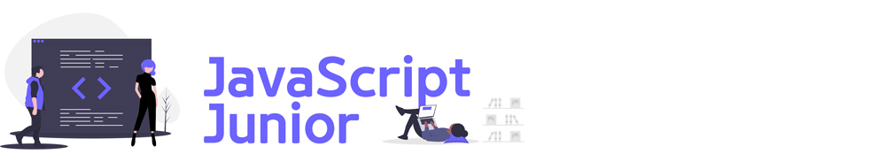

# 이듬(E.UID) 블렌디드 러닝

학습 기간 : `2020.10` — `2020.11`

 

---

 

## 오프닝 데이

> **2020.10.17 PM 08:00**

### 블렌디드 러닝

블렌디드 러닝은 "<u>온라인, 오프라인 각 방법의 장점을 취합한 혼합형 교육 방법론</u>"입니다.

- 영상 강의 ( 온라인, 주 5일 `1시간 이내/일` )
- 현장 강의 ( 오프라인, 주 1회 `본 수업: 4시간 + 멘토링: 2시간` )

### 학습 방법 안내

1. GitHub 저장소 협업(collaboration) → 이메일 초대
1. 영상 강의 시청 →TIL 작성 → 커밋 → 푸시 방법 (개별)
1. Git 버전 관리 안내 ( Soft Reset / Push Force / Merge Conflict )
1. 질문(Question) 남기기 / 답변(Answer) 확인

### TIL 작성 예시

기 수강생의 TIL 작성 방법을 살펴보고 참고하세요.

- [UI Structure & Design, TIL (GitHub)](https://github.com/dreamfulbud/TIL)
- [UI Interaction Senior, TIL (GitBook)](https://jmk.gitbook.io/workspace/)
- [UI Interaction Senior, TIL (Medium)](https://medium.com/@shane_78140)
- [React Framework, TIL (GitHub)](https://github.com/LimEunSeop/TIL-React-Framework)

 

---

 

## UI 인터랙션 주니어(Interaction Junior)

- [JavaScript 프로그래밍을 시작하는 이들을 위한 학습 프로그램](./UI_Interaction_Junior/README.md)
- [Front-End Master(영상 강의 사이트)](https://이듬.run/front-end-master)
- [질문 / 답변](./UI_Interaction_Junior/QnA/README.md)

 

 

 

---

 

## React 프레임워크(Framework)

- [React 프로그래밍을 익혀 서비스를 개발하려는 이들응 위한 학습 프로그램](./React_Framework/README.md)
- [React Master(영상 강의 사이트)](https://이듬.run/react-master)
- [질문 / 답변](./React_Framework/QnA/README.md)

 

