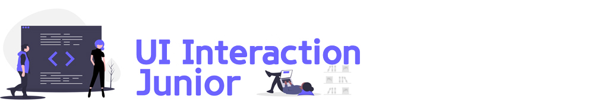

# 이듬(E.UID)

**함께 성장하는 바른 교육 [이듬](https://euid.dev)! 블렌디드 러닝** ★ 학습 기간 : `2020.10` — `2020.11`

 

## 

- [JavaScript 프로그래밍을 시작하는 이들을 위한 학습 프로그램](./UI_Interaction_Junior/README.md)
- [Front-End Master(영상 강의 사이트)](https://이듬.run/front-end-master)
- [학습 일정](./UI_Interaction_Junior/lecture/README.md)
- [학습자 TIL](./UI_Interaction_Junior/TIL/README.md)
- [질문 / 답변](./UI_Interaction_Junior/QnA/README.md)

 
 

## 

- [React 프로그래밍을 익혀 서비스를 개발하려는 이들을 위한 학습 프로그램](./React_Framework/README.md)
- [React Master(영상 강의 사이트)](https://이듬.run/react-master)
- [학습 일정](./React_Framework/lecture/README.md)
- [학습자 TIL](./React_Framework/TIL/README.md)
- [질문 / 답변](./React_Framework/QnA/README.md)

 
 

## 오프닝 데이

> **2020.10.17 PM 08:00**

### 블렌디드 러닝

블렌디드 러닝은 "<u>온라인, 오프라인 각 방법의 장점을 취합한 혼합형 교육 방법론</u>"입니다.

- 영상 강의 ( 온라인, 주 5일 `1시간 이내/일` )
- 현장 강의 ( 오프라인, 주 1회 `본 수업: 4시간 + 멘토링: 2시간` )

### 학습 방법 안내

1. GitHub 저장소 협업
1. 영상 강의 시청 → TIL 작성 → 커밋 → 푸시
1. Git 버전 관리 ( Soft Reset / Push Force / Merge Conflict )
1. 질문(Question) 남기기 / 답변(Answer) 확인

### TIL 작성 예시

기 수강생의 TIL 작성 방법을 살펴보고 참고하세요.

- [UI Structure & Design, TIL (GitHub)](https://github.com/dreamfulbud/TIL)
- [UI Interaction Senior, TIL (GitBook)](https://jmk.gitbook.io/workspace/)
- [UI Interaction Senior, TIL (Medium)](https://medium.com/@shane_78140)
- [React Framework, TIL (GitHub)](https://github.com/LimEunSeop/TIL-React-Framework)

### 커밋 메시지 작성 예시

TIL 작성 제출 및 질문을 남길 경우, 다음과 같은 포멧으로 커밋 메시지를 작성해주세요.

- `[TIL 작성] 3일차 학습 내용 정리`
- `[TIL 업데이트] 3일차 학습 내용 중 "특정 주제" 업데이트`
- `[병합 충돌 검토] 학습 검토 병합 과정에서 발생한 충돌 문제 수동 검토 후 해결`
- `[질문] "질문 내용" 요약`

 

**🐧 커밋 메시지는 협업 과정에서 작업자 간에 주고 받는 메시지이므로 "간단 명료하게 작성"합니다.**

 