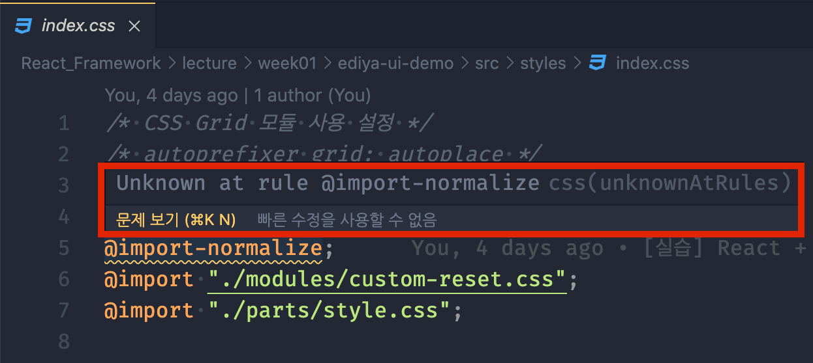
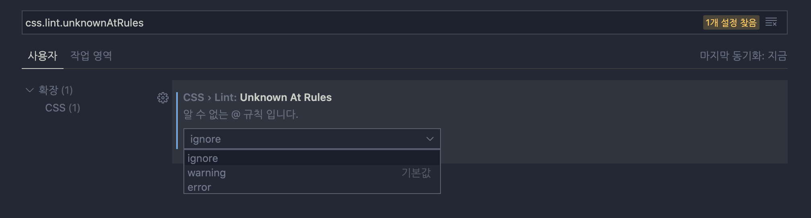
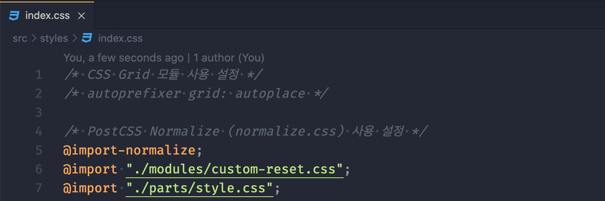
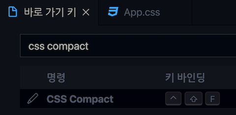
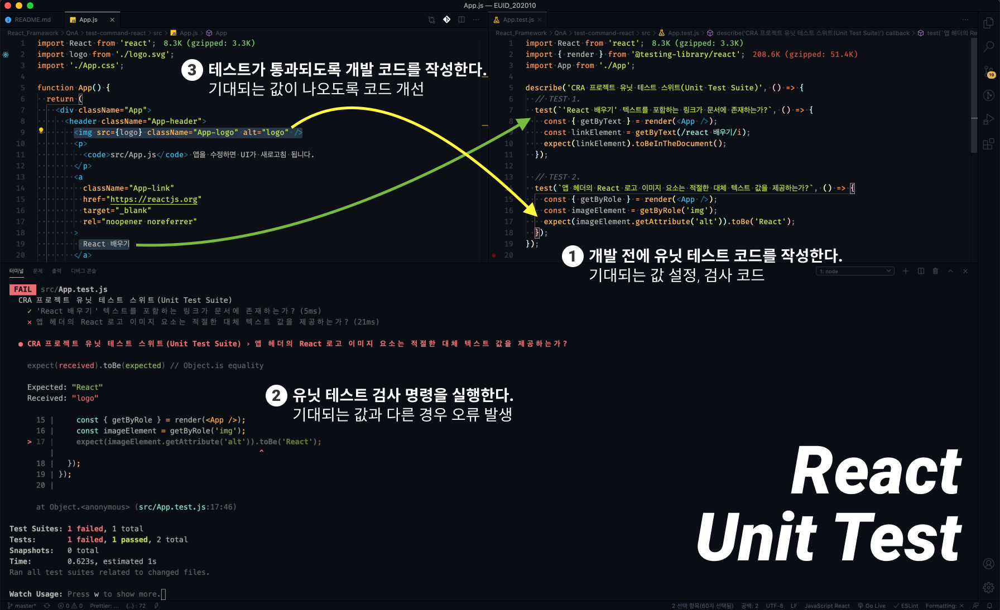
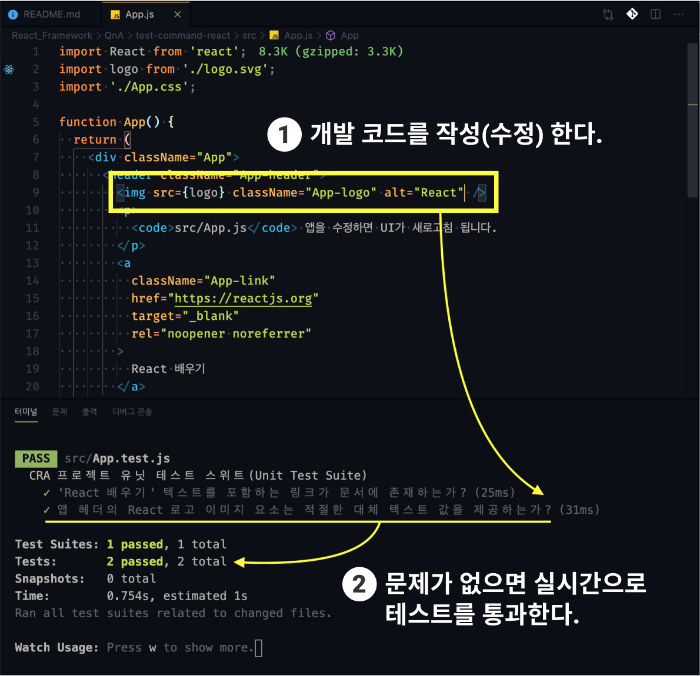

[← BACK](../README.md)

# React Framework, QnA

질문을 남겨주시면, 최선을 다해 답변하겠습니다. 🐧

## 목차

1. [모듈 번들러의 배경지식은 어느정도 가지고 있어야될까요?](#q1-질문)
1. [`npm run test`의 용도와 사용법을 간략하게나마 알고 싶습니다.](#q2-질문)
1. [prettier의 css,scss 포맷팅 관련 옵션설정은 따로 없나요?](#q3-질문)
1. [Virtual DOM 패러다임을 유행시킨 건 리액트인가요?](#q4-질문)
1. [create-react-app이 ie를 지원하지 않는다는데 어떻게 해결해야 하나요?](#q5-질문)
1. [파일 확장자 `js`와 `jsx`는 특별한 차이점이 있나요?](#q6-질문)
1. [`normalize.css`를 불러오는 부분이 에러가 발생하는데 문제 원인이 뭔가요?](#q7-질문)
1. [`useEffect()` 훅을 사용해 데이터를 패치(fetch) 하는데 무한 루프가 발생하는 이유가 뭘까요?](#q8-질문)

<br />

## Q8. 질문

이디아 예제의 Navigation 컴포넌트를 훅으로 변환시키는 연습을 하는 도중에 `useEffect()` 훅에 의존배열 `items`를 넣을 경우 무한 렌더링이 일어납니다. 
처음 컴포넌트가 마운트 되었을 시점에 데이터 패치(fetch)를 하여 처음 한번만 메뉴 `items` 배열을 받아오고 이 `items` 배열이 기존 값과 달라질때만 
리렌더링을 시키고자 하는게 의도였는데 의존배열에 `items`를 넣을 경우 무한으로 fetch 하는 현상이 일어나는거 같습니다. 왜 이런 현상이 일어나는 것일까요? 😂

<details>
  <summary>Navigation 컴포넌트 코드</summary>
  <br/>

  ```jsx
  import React, { useEffect, useRef, useState } from 'react';
  import { string } from 'prop-types';
  import classNames from 'classnames';
  import Button from 'components/common/Button';
  import { fetchData, delay } from 'utils';
  import { API, CLASSES } from 'constants/index';

  const Navigation = ({ headline }) => {
    const [items, setItems] = useState([]);
    const [isOpened, setIsOpened] = useState(false);
    const [hasError, setHasError] = useState(false);
    const [isLoading, setIsLoading] = useState(false);
    const [activeClass, setActiveClassss] = useState('');

    const openMenuButtonRef = useRef();
    const closeMenuButtonRef = useRef();
    const firstLinkRef = useRef();

    const _checkCurrentPage = (linkPath) => {
      const { href } = window.location;
      const isCurrentPage = href.includes(linkPath);
      return isCurrentPage ? CLASSES.currentPage : null;
    };

    const _handleKeydown = (e) => {
      const { current: firstLinkNode } = firstLinkRef;
      const { current: closeMenuButtonNode } = closeMenuButtonRef;

      const { target, key, shiftKey } = e;

      if (shiftKey && key === 'Tab' && target.isEqualNode(firstLinkNode)) {
        e.preventDefault();
        closeMenuButtonNode.focus();
      }

      if (!shiftKey && key === 'Tab' && target.isEqualNode(closeMenuButtonNode)) {
        e.preventDefault();
        firstLinkNode.focus();
      }
    };

    const handleOpenMenu = () => {
      setIsOpened(true);
      delay(100).then(() => {
        setActiveClassss(CLASSES.activeClass);
        document.addEventListener('keydown', _handleKeydown);
      });
    };

    const handleCloseMenu = () => {
      setActiveClassss('');
      delay(400).then(() => {
        setIsOpened(false);
      });
      document.removeEventListener('keydown', _handleKeydown);
    };

    useEffect(() => {
      setIsLoading(true);
      fetchData(
        API.navigation,
        ({ data: items }) => {
          setIsLoading(false);
          setItems(items);
        },
        ({ message }) => {
          setIsLoading(false);
          setHasError({ message });
        }
      );
      console.log(items)
    }, [items]);

    // 데이터를 로딩 중인 상태 렌더링
    if (isLoading) {
      return <div role="alert">데이터 로딩 중입니다...</div>;
    }

    // 오류가 발생했을 때 상태 렌더링
    if (hasError) {
      return <div role="alert">{hasError.message} 오류가 발생했습니다.</div>;
    }
    // 로딩 끝, 오류 없음 상태 렌더링
    return (
      <>
        <Button
          ref={openMenuButtonRef}
          className="is-open-menu"
          label="메뉴 열기"
          onClick={handleOpenMenu}
        >
          <span className="ir" />
        </Button>

        <nav
          hidden={!isOpened}
          aria-labelledby="globalNav"
          className={classNames('app-navigation', activeClass)}
          // {...navWrapperProps}
        >
          <h2 id="globalNav" className="a11y-hidden">
            {headline}
          </h2>

          <ul className="reset-list">
            {/* 비동기 데이터 바인딩 → 내비게이션 리스트 렌더링 (아래 템플릿 코드 활용) */}
            {items.map((item, index) => (
              <li key={item.id} className={_checkCurrentPage(item.link)}>
                <a ref={index === 0 ? firstLinkRef : null} href={item.link}>
                  {item.text}
                </a>
              </li>
            ))}
          </ul>
          <Button
            ref={closeMenuButtonRef}
            className="is-close-menu"
            label="메뉴 닫기"
            onClick={handleCloseMenu}
          >
            <span className="close" aria-hidden="true">
              ×
            </span>
          </Button>
        </nav>
      </>
    );
  };

  Navigation.propTypes = {
    headline: string.isRequired,
  };

  export default Navigation;
  ```
</details>

<br/>

<details open>
  <summary>A8. 답변</summary>

  ### 무한 루프 현상이 발생한 이유

  비동기 네트워크 통신 요청은 내비게이션 함수 컴포넌트 생성 시점에 **1회** 진행되어 데이터를 패치(fetch)한 후, `items` 상태를 **1회** 업데이트 하여야 합니다.
  즉, **데이터 패치는 컴포넌트 생성 시점에 1회만 시도 되어야 합니다.** 하지만 질문 코드의 `useEffect()` 훅 코드를 살펴보면 콜백 함수 (재)실행 여부를 결정하는 
  2번째 인자 배열에 `items` 상태 값이 설정되어 있습니다. `items` 상태 값이 변경될 때만 `useEffect()` 훅의 콜백 함수가 실행되도록 구성하기 위함이겠죠.

  ```js
  useEffect(() => {
    setIsLoading(true);
    fetchData(
      API.navigation,
      ({ data: items }) => {
        setIsLoading(false);
        setItems(items);
      },
      ({ message }) => {
        setIsLoading(false);
        setHasError({ message });
      }
    );
  }, [items]); // items 상태가 업데이트 될 때 마다 콜백 함수 (재)실행
  ```

  **바로 이 설정이 무한 루프 문제가 발생한 원인입니다.** 왜 그러한 지 코드 흐름을 간단하게 정리해봅시다.

  1. **`items` 상태 초기 값 `[]`**
  1. **`items` 상태에 의존하므로,** `useEffect()` 콜백 함수 실행 → 비동기 통신 → 데이터 패치 → **`items` 상태 업데이트**
  1. **`items` 상태 업데이트 됨에 따라,** 다시 `useEffect()` 콜백 함수 실행 → 비동기 통신 → 데이터 패치 → **`items` 상태 업데이트**
  1. **`items` 상태 업데이트 됨에 따라,** 다시 `useEffect()` 콜백 함수 실행 → 비동기 통신 → 데이터 패치 → **`items` 상태 업데이트**
  1. ...
  1. ...
  1. ...
  1. (⚠️ 무한 루프 발생)

  <br/>

  ### 문제 해결 방법: 데이터 패치는 1회만 실행

  데이터 패치를 통해 `items` 상태가 업데이트 되고, 다시 데이터 패치, `items` 상태 업데이트... **무한 연쇄 고리를 끊으려면 
  `useEffect()` 훅에 설정된 의존 상태 값 `items`를 제거하고 빈 배열을 설정해야 합니다.** 빈 배열을 설정하면 의존하는 상태 속성 값이 없으므로
  컴포넌트 생성 시점에 1회만 콜백함수를 실행하게 됩니다. (클래스 컴포넌트의 `componentDidMount` 라이프 사이클 훅과 유사)

  ```js
    useEffect(() => {
      setIsLoading(true);
      fetchData(
        API.navigation,
        ({ data: items }) => {
          setIsLoading(false);
          setItems(items);
        },
        ({ message }) => {
          setIsLoading(false);
          setHasError({ message });
        }
      );
    }, []);
  ```
</details>

<br/>

---

<br />

## Q7. 질문

`normalize.css`를 불러오는 부분이 에러가 발생하는데 문제 원인이 뭔가요? → 에러 내용: `Unknown at rule @import-normalize`

<details>
  <summary>A7. 답변</summary>
  <!-- <br/> -->

  ### 문제 원인

  믹스인을 호출하는 `@include` 문법은 Sass의 기능이라서 CSS 파일에서 사용될 경우 경고를 표시합니다.

  

  ### 해결 방법 1

  CSS 파일 대신 SCSS 파일을 사용하면 유효한 문법이므로 오류가 발생하지 않습니다.

  ### 해결 방법 2

  VS Code 설정 → 설정 검색 `css.lint.unknownAtRules` → 무시(`ignore`) 값으로 설정을 변경하면 더 이상 오류를 표시하지 않습니다.

  
  


</details>

<br/>

---

<br/>

## Q6. 질문

Mini Project {E1}실습에서는 컴포넌트 파일 확장자가 `js`파일이 아닌 `jsx`파일을 쓰는데
`js`와 `jsx`와는 특별한 차이점이 있는건가요?

<details>
  <summary>A6. 답변</summary>
  <!-- <br/> -->

  ### ES 표준 확장이 아닌 JSX

  JSX는 ECMAScript 표준 확장이 아니라서 `js` 확장자가 아닌, `jsx` 확장자를 통해 별도 관리되어야 하고
  React 앱의 컴포넌트 파일 임을 명확화 할 수 있습니다. 뿐만 아니라 JSX 코드 안에서 Emmet을 사용할 수 있어
  구분해 사용하였습니다.
  하지만 `jsx` 확장자를 사용하는 것이 React 앱 개발에 필수로 요구되지 않을 뿐더러, `js` 확장자를 사용한다고 해서
  특별한 문제가 발생하지는 않습니다. React 컴포넌트 파일, 일반 JS 파일을 구분하지 않고 `js` 확장자를 통일해 사용해도 무방합니다.

  ### VS Code 설정

  `js` 확장자에서 Emmet 사용을 할 수 없는 불편함이 있을 수 있습니다. 이 문제는 VS Code 설정을 통해 해결할 수 있습니다.

  *settings.json*

  ```json
  {
    "emmet.includeLanguages": { "javascript": "javascriptreact" },
    "files.associations": { "*.js": "javascriptreact" },
  }
  ```

  ### 결론

  React 컴포넌트 파일을 별도로 `jsx` 확장자로 구분해 사용하지 않고, `js` 확장자로 통일해 사용해 앱을 개발해도 무방합니다. :-)
</details>

<br/>

---

<br />

## Q5. 질문

회사에서 create-react-app을 실습해보았는데, IE에서 아예 빈 화면이 나옵니다.<br/>
급 놀라서 구글링 해 보니 IE는 지원 안 한다고...
해결 방법으로 아래 2개를 설치하면 된다는데 전 안 되는 거 같아요.

```js
import 'react-app-polyfill/ie11';
import 'react-app-polyfill/stable';
```

<details>
  <summary>A5. 답변</summary>

### [브라우저 호환성(Supported Browsers)](https://create-react-app.dev/docs/supported-browsers-features#supported-browsers)

Create React App 공식 문서안내에 따르면 CRA는 IE 9-11을 지원하려면 폴리필 라이브러리를 사용해야 합니다.

> By default, the generated project supports all modern browsers.
> **Support for Internet Explorer 9, 10, and 11 requires polyfills.**
> For a set of polyfills to support older browsers, use react-app-polyfill.

### [React 앱 폴리필](https://github.com/facebook/create-react-app/blob/master/packages/react-app-polyfill/README.md)

이 패키지는 Create React App 프로젝트에서 사용하는 최소 요구 사항과 일반적으로 사용되는 언어 기능이 포함되어 있습니다.
예를 들어 아래 나열된 ECMAScript 기술을 사용한 경우, 이를 지원하지 않는 브라우저에서 React 앱이 정상 작동하지 않으므로
폴리필 패키지를 설치한 후 호출하면 IE 9-11에서도 CRA 프로젝트가 문제 없이 실행됩니다.

- `Promise`(`async/await`)
- `window.fetch()`
- `Object.assign()`
- `Symbol`, `for...of` 구문
- `Array.from()`

#### 폴리필 설치

```sh
$ npm i react-app-polyfill
```

#### IE 지원 설정

IE 브라우저 호환성을 위해서는 폴리필을 설치한 후, 엔트리 파일(`src/index.js`)의 첫번째 라인에서 폴리필 라이브러리를 호출해야 합니다.

_IE 9-11_

```js
// 반드시 src/index.js의 1번째 라인에 작성해야 함.
import 'react-app-polyfill/ie9';
```

_IE 11_

```js
// 반드시 src/index.js의 1번째 라인에 작성해야 함.
import 'react-app-polyfill/ie11';
```

#### 기타 언어 기능 폴리필 (Polyfilling other language features)

대상(target) 브라우저에서 사용할 수 없는 안정적인(stable) 언어 기능을 폴리필 할 수도 있습니다.
Create React App 프로젝트에 이 폴리필을 사용할 경우, 정의된 `browserslist`를 확인하여 안정적인 폴리필을 가져올 때 대상 브라우저에 필요한 기능만 포함되도록 처리합니다.
애플리케이션에서 Internet Explorer를 지원해야 하는 경우, 앞서 다룬 [IE 지원 설정](#ie-지원-설정)을 참고하세요.

_IE 9-11_

```js
// 반드시 src/index.js의 1번째 라인에 작성해야 함.
import 'react-app-polyfill/ie9';
import 'react-app-polyfill/stable';
```

_IE 11_

```js
// 반드시 src/index.js의 1번째 라인에 작성해야 함.
import 'react-app-polyfill/ie11';
import 'react-app-polyfill/stable';
```

### CRA 개발 서버 실행 결과, 빈 화면이 나온다면

아마도 빌드 과정에서 오류가 발생했을 것이고, Console 패널을 통해 오류 메시지가 출력될 것입니다.
오류 메시지 안내에 따라 문제를 진단한 후 해결하면 테스트 환경에서 정상적으로 CRA 앱이 작동될 것이라 생각합니다.
앞에서 기술한 [React 앱 폴리필](#react-앱-폴리필)에서 안내한대로 수행했음에도 문제가 지속된다면?
밋업(MeetUp)을 통해 화면을 공유하여 실시간으로 문제를 확인 후 해결 방법에 대해 이야기 나눠 볼 수 있겠습니다. 🐧

> 해당 문제를 검토한 후, 답변 글을 업데이트 할 예정입니다.

</details>

<br/>

---

<br />

## Q4. 질문

유튜브 강의에 있는 virtual-dom 라이브러리 깃헙에 가보면 react에서 영감을 얻었다고 적어놓은 문구가 있던데 Virtual DOM 패러다임을 유행시킨건 리액트인가요?

<details>
  <summary>A4. 답변</summary>

### 새로운 시대의 서막. 두~둥!

누군가 생소한 것을 사용해보라며 권했다면? 대부분 그대로 받아들이기 어려울 것입니다. 아마도.

> Virtual DOM이라는 것이 있어! 한 번 써봐!<br>
> 일반적인 DOM 조작 보다 훨씬 효과적이고 조직적으로 애플리케이션을 개발할 수 있을 거야!

하자만 누군가 다음과 같이 말했다면 받아들이는 태도가 바뀔 수 있습니다.

> Facebook, Instagram 애플리케이션을 만드는데 React 라고 불리는 라이브러리가 사용되었다고 해.<br/>
> 그래서 전 세계에서 지구인이 동시 접속을 해도 문제 없이 빠르게 서비스가 돌아가는 거래. 놀랍지 않냐?<br/>
> 그런데 React 라이브러리를 구성하는 핵심 설계가 Virtual DOM 이라더라. Virtual DOM을 써보는 건 어때?

### 검증된 서비스에 사용된 기술 → 신뢰

Facebook이 개발하고 사용 중인 React는 웹 애플리케이션과 UI 개발에 대한 우리의 생각을 바꾸었습니다.
그리고 그 놀라운 React는 Virtual DOM 시스템을 사용해 UI를 렌더링 하고 애플리케이션으로 작동됩니다.
React는 기존의 애플리케이션 개발과 달리, 실제 DOM이 아닌 Virtual DOM 개념을 대중에게 소개하고
말 뿐만이 아니라 실제 성능 상 이점이 있으며, 효과적이라는 것을 입증했습니다.

React의 흥행 성공은 Virtual DOM에 대한 인식을 시장에 자리 잡게 하였을 뿐만 아니라,
Virtual DOM을 핵심 설계 시스템으로 하는 또 다른 도구(예: Vue.js)의 등장을 촉발시켰습니다.
그리고 그 도구는 또 하나의 기술적 리더로 자리잡고 선의의 경쟁 중입니다.

React와 Vue.js는 Virtual DOM 시스템을 도구의 핵심 개념으로 소개하고 있으며,
실제 DOM 조작과 비교하여 어떤 점이 효과적이고, 애플리케이션 개발에 적합한지 기술하고 있습니다.
Front-End 개발을 대표하는 프레임워크 들의 Virtual DOM은 그렇게 세상에 알려졌습니다. 🐧

</details>

<br/>

---

<br />

## Q3. 질문

prettier의 css,scss 포맷팅 관련 옵션설정은 따로 없나요?

```css
body {
  margin: 0;
  padding: 0;
}
.container {
  display: flex;
  align-items: center;
  justify-content: center;
}
```

팀프로젝트의 css 작성 컨벤션이 위와 같이 개행하지 않고 빈공간을 허용하지 않는 것으로 정해져 있는데
이 컨벤션에 맞게 prettier 옵션을 설정하는 방법을 [playground](https://prettier.io/playground/)와 구글링을 해봐도 못찾겠네요...

<details>
  <summary>A3. 답변</summary>
  <br/>

Prettier는 CSS, SCSS 포맷팅을 지원하지만 한 줄(oneline) 코드 라인으로 자동 변경하는 옵션은 제공하지 않습니다. 참고로 제가 사용하는 Prettier VS 확장은 [Prettier Now](https://marketplace.visualstudio.com/items?itemName=remimarsal.prettier-now) 입니다.

_settings.json_

```jsonc
{
  "[css]": {
    "editor.defaultFormatter": "remimarsal.prettier-now",
    "editor.formatOnSave": true
  },
  "[scss]": {
    "editor.defaultFormatter": "remimarsal.prettier-now",
    "editor.formatOnSave": true
  }
}
```

질문 주신 CSS 코딩 컨벤션이 라인을 개행하지 않고, 빈 공간을 허용하지 않는 것으로 정해져 있다고 말씀주셔서 요구하시는 결과를 낼 수 있는 다른 VSCode 확장을 소개할께요.

### CSS Compressor

[CSS Compressor](https://marketplace.visualstudio.com/items?itemName=bestvow.css-compressor) 확장을 설치하면 요구하는 코딩 컨벤션에 맞게 코드를 자동 포맷팅합니다.

**포맷팅 전** 👀

```css
.App {
  text-align: center;
}

.App-logo {
  height: 40vmin;
  pointer-events: none;
}

@media (prefers-reduced-motion: no-preference) {
  .App-logo {
    animation: App-logo-spin infinite 20s linear;
  }
}

@keyframes App-logo-spin {
  from {
    transform: rotate(0deg);
  }
  to {
    transform: rotate(360deg);
  }
}
```

**포맷팅 후** 💥

```css
.App {
  text-align: center;
}
.App-logo {
  height: 40vmin;
  pointer-events: none;
}
@media (prefers-reduced-motion: no-preference) {
  .App-logo {
    animation: App-logo-spin infinite 20s linear;
  }
}
@keyframes App-logo-spin {
  from {
    transform: rotate(0);
  }
  to {
    transform: rotate(360deg);
  }
}
```

#### 바로가기 키(단축키) 설정

확장을 설치한 후 포맷팅하려면, 포맷팅하려는 CSS 파일에서 `CSS Compact` 명령을 실행합니다. 문서에서 안내한 기본 단축키로 실행되지 않거나, 다른 단축키로 변경하려면 바로가기 키를 통해 새로운 단축키를 등록해 사용하세요.

> 사용자 설정 바로가기 키 : `Ctrl` + `Shift` + `F`



</details>

<br />

---

<br />

## Q2. 질문

<code>npm run test</code>의 용도와 사용법을 간략하게나마 알고 싶습니다.

<details>
  <summary>A2. 답변</summary>
  <br/>

### 테스트 명령

`npm run test` 명령은 React 앱의 특정 코드 영역을 단위 별로 테스트할 때 사용합니다.
단위 별로 테스트 하는 것을 "유닛 테스트(unit test)"라고 부릅니다. 컴퓨터 프로그래밍에서 소스 코드의 특정 모듈이
의도된 대로 정확히 작동하는지 검증하는 절차가 필요할 때 작성합니다.

예를들어 함수와 메소드에 대한 테스트 케이스(Test case)를 작성할 수 있습니다. 이를 통해 언제라도 코드 변경으로 인해 문제가 발생할 경우,
단시간 내에 이를 파악하고 바로 잡을 수 있습니다. 이상적인 테스트 케이스는 각각 분리 되어야 합니다.

아래 이미지는 React 앱(App) 컴포넌트를 유닛 테스트 하는 화면을 보여줍니다.

  
  <br />
  <br />

> 🎯 [App.test.js 테스트 코드](./test-command-react/src/App.test.js)를 확인하세요.

테스트 결과 실패(Failed)한 오류를 해결하기 위해 기대되는 값을 출력하도록 개발 코드를 작성(수정)하면,
테스트 결과가 통과(PASS) 상태로 변경되어 모든 테스트를 통과하게 됩니다.

  
  <br />
  <br />

살펴본 유닛 테스트는 React와 같은 프레임워크 개발 환경이 아닌 경우에도 사용할 수 있습니다.
[Jasmine](https://jasmine.github.io/), [Jest](https://jestjs.io/)와 같은
테스트 러너 라이브러리를 사용해 함수 또는 메서드 등을 테스트 할 수 있습니다.

### 함수 테스트 시나리오 예시

배열의 원소 중, 특정 인덱스를 전달하여 뒤에서 부터 인덱스와 일치하는 원소를 반환하는 함수를 작성하고자 합니다.
함수 이름을 설정하고, 전달 받을 매개변수는 설계했으나 아직 함수의 처리 로직은 작성 전입니다.

```js
function lastIndexOf(list, index) {
  // 함수 로직 (작성 전)
}
```

함수 로직을 작성하기 전에 테스트 케이스를 작성해 기대되는 값을 설계합니다.
예시 코드는 [Jest API](https://jestjs.io/docs/en/getting-started)를 사용했습니다.

- [공통 매처(Matchers)](https://jestjs.io/docs/en/using-matchers#common-matchers)
- [expect()](https://jestjs.io/docs/en/expect#expectvalue)
- [toBe()](https://jestjs.io/docs/en/expect#tobevalue)

```js
// TEST CASE
test('Front-End 프레임워크 배열 원소 중, 마지막에서 3번째 인덱스에 해당하는 값은 "React"이다.', () => {
  const FE_FRAMEWORKS = ['react', 'vue', 'angular'];
  const lastIndex = 3;

  // Jest API
  // expect() : https://jestjs.io/docs/en/expect#expectvalue
  // toBe()   : https://jestjs.io/docs/en/expect#tobevalue
  expect(lastIndexOf(FE_FRAMEWORKS, lastIndex)).toBe('react');
});
```

작성한 테스트를 실행하면 기대한 값이 나오지 않으므로 오류가 발생합니다.

```sh
Test Suites: 1 failed, 1 total
Tests:       1 failed
```

이제 기대되는 값이 출력되도록 함수의 처리 로직을 작성합니다.

```js
function lastIndexOf(list, index) {
  // 함수 로직 (작성)
  index = index - 1;
  return list[list.length - index];
}
```

작성된 처리 로직이 기대되는 값을 출력하면 테스트는 통과(PASS) 됩니다.

```sh
Test Suites: 1 passed, 1 total
Tests:       1 passed
```

</details>

<br/>

---

<br />

## Q1. 질문

모듈 번들러의 배경지식은 어느정도 가지고 있어야될까요?
React의 경우 Webpack을 기본 모듈러로 쓰고 있는걸로 알고 있는데... 어느정도의 배경지식이 있어야 학습이 원활한지 알고싶습니다.

<details>
  <summary>A1. 답변</summary>
  <br/>

React 앱을 시작하는 방법에 따라 모듈 번들러에 대한 사전 지식 수준이 다릅니다.

### 매뉴얼 구성

매뉴얼 방식으로 [Webpack](https://webpack.js.org/), [Babel](https://babeljs.io/), [Babel Plugins](https://babeljs.io/docs/en/plugins), [React](https://www.npmjs.com/package/react), [ReactDOM](https://www.npmjs.com/package/react-dom)을 구성하고 나아가 [Sass](https://www.npmjs.com/package/sass), [PostCSS](https://postcss.org/) [Autoprefixer](https://www.npmjs.com/package/autoprefixer), [이미지(JPG, PNG, SVG 등) 최적화](https://www.npmjs.com/package/imagemin-webpack-plugin) 등 다양한 기능을 직접 추가하고자 할 경우 Webpack 모듈 번들러 사용 방법에 능숙해야 합니다. 다른 모듈 번들러([Parcel](https://v2.parceljs.org/), [Rollup](https://rollupjs.org/guide/en/), [Snowpack](https://www.snowpack.dev/) 등)를 사용해도 마찬가지입니다. 매뉴얼 방식으로 구성할 경우 각 모듈 번들러 사용법에 능숙해야 합니다.

### 바로 시작하기

반면 직접 구성하는 방법을 몰라도 바로 개발을 시작할 수 있도록 고안된 [CRA(Create React App)](https://create-react-app.dev/)과 같은 도구를 사용한다면 모듈 번들러 사용 능력이 부족해도 React를 학습하는데 큰 무리가 없습니다. 말 그대로 바로 시작할 수 있기 때문에 매뉴얼 방식에 비해 간편합니다. 아래 명령어 한 줄이면 설치 후 바로 시작할 수 있죠. 우리 수업에서는 CRA 도구를 사용하니 모듈 번들러에 대한 깊은 이해를 요구하지는 않습니다. :-)

```sh
$ npx create-react-app <프로젝트_이름>
```

물론 기본 설정된 Settings 외에 원하는 개발 모듈을 추가하고 확장하려면 모듈 번들러를 능숙하게 사용할 수 있어야 합니다. 각 모듈 번들러는 사용 방법이 다르기 때문에
사용할 모듈 번들러 공식 문서를 참고해 구성해야 합니다.

### 매뉴얼 방식으로 React 시작하기

- [Webpack 모듈 번들러 튜토리얼](./manual-webpack-react/README.md)
- [Parcel 모듈 번들러 튜토리얼](./manual-parcel-react/README.md)

</details>
