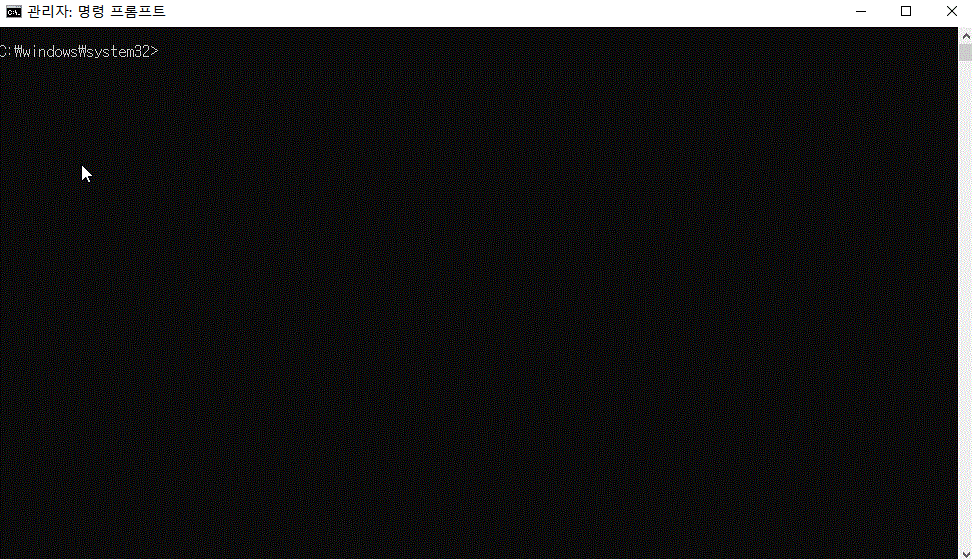

[← BACK](../README.md)

# DAY 01 (2020-10-19, 월)

### 사전 학습 가이드🤸‍♀️

#### React 학습에 앞서 <ins>Front-End 개발 학습이 필요</ins>하다🤯

+ 웹 표준(Standards) 및 접근성(A11Y) 이해
+ 구조 디자인 (HTML5 마크업)
+ 표현 디자인 (CSS3 스타일링 + 레이아웃)
+ 반응형 디자인 (RWD)
+ 인터랙션 디자인 (JavaScript + DOM API)
+ 비동기 프로그래밍(AJAX) 및 보안 이슈(SOP/CORS), 우회 방법(JSONP)
+ RESTful 웹 서비스 (CRUD + REST API)
+ 모던 자바스크립트 (ES 6+)
+ Git 버전 관리 & GitHub 서비스

#### [Front-End 개발 학습 로드맵](https://roadmap.sh/frontend)에서 <ins>Front-End 개발자가 갖춰야 할 역량(2020 ver.)</ins>을 확인할 수 있다🤖
여기서 React와 관련한 부분만 간략히 정리하면 다음과 같다. 
+ Front-End의 <ins>3대 프레임워크</ins>: **React.js / Angular / Vue.js**
+ React.js의, 
    - Application State Manager: [Redux](https://redux.js.org/), MobX
    - Server Side Rendering(SSR): [Next.js](https://nextjs.org/)
    - Static Site Generators: Next.js, [GatsbyJS](https://www.gatsbyjs.com/)
    - Mobile Applications: [React Native](https://reactnative.dev/)

### 개발 환경 구성🤸‍♀️
#### 학습에 필요한 개발 환경(크롬, VS code, Node.js, Git 등등)을 구성하였다🔧

크롬 익스텐션

+ Octotree
+ GitZip for Github
+ GitHub Custom Tab Size
+ Restlet Client
+ VSCode Marketplace
+ disable-HTML
+ Quick Color

VS code 익스텐션

+ FIle Utils
+ Bracket Pair Colorizer 2
+ Image preview
+ Color Highlight
+ Color Manager
+ HTMLHint
+ ESLint
+ Translator
+ Auto Complete Tag
+ IntelliSense for CSS class names in HTML
+ Live Server
+ Debugger for Chrome

Node.js with NVM(Node Version Manager)

[NVM](https://github.com/nvm-sh/nvm)은 컴퓨터에 여러 버전의 Node.js를 관리하도록 돕는 도구다. 
1. Windows용 패키지 매니저 [Chocolatey](https://chocolatey.org/) 설치

2. Chocolatey 패키지 매니저를 사용해 [NVM for Windows](https://github.com/coreybutler/nvm-windows#usage) 설치     
`choco install nvm`
3. nvm으로 Node.js 설치

Git 버전 관리 도구(Cmder, Git for Windows, Bash-it)

+ Cmder 
    - Chocolatey를 사용해 [Cmder](https://chocolatey.org/packages/Cmder) 설치 
    
    - cmder 설정 변경 

+ Git for Windows 
    - [git 간편 안내서
    ](https://rogerdudler.github.io/git-guide/index.ko.html)
+ Bash-it 도구 

Yarn 관리 도구

[Yarn](https://yarnpkg.com/)은 NPM과 같은 패키지 매니저다. 수업에서는 Yarn을 사용한다고 하여 npm을 사용해 Yarn도 설치해보았다.

### 프로그래밍 언어 환경🤸‍♀️
#### React 앱 개발에는 기본적으로 최신 **ECMAScript**언어를 사용한다🤓

따라서 자주 사용되는 ES6 문법을 모르면 React 학습이 더 어려워진다고 한다. 혼자 프로젝트를 꾸준히 진행하긴 했지만, 모던 자바스크립트 문법을 따로 공부한 적이 없어서 사실 좀 당황스러운데😦
오는 주말에 React에서 [자주 사용하는 ES6+ 문법](https://xn--xy1bk56a.run/react-master/lecture/pre-js-env.html#javascript-%ED%8A%B8%EB%9E%9C%EC%8A%A4%ED%8F%AC%EB%A8%B8) 위주로 빠르게 실습하고 정리해봐야 겠다. 
위키북스에서 나온 <ins>[모던 자바스크립트 Deep Dive](https://xn--xy1bk56a.run/react-master/lecture/pre-js-env.html#javascript-%ED%8A%B8%EB%9E%9C%EC%8A%A4%ED%8F%AC%EB%A8%B8)</ins>도 참조하면 좋을 것같다. 

### 프레임워크를 사용하는 이유🤸‍♀️
#### 프레임워크를 사용하면 차세대 웹 표준 기술(모듈 프로그래밍, 웹 컴포넌트 시스템)을 문제없이 사용할 수 있다🤖
+ **모듈 프로그래밍**  
지금까지는 js 파일 하나 안에서 의존하는 모듈을 스크립트 상단에 불러와서 사용했다.  
그렇지만 최신 자바스크립트에서 모듈 프로그래밍을 사용하면서 main.js에 있던 모든 코드 로직들을 분리해서 관리할 수 있게 되었다. 즉 역할별로 구분된 다수의 js 파일로 구성되며 필요한 모듈을 호출해서 사용하는 식이다. 이렇게 하면 DOM content loading에 소요되는 시간이 훨씬 단축된다. 다시 말해서 사용자가 체감하기에 화면에 UI가 그려지는 속도가 훨씬 빠르다는 것이다.  
정리하면 모듈 프로그래밍은, <ins> (1) 관리가 쉽고, (2) 속도가 빠르며, (3) 사용자 경험 측면에서 우수하다. </ins>

+ **[웹 컴포넌트 시스템](github.com/yamoo9/WebComponent#소개)**  
웹 컴포넌트는 웹 어플리케이션 제작시 사용가능한 컴포넌트를 의미하며, 재사용을 목적으로 캡슐화된 커스텀 HTML 요소를 만들 수 있는 웹 플랫폼 API 세트다(자세한 설명은 상기한 링크 참조)

+ **프레임워크를 사용하는 이유⭐**
1. 모듈 프로그래밍과 웹 컴포넌트 시스템은 모두 브라우저 호환성 문제를 가지고 있다. <ins>프레임워크를 활용하면 이러한 문제없이 차세대 웹 표준 기술을 바로 활용할 수 있다.</ins> 
2. 차세대 웹 표준 기술 중 일부는 개발 과정에서 채택되지 않고 버려지므로, 표준 확정 전에 학습할 경우 시간 낭비가 될 수 있다. <ins>Front-End 프레임워크를 사용하면 차후 웹 표준이 될 기술을 미리 사용하여 오늘날 바로 사용할 수 있다(브라우저 호환, 변동, 최적화 자동 수행)</ins>

### 오늘 느낀 점🤸‍♀️
모던 자바스크립트 문법을 깊게 공부한 적이 없어서 살짝 겁이 난다😢고생 오지게 할 느낌이 온다🌊고생해도 좋으니 잘 배웠으면!🦔
React를 배우는 동시에 모던 자바스크립트를 꾸준히 공부하고, 특히 주말을 잘 활용해야 겠다는 생각이 든다. 화이팅!💪🌝

