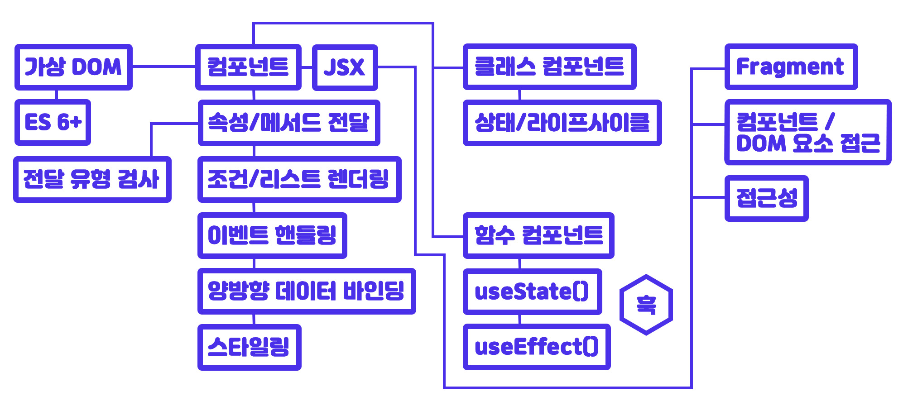
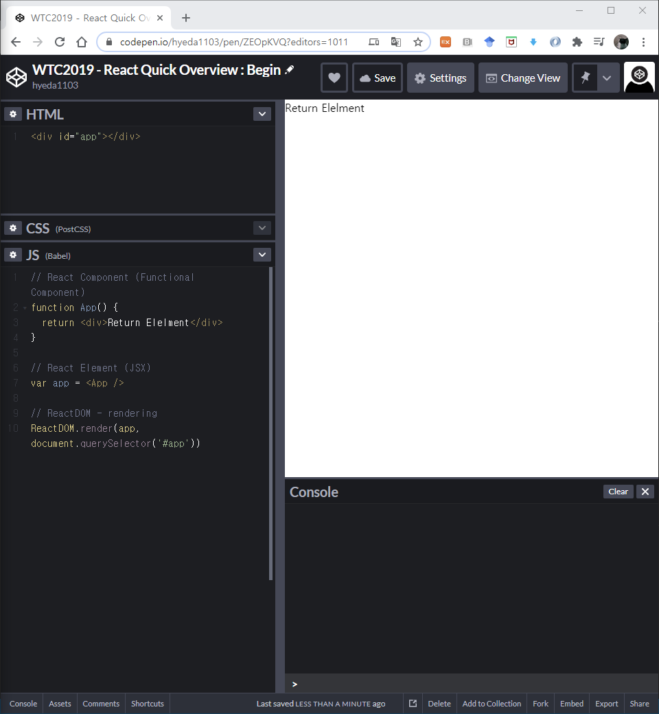
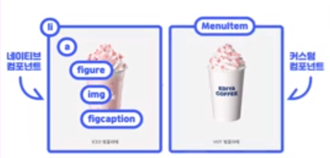
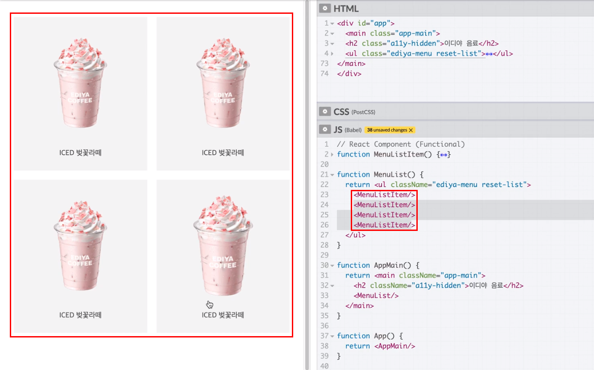
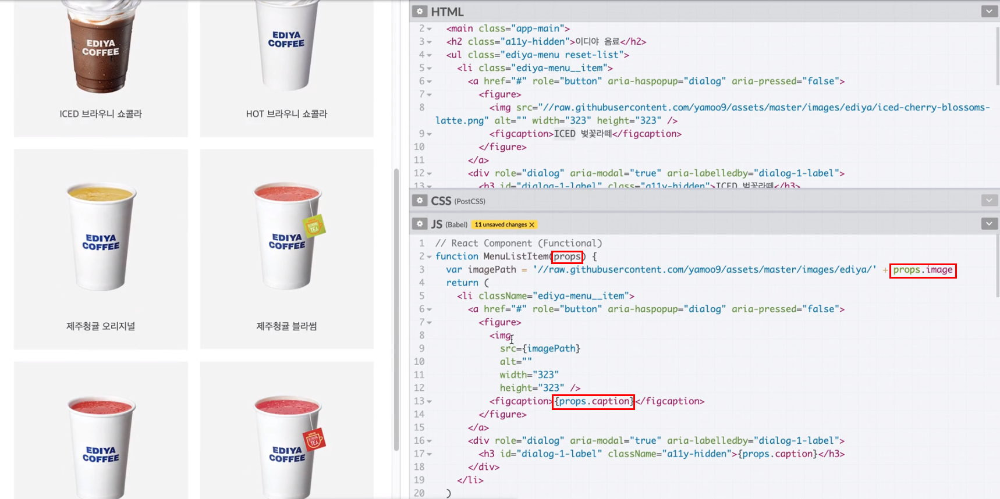

[← BACK](./README.md)

# DAY 02 (2020-10-20, 화) 

### React 소개🤸‍♀️

#### React는?🤓 
1. UI를 구현하는 JavaScript 라이브러리 
2. 현 시점에서 전 세계적으로 가장 사용율이 높다. 
3. 웹 앱, 네이티브 모바일 앱(Android, iOS 등) 개발 등 다양한 플랫폼에서 애플리케이션을 제작하는 공통된 핵심 개발 방법을 제공한다.  
  
🤖React가 제공하는 프로그래밍 방식을 한 번만 공부하면,  
<ins>React DOM과 연결했을 때 웹 사이트 또는 웹앱을 만들 수 있고,</ins>  
<ins>React Native와 연결해서 사용하면 모바일 네이티브 앱을 만들 수 있다.</ins> 
  
  
#### React의 특징은?🤓
1. 선언형(Declarative) 프로그래밍  
전달 속성 props, 상태 state 의 변경을 감지하여 UI, 즉 사용자가 보고있는 화면을 업데이트한다.
2. 컴포넌트(Component) 기반 프로그래밍  
캡슐화 된 컨포넌트 로직 logic을 사용해서 탬플릿 Template이 아닌 <ins>JSX(JavaScript + XML)라는 방식으로 앱을 개발</ins>한다. 
3. 확장성  
한 번 배워 어디서나 사용 가능(Learn Once, Write Anywhere), 웹 앱(Web App)과 네이티브 앱(Native App) 모두 만들 수 있다.  
  
  
### React 시작하기-에 앞서 공부해야 할 기본 개념을 정리해보기🤸‍♀️

#### React 러닝 다이어그램🤸‍♀️
  
+ 모던 자바스크립트를 알아야 한다.
+ 가상 DOM에 대한 이해가 필요하다.
+ 컴포넌트로 이루어지는 어플리케이션이다. JSX를 사용하려 HTML과 유사한 식으로 화면에 실제 DOM을 만들어내게 된다.
+ 데이터는 컴포넌트 외부에서 속성 또는 메서드로 전달받게 된다.
+ 컴퍼넌트는 조건 또는 반복에 따라 처리를 함으로써 화면에 그림을 그리는 렌더링 과정을 수용할 수 있다.
+ 컴포넌트는 크게 두 가지, (1) 클래스 컴포넌트(ES6+), (2) 함수형 컴포넌트가 있다.
    - 클래스 컴포넌트: 함수형 컴포넌트가 없는 기능을 쓸 수 있다. 상태, 즉 자신만의 데이터를 가지거나 특정 시점에 함수를 실행시킬 수 있는 라이프 사이클 훅을 가지고 있다. 
    - 함수형 컴포넌트: 상태, 또는 라이프 사이클 훅을 가질 수 없는 컴포넌트. React의 16.8+ ver. 부터는 React의 훅을 사용할 수 있게 됨에 따라 use로 시작하는 함수를 사용해서 클래스 컴포넌트와 유사한 기능을 구현할 수 있게 되었다. 

#### React 컴포넌트와 요소🤸‍♀️
  
React의 컴포넌트(React Component(Functional Component))는 설계다. 이 설계를 사용해서 인스턴스를 만들어낸다.
이 객체를 참조한 변수를 ReactDOM.render에 전달. ReactDOM.render는 전달받은 가상 DOM요소를 실제 DOM인 id값 app인 요소에 붙여서 화면에 그림을 그려주게 되는 구조다.

#### React 컴포넌트 구조 이해 및 활용🤸‍♀️
  
위의 예시에서 네이티브 컴포넌트의 경우 `li > a > figure > img`와 figcaption(이미지를 설명하는 캠션) 요소로 구성되어 있다. 이와 같은 구조에서 수정사항이 발생하면 복잡한 구조를 일일히 고쳐야 한다.  <ins>반면 React와 같은 프레임워크에서는 커스텀 컴포넌트를 사용할 수 있다.</ins> 아래와 같이 커스텀 컴포넌트를 활용하여 반복적으로 사용되는 구조를 손쉽게 화면에 넣을 수 있다.
 

#### React 컴포넌트와 전달 속성(props)🤸‍♀️
 
React에서 props는 함수형 컴포넌트의 첫번째 매개변수가 된다. 사용자가 컴포넌트를 사용할 때, 설정되는 속성을 통해 데이터를 전달하게 되면 컴포넌트는 그 데이터를 props로 받는다. 

#### React 프로젝트 생성 with CRA🤸‍♀️

#### React 프로젝트 디렉토리 구조🤸‍♀️