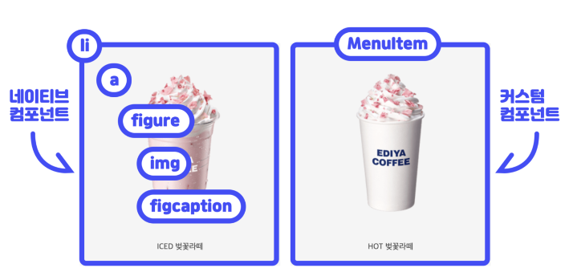
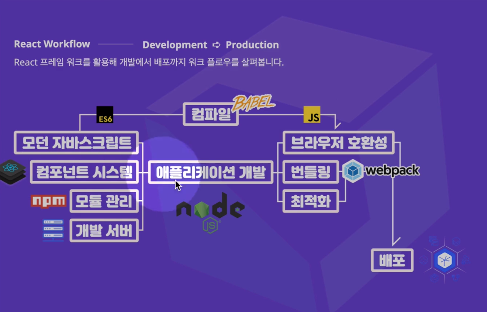
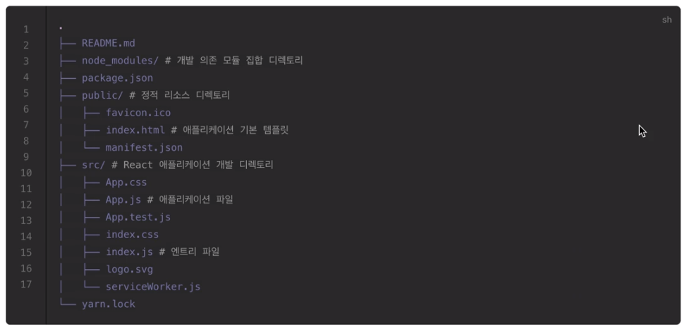

[← BACK](./README.md)

# DAY 02 (2020-10-20, 화) 

### React 소개🤸‍♀️

#### React는?🤓 
1. UI를 구현하는 JavaScript 라이브러리 
2. 현 시점에서 전 세계적으로 가장 사용율이 높다. 
3. 웹 앱, 네이티브 모바일 앱(Android, iOS 등) 개발 등 다양한 플랫폼에서 애플리케이션을 제작하는 공통된 핵심 개발 방법을 제공한다.  
  
🤖React가 제공하는 프로그래밍 방식을 한 번만 공부하면,  
<ins>React DOM과 연결했을 때 웹 사이트 또는 웹앱을 만들 수 있고,</ins>  
<ins>React Native와 연결해서 사용하면 모바일 네이티브 앱을 만들 수 있다.</ins> 
  
  
#### React의 특징은?🤓
1. 선언형(Declarative) 프로그래밍  
전달 속성 props, 상태 state 의 변경을 감지하여 UI, 즉 사용자가 보고있는 화면을 업데이트한다.
2. 컴포넌트(Component) 기반 프로그래밍  
캡슐화 된 컨포넌트 로직 logic을 사용해서 탬플릿 Template이 아닌 <ins>JSX(JavaScript + XML)라는 방식으로 앱을 개발</ins>한다. 
3. 확장성  
한 번 배워 어디서나 사용 가능(Learn Once, Write Anywhere), 웹 앱(Web App)과 네이티브 앱(Native App) 모두 만들 수 있다.  
  
  
### React 시작하기-에 앞서 공부해야 할 기본 개념을 정리해보기🤸‍♀️

#### React 러닝 다이어그램🤸‍♀️
  
  
+ 모던 자바스크립트를 알아야 한다.
+ 가상 DOM에 대한 이해가 필요하다.
+ 컴포넌트로 이루어지는 어플리케이션이다. JSX를 사용하여 HTML과 유사한 식으로 화면에 실제 DOM을 만들어내게 된다.
+ 데이터는 컴포넌트 외부에서 속성 또는 메서드로 전달받게 된다.
+ 컴포넌트는 조건 또는 반복에 따라 처리를 함으로써 화면에 그림을 그리는 렌더링 과정을 수용할 수 있다.
+ 컴포넌트는 크게 두 가지, **(1) 클래스 컴포넌트(ES6+), (2) 함수형 컴포넌트**가 있다.
    - 클래스 컴포넌트: 함수형 컴포넌트가 없는 기능을 쓸 수 있다. 상태, 즉 자신만의 데이터를 가지거나 특정 시점에 함수를 실행시킬 수 있는 라이프 사이클 훅을 가지고 있다. 
    - 함수형 컴포넌트: 상태, 또는 라이프 사이클 훅을 가질 수 없는 컴포넌트. React의 16.8+ ver. 부터는 React의 훅을 사용할 수 있게 됨에 따라 use로 시작하는 함수를 사용해서 클래스 컴포넌트와 유사한 기능을 구현할 수 있게 되었다. 

#### React 컴포넌트와 요소🤸‍♀️

    
React의 컴포넌트(React Component(Functional Component))는 설계다. 이 설계를 사용해서 인스턴스를 만들어낸다.
이 객체를 참조한 변수를 ReactDOM.render에 전달. ReactDOM.render는 전달받은 가상 DOM요소를 실제 DOM인 id값 app인 요소에 붙여서 화면에 그림을 그려주게 되는 구조다.

#### React 컴포넌트 구조 이해 및 활용🤸‍♀️
  
  
위의 예시에서 네이티브 컴포넌트의 경우 `li > a > figure > img와 figcaption(이미지를 설명하는 캠션)` 요소로 구성되어 있다. 이와 같은 구조에서 수정사항이 발생하면 복잡한 구조를 일일히 고쳐야 한다.  <ins>반면 React와 같은 프레임워크에서는 커스텀 컴포넌트를 사용할 수 있다.</ins> 아래와 같이 커스텀 컴포넌트를 활용하여 반복적으로 사용되는 구조를 손쉽게 화면에 넣을 수 있다.
  
 

#### React 컴포넌트와 전달 속성(props)🤸‍♀️
 
  
React에서 props는 함수형 컴포넌트의 첫번째 매개변수가 된다. <ins>사용자가 컴포넌트를 사용할 때, 설정되는 속성을 통해 데이터를 전달하게 되면 컴포넌트는 그 데이터를 props로 받는다.</ins> 

#### React 프로젝트 생성 with CRA🤸‍♀️
 
  
위의 도식에서 확인할 수 있다시피 어플리케이션 개발을 위한 공정은 많은 작업을 필요로 한다. 이를 일일히 사람이 하는 대신 도구를 사용할 수 있다.   
+ React와 모던자바스크립트를 사용하기 위해서는 node.js라는 환경이 필요하다. node.js는 자바스크립트가 핵심언어인 런타임 환경이다. 설치형 어플리케이션이나 웹 서버를 개발할 때 사용할 수 있다.   
+ 모듈을 관리할 때는 npm(Node Package Manager)을 사용한다.   
+ 컴포넌트 시스템으로는 React를 사용한다.  
+ React에 사용하는 모던 자바스크립트로는 ES6를 쓰게 된다.  
+ ES6를 브라우저와 호환되는 기존 자바스크립트로 바꾸기 위해서는 Babel이라는 컴파일러가 필요하다.  
+ 개발 서버를 구동하거나, 모듈로 관리되는 수십 가닥을 효율적으로 묶어주기 위해서는 번들링이 필요하고, 배포를 위한 최적화 또한 필요하다. 여기에 webpack이라는 모듈 번들러를 사용한다.

다행히 [Create React App](https://create-react-app.dev/)(이하 CRA)이라는 도구를 사용하여 번거로운 개발환경 구성을 직접 하지 않을 수 있다😀  
  
```
# Create React App 패키지 설치
$yarn global add create-react-app

# 새로운 프로젝트 생성
$npm create-react-app <프로젝트-이름>
```
  
#### CRA 명령어⭐
| 명령어 | 설명 |
| ------------- | ------------- |
| npm start  | React 프로젝트 개발 서버를 시작합니다.  |
| npm run build  | 배포를 위해 앱을 정적(Static) 파일로 번들(Bundle) 합니다.  |
| npm run test  | 테스트 러너(Test Runner)를 시작합니다. |
| npm run eject | 사용자 정의 구성(예: Webpack)을 직접 수행할 수 있도록 프로젝트를 준비합니다. (※ 주의! 되돌릴 수 없습니다.) |


#### React 프로젝트 디렉토리 구조🤸‍♀️
 
  
+ Create React App은 프로젝트에 필요한 디렉토리 구조를 자동으로 생성해주면서 React를 바로 시용할 수 있도록 해준다😉
    - `public/index.html` React 앱이 구성되는 기본 템플릿 파일
    - `#src/index.js` React 애플리케이션의 엔트리(Entry) 파일로 애플리케이션을 구성하는 설정 포함
    - `src/App.js` React의 컴포넌트 파일로, 컴포넌트는 UI를 구성하는 작은 조각(piece)
