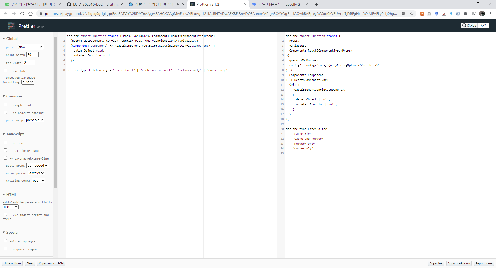
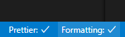
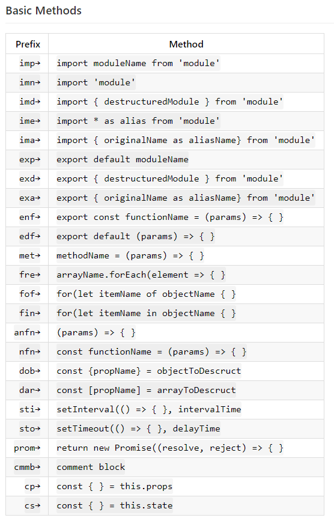

[← BACK](./README.md)

# DAY 03 (2020-10-21, 수)

### Prettier - Code formatter🤸‍♀️

#### 설정된 규칙에 따라 자동으로 코드 스타일을 정리해준다🔧

설정

1. **Settings**패널(Windows에서는 `ctrl` + `,`)을 열어 'format javascript' 검색 후 사용하지 않도록 설정(체크 해제)

2. 'format on save' 검색 후 사용하도록 설정(체크)

3. 'prettier' 검색 후 사용할 Prettier 규칙을 설정(체크 또는 해제)

[Prettier Playground](https://prettier.io/playground/) 서비스로 실시간 규칙 적용 확인 가능👇

 

### Formatting Toggle🤸‍♀️

#### 클릭 한 번으로 포멧터(Prettier, Beautify 등)을 켜고 끌 수 있다🔧

Formatting Toggle을 설치하면 VS Code 하단 탭에 아래와 같이 포맷터의 상태를 체크하거나 해제할 수 있게 된다.

 

### React Snippets🤸‍♀️

#### React 앱 개발에서 자주 사용하는 코드 조각을 빠르게 작성하도록 도와주는 ES7 React snippets 확장이다🔧

 

### React Pure To Class🤸‍♀️

### Auto Import🤸‍♀️

### Import Cost🤸‍♀️

### Auto Complete Tag🤸‍♀️

### Bracket Pair Colorizer 2🤸‍♀️

### Color Highlight & Manager🤸‍♀️

### Image Preview🤸‍♀️

### Translator🤸‍♀️
