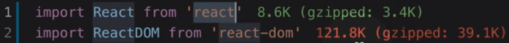

[← BACK](./README.md)

# DAY 03 (2020-10-21, 수)

### Prettier - Code formatter🤸‍♀️

#### 설정된 규칙에 따라 자동으로 코드 스타일을 정리해준다🔧

설정

1. **Settings**패널(Windows에서는 `ctrl` + `,`)을 열어 'format javascript' 검색 후 사용하지 않도록 설정(체크 해제)

2. 'format on save' 검색 후 사용하도록 설정(체크)

3. 'prettier' 검색 후 사용할 Prettier 규칙을 설정(체크 또는 해제)

[Prettier Playground](https://prettier.io/playground/) 서비스로 실시간 규칙 적용 확인 가능👇

---

### Formatting Toggle🤸‍♀️

#### 클릭 한 번으로 포멧터(Prettier, Beautify 등)을 켜고 끌 수 있다🔧

Formatting Toggle을 설치하면 VS Code 하단 탭에 아래와 같이 포맷터의 상태를 체크하거나 해제할 수 있게 된다.

---

### React Snippets🤸‍♀️

#### React 앱 개발에서 자주 사용하는 코드 조각을 빠르게 작성하도록 도와주는 ES7 React snippets 확장이다🔧

---

### React Pure To Class🤸‍♀️

#### React 함수형 컴포넌트를 클래스 컴포넌트로 손쉽게 변경할 수 있다🔧

변경하고 싶은 영역을 블록 선택한 다음에, `F1` 키를 누르고, React Pure To Class라고 검색하여 `Enter`를 누르면 클래스 컴포넌트로 변경된다.

🤔그런데 매번 이렇게 하기도 귀찮기 때문에 `바로 가기 키` 설정(VS Code 좌측 하단의 기어 모양으로 누르면 있음)에서 `React Pure To Class`를 검색하여 `키 바인딩 추가(+ 버튼)`를 누르고 편리한 단축키로 설정할 수 있다.

---

### Auto Import - ES6, TS, JSX, TSX🤸‍♀️

#### 필요한 모듈을 자동으로 불러 들이는 Auto Import 확장을 설치하면 개발이 편리해진다🔧

<요소 이름> 입력하면 존재하고 있는 컴포넌트를 찾아서 바로 처리해준다.

---

### Import Cost🤸‍♀️

#### 가져온 모듈의 크기를 시각적으로 화면에 표시하려면 Import Cost 확장을 설치한다🔧

가져온 용량이 적당(?)하면 초록색, 크면 빨간색으로 표시된다.  

---

### Path Autocomplete🤸‍♀️

#### 불러올 모듈 파일 경로를 자동 완성하는 Path Autocomplete 확장을 설치하면 개발이 편리해진다🔧

---

### Auto Complete Tag🤸‍♀️

#### 태그 자동 닫기(Auto Close Tag), 태그 자동 이름 변경(Auto Rename Tag) 기능을 함께 사용할 수 있다🔧

---

### Bracket Pair Colorizer 2🤸‍♀️

#### 코드 블록 마다 색상을 부여해 구분을 손쉽게 할 수 있다🔧

---

### Color Highlight & Manager🤸‍♀️

#### Color Highlight를 설치하면 컬러 정보를 가진 텍스트의 색상을 미리보기 할 수 있다. 그리고 Color Manager를 설치하면 JavaScript 파일에서도 컬러 관리를 유용하게 할 수 있다🔧

---

### Image Preview🤸‍♀️

#### 이미지 파일을 에디터에서 미리보기 할 수 있다🔧

---

### Translator🤸‍♀️

#### 클래스, 변수 및 함수 이름을 작성할 때 한글 → 영어 번역 기능을 사용할 수 있다🔧

일단 한글로 써놓고 영어로 변역하고 싶은 부분을 블록 선택한 다음에, `F1` 키를 누르고, Translator라고 검색하여 `Enter`를 누르면 같은 의미의 영어로 변경된다.

---

### 오늘 느낀 점🤸‍♀️

혼자 개발 공부하면서 다른 개발자들이 쓰는 (좋아 보이는) 익스텐션을 야금야금 설치해놨더니 오늘 소개받은 것 중 상당수가 이미 깔려 있었다. 오늘은 꼭 자정에 자야지 했는데 성공 (저녁 멍상을 빼먹은 결과라 살짝 찜찜)!🤶  
무엇이든 꾸준히 하기 위해서는 체력 관리, 수면 관리가 정말 중요한 것 같다. 오늘부터 푹 자고 체력 충전💪, 의지 충전🔥

야광인형

