[← BACK](./README.md)

# DAY 04 (2020-10-22, 목)

### Virtual DOM🤸‍♀️

#### Part 00. 환경설정🔧

0. [virtual-dom](https://github.com/Matt-Esch/virtual-dom)?  
   A JavaScript DOM(Document Object Model) model supporting element creation, diff computation and path operations for efficient re-rendering

1. npm을 사용하여 budo라는 패키지를 설치한다.

```sh
# package.json 파일을 생성한다.
$ npm init -y

# 개발 버전으로 budo를 설치한다.
$ npm i -D budo
```

2. `package.json` 파일의 내용을 아래와 같이 변경한다.  
   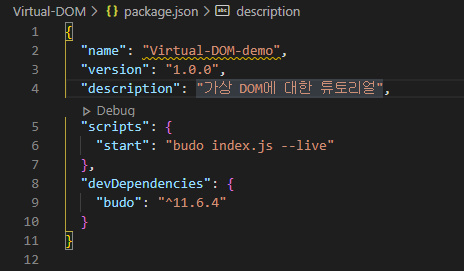

3. virtual DOM을 설치한다.

```sh
# virtual-DOM을 설치한다.
$ npm i -S virtual-DOM
```

이제 `package.json` 파일을 보면 `dependencies`에 `virtual-DOM`이 추가된 것을 확인할 수 있다.  
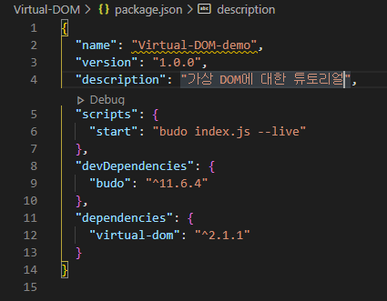

4. `index.js` 파일과 `index.html` 파일을 생성한다.

```sh
# index.html
<!DOCtype html>
<html lang="ko-KR">

<head>
    <meta charset="UTF-8">
    <meta http-equiv="X-UA-Compatible" content="IE=Edge">
    <title>가상 DOM 학습</title>
</head>

<body>
    # index.js 호출
    <script src="index.js"></script>
</body>

</html>
```

5.  `npm start`

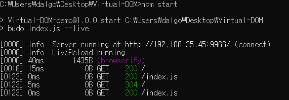

👉여기까지 하고 `http://192.168.35.45:9966/`에 접속하면 <ins>가상 DOM 학습</ins>이라는 탭의 빈 페이지가 나온다.

#### Part 01. 실제 DOM model 컨트롤🔧

6. `index.js` 파일을 아래와 같이 작성해본다.

```sh
# index.js
// Actual DOM
var actual_dom = document.createElement("p");

actual_dom.innerHTML = "Actual DOM";

document.body.appendChild(actual_dom);
```

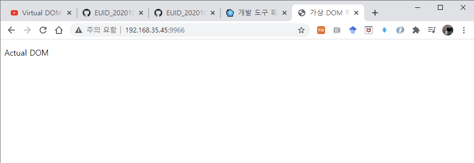

#### Part 2. 가상 DOM model 컨트롤🔧

`virtual-dom`은 다음의 네 가지 모듈을 지원한다.

- For `create-element.js`see the [vdom README](https://github.com/Matt-Esch/virtual-dom/blob/master/vdom/README.md)
- For `diff.js` see the [vtree README](https://github.com/Matt-Esch/virtual-dom/blob/master/vtree/README.md)
- For `h.js` see the [virtual-hyperscript README](https://github.com/Matt-Esch/virtual-dom/blob/master/virtual-hyperscript/README.md)
- For `patch.js` see the [vdom README](https://github.com/Matt-Esch/virtual-dom/blob/master/vdom/README.md)

7. `h.js`로 <ins>virtual tree</ins>를 만든다.
   `virtual-hyperscript`는 virtual tree를 만들어주는 역할을 한다.  
   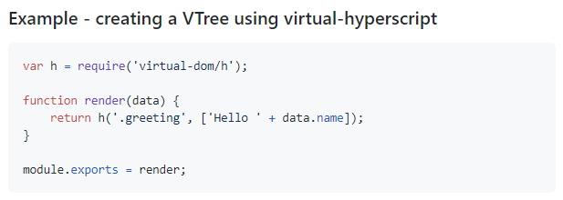

위의 예시를 참조하여 `index.js` 파일에 아래와 같이 스크립트를 작성한다.

```sh
# virtual-dom에 있는 h 모듈을 불러온다
var h = require("virtual-dom/h");

// Virtual DOM
# h 모듈이 무엇인지 확인하기 위해 typeof를 찍어본다
console.log(typeof h);
```

페이지의 콘솔 창을 보면 `virtual-dom`의 `h` 모듈 유형은 <ins>function</ins>임을 확인할 수 있다.  
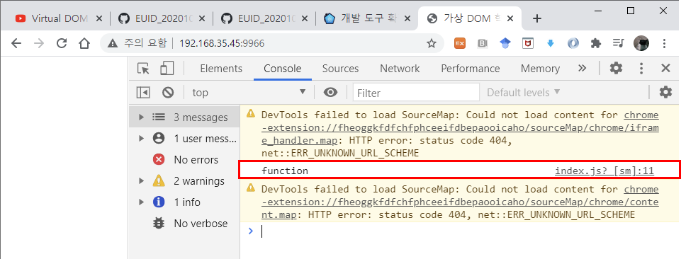

```sh
# virtual-dom에 있는 h 모듈을 불러온다
var h = require("virtual-dom/h");

// Virtual DOM
var tree = h('p', 'virtual dom')

console.log(tree)
```

페이지의 콘솔 창을 보면 `Virtual Mode`가 생성되어 있고, `tagName`은 `p`, `Virtual Text`의 `text`는 `virtual dom`임을 확인할 수 있다.  
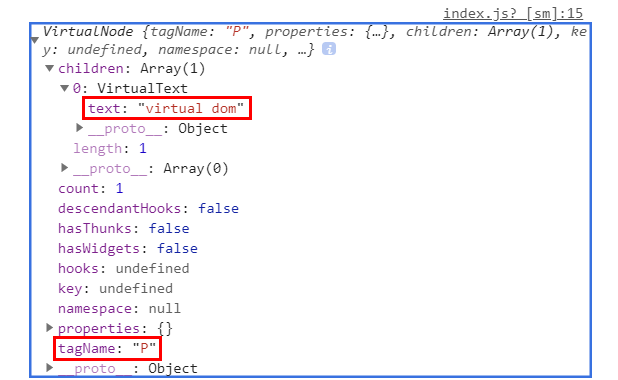

8. `create-element.js`로 앞서 생성한 tree를 실제 html element에 붙여본다.
   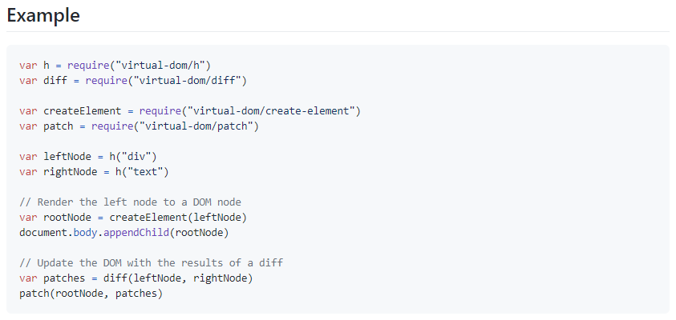

```sh
# index.js
var h = require("virtual-dom/h");
var createElement = require("virtual-dom/create-element");

// Actual DOM
# 가상으로 tree를 만든다
var tree = h("p", "virtual dom");
# element를 생성한다
var rootNode = createElement(tree);
# body 요소에 element를 붙여준다
document.body.appendChild(rootNode);
```

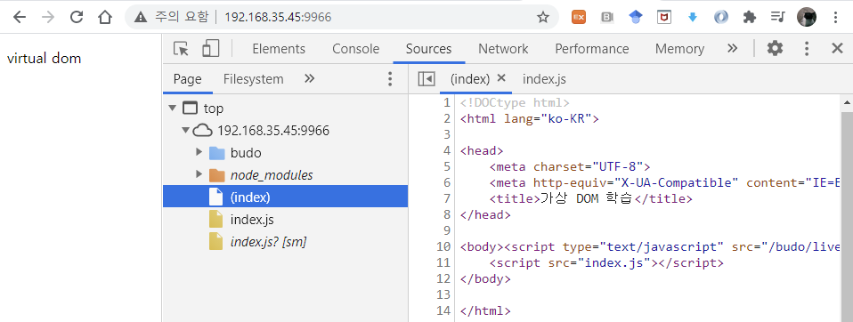

#### Part 3. 가상 DOM 가상 트리 비교 후, 패치🔧

9. `diff.js`로 기존 노드와 변경 사항을 감지한다.
   

10. `patch.js`로 변경 사항을 rootNode에 적용한다.
    

```sh
# index.js
var h = require("virtual-dom/h");
var createElement = require("virtual-dom/create-element");
var diff = require("virtual-dom/diff");
var patch = require("virtual-dom/patch");


// Virtual DOM

var count = 0;

function render(n) {
  return h("p", "virtual dom" + n);
}

function update() {
  // 새로운 가상 트리를 생성
  var newTree = render(++count);
  // 기존 가상 트리, 새로운 가상 트리하고 변경점이 있는지 확인
  var patches = diff(tree, newTree);
  // 변경사항이 발생하면 rootNode에 패치
  patch(rootNode, patches);
}

var tree = render(count);
var rootNode = createElement(tree);

document.body.appendChild(rootNode);

window.setInterval(function () {
  update();
}, 1400);

```

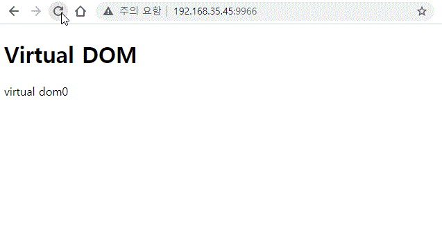

#### Part 4. 가상 DOM 배열 데이터 순환 처리🔧

11. `count` 대신 `배열 데이터`를 적용해본다.

```sh
# index.js
var h = require("virtual-dom/h");
var createElement = require("virtual-dom/create-element");
var diff = require("virtual-dom/diff");
var patch = require("virtual-dom/patch");


// Virtual DOM

var data = [
    "vue.js",
    "angular",
    "react"
    ];

function render(data) {
  var lists = data.map(function (item, index) {
    return h("li", item);
  });
  return h("ul", lists);
}

function update() {
  // 새로운 가상 트리를 생성
  var newTree = render(data);
  // 기존 가상 트리, 새로운 가상 트리하고 변경점이 있는지 확인
  var patches = diff(tree, newTree);
  // 변경사항이 발생하면 rootNode에 패치
  patch(rootNode, patches);
}

var tree = render(data);
var rootNode = createElement(tree);

document.body.appendChild(rootNode);

window.setInterval(function () {
  update();
}, 1400);

```

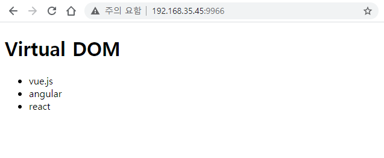

#### Part 5. 가상 DOM 제거 버튼🔧

12. 아이템을 지울 수 있는 `delete` 버튼을 추가해본다.

```sh
var h = require("virtual-dom/h");
var createElement = require("virtual-dom/create-element");
var diff = require("virtual-dom/diff");
var patch = require("virtual-dom/patch");

var data = ["vue.js", "angular", "react"];

function render(data) {
  var deleteBtn = h("button", { type: "button" }, "delete");
  var lists = data.map(function (item, index) {
    return h("li", [item, deleteBtn]);
  });
  return h("ul", lists);
}

function update() {
  // 새로운 가상 트리를 생성
  var newTree = render(data);
  // 기존 가상 트리, 새로운 가상 트리하고 변경점이 있는지 확인
  var patches = diff(tree, newTree);
  // 변경사항이 발생하면 rootNode에 패치
  patch(rootNode, patches);
}

var tree = render(data);
var rootNode = createElement(tree);

document.body.appendChild(rootNode);
```

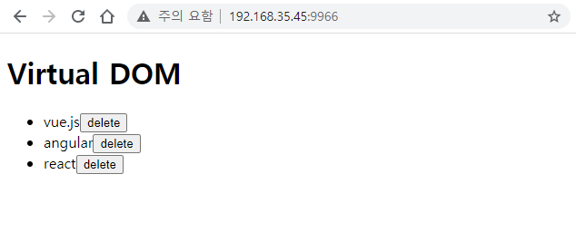

13. 앞서 만든 `delete` 버튼에 이벤트를 바인딩한다.

```sh
var h = require("virtual-dom/h");
var createElement = require("virtual-dom/create-element");
var diff = require("virtual-dom/diff");
var patch = require("virtual-dom/patch");

var data = ["vue.js", "angular", "react"];

function render(data) {
  var lists = data.map(function (item, index) {
    return h("li", [
      item,
      h(
        "button",
        {
          type: "button",
          onclick: function (e) {
            // 모델 데이터 변경
            data.splice(index, 1);
            console.log("data");
            // 화면 뷰 업데이트
            update();
          },
        },
        "delete"
      ),
    ]);
  });

  var list = h("ul", lists);

  return list;
}

function update() {
  // 새로운 가상 트리를 생성
  var newTree = render(data);
  // 기존 가상 트리, 새로운 가상 트리하고 변경점이 있는지 확인
  var patches = diff(tree, newTree);
  // 변경사항이 발생하면 rootNode에 패치
  patch(rootNode, patches);
}

var tree = render(data);
var rootNode = createElement(tree);

document.body.appendChild(rootNode);
```

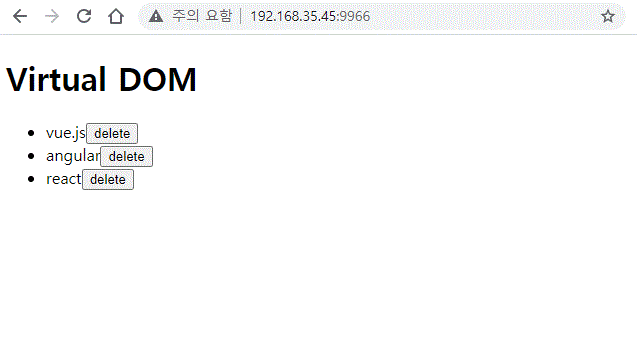

#### Part 6. 가상 DOM 추가 버튼🔧

14. 삭제 버튼과 마찬가지로 추가 버튼을 만들고 이벤트를 바인딩한다.

```sh
var h = require("virtual-dom/h");
var createElement = require("virtual-dom/create-element");
var diff = require("virtual-dom/diff");
var patch = require("virtual-dom/patch");

var data = ["vue.js", "angular", "react"];

function render(data) {
  var lists = data.map(function (item, index) {
    return h("li", [
      item,
      h(
        "button",
        {
          type: "button",
          onclick: function (e) {
            // 모델 데이터 변경
            data.splice(index, 1);
            console.log("data");
            // 화면 뷰 업데이트
            update();
          },
        },
        "delete"
      ),
    ]);
  });

  var list = h("ul", lists);

  var input = h("input.add-content", {
    type: "text",
    placeholder: "Add Favorite Framework",
  });

  var add_btn = h(
    "button.add-btn",
    {
      type: "button",
      onclick: function (e) {
        var input = document.querySelector(".add-content");
        // 모델 데이터 업데이트
        data.push(input.value);
        // 화면 뷰 업데이트
        update();
        // 인풋 초기화
        input.value = "";
      },
    },
    "Add"
  );

  var container = h("div.container", [input, add_btn, list]);

  return container;
}

function update() {
  // 새로운 가상 트리를 생성
  var newTree = render(data);
  // 기존 가상 트리, 새로운 가상 트리하고 변경점이 있는지 확인
  var patches = diff(tree, newTree);
  // 변경사항이 발생하면 rootNode에 패치
  patch(rootNode, patches);
  // tree 변수 값 업데이트
  tree = newTree;
}

var tree = render(data);
var rootNode = createElement(tree);

document.body.appendChild(rootNode);

```

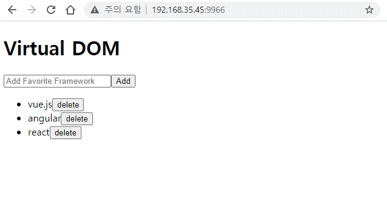
