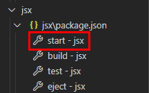
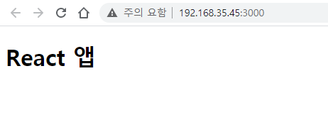
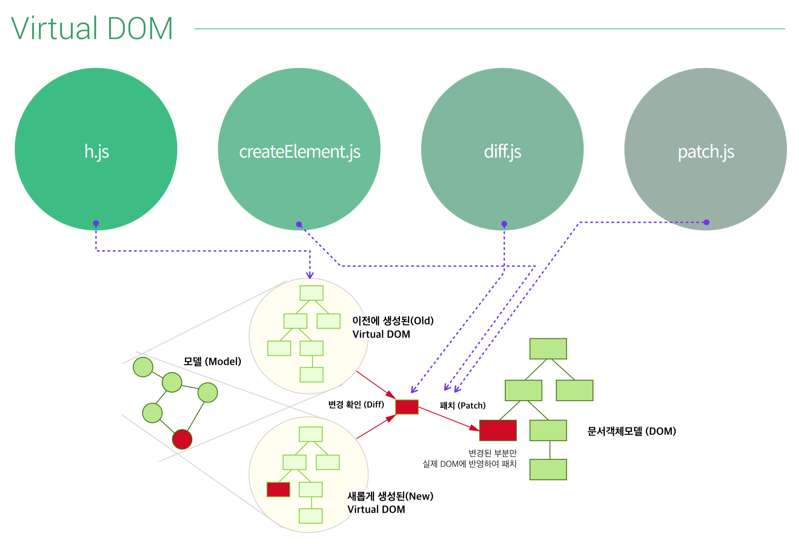
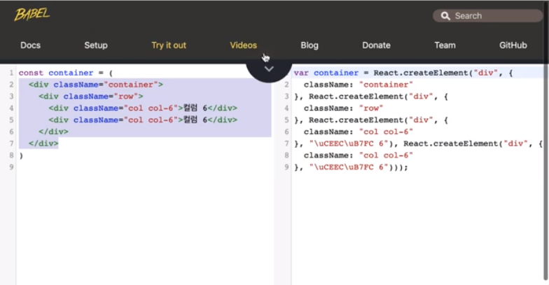

[← BACK](./README.md)

# DAY 04 (2020-10-22, 목)

## Virtual DOM🤸‍♀️

### Part 00. 환경설정🔧

0. [virtual-dom](https://github.com/Matt-Esch/virtual-dom)?  
   A JavaScript DOM(Document Object Model) model supporting element creation, diff computation and path operations for efficient re-rendering

1. npm을 사용하여 budo라는 패키지를 설치한다.

```sh
# package.json 파일을 생성한다.
$ npm init -y

# 개발 버전으로 budo를 설치한다.
$ npm i -D budo
```

2. `package.json` 파일의 내용을 아래와 같이 변경한다. <br />
   

3. virtual DOM을 설치한다.

```sh
# virtual-DOM을 설치한다.
$ npm i -S virtual-DOM
```

이제 `package.json` 파일을 보면 `dependencies`에 `virtual-DOM`이 추가된 것을 확인할 수 있다. <br />


4. `index.js` 파일과 `index.html` 파일을 생성한다.

```sh
# index.html
<!DOCtype html>
<html lang="ko-KR">

<head>
    <meta charset="UTF-8">
    <meta http-equiv="X-UA-Compatible" content="IE=Edge">
    <title>가상 DOM 학습</title>
</head>

<body>
    #index.js 호출
    <script src="index.js"></script>
</body>

</html>
```

5.  `npm start`


👉여기까지 하고 `http://192.168.35.45:9966/`에 접속하면 <ins>가상 DOM 학습</ins>이라는 탭의 빈 페이지가 나온다.

---

### Part 01. 실제 DOM model 컨트롤🔧

6. `index.js` 파일을 아래와 같이 작성해본다.

```sh
#index.js
// Actual DOM
var actual_dom = document.createElement("p");

actual_dom.innerHTML = "Actual DOM";

document.body.appendChild(actual_dom);
```


---

### Part 2. 가상 DOM model 컨트롤🔧

`virtual-dom`은 다음의 네 가지 모듈을 지원한다.

- For `create-element.js`see the [vdom README](https://github.com/Matt-Esch/virtual-dom/blob/master/vdom/README.md)
- For `diff.js` see the [vtree README](https://github.com/Matt-Esch/virtual-dom/blob/master/vtree/README.md)
- For `h.js` see the [virtual-hyperscript README](https://github.com/Matt-Esch/virtual-dom/blob/master/virtual-hyperscript/README.md)
- For `patch.js` see the [vdom README](https://github.com/Matt-Esch/virtual-dom/blob/master/vdom/README.md)

7. `h.js`로 <ins>virtual tree</ins>를 만든다.
   `virtual-hyperscript`는 virtual tree를 만들어주는 역할을 한다.  
   

위의 예시를 참조하여 `index.js` 파일에 아래와 같이 스크립트를 작성한다.

```sh
# virtual-dom에 있는 h 모듈을 불러온다
var h = require("virtual-dom/h");

// Virtual DOM
# h 모듈이 무엇인지 확인하기 위해 typeof를 찍어본다
console.log(typeof h);
```

페이지의 콘솔 창을 보면 `virtual-dom`의 `h` 모듈 유형은 <ins>function</ins>임을 확인할 수 있다. <br />


```sh
# virtual-dom에 있는 h 모듈을 불러온다
var h = require("virtual-dom/h");

// Virtual DOM
var tree = h('p', 'virtual dom')

console.log(tree)
```

페이지의 콘솔 창을 보면 `Virtual Mode`가 생성되어 있고, `tagName`은 `p`, `Virtual Text`의 `text`는 `virtual dom`임을 확인할 수 있다.  


8. `create-element.js`로 앞서 생성한 tree를 실제 html element에 붙여본다.
   

```sh
#index.js
var h = require("virtual-dom/h");
var createElement = require("virtual-dom/create-element");

// Actual DOM
# 가상으로 tree를 만든다
var tree = h("p", "virtual dom");
# element를 생성한다
var rootNode = createElement(tree);
# body 요소에 element를 붙여준다
document.body.appendChild(rootNode);
```


---

### Part 3. 가상 DOM 가상 트리 비교 후, 패치🔧

9. `diff.js`로 기존 노드와 변경 사항을 감지한다.
   

10. `patch.js`로 변경 사항을 rootNode에 적용한다.
    

```sh
#index.js
var h = require("virtual-dom/h");
var createElement = require("virtual-dom/create-element");
var diff = require("virtual-dom/diff");
var patch = require("virtual-dom/patch");


// Virtual DOM

var count = 0;

function render(n) {
  return h("p", "virtual dom" + n);
}

function update() {
  // 새로운 가상 트리를 생성
  var newTree = render(++count);
  // 기존 가상 트리, 새로운 가상 트리하고 변경점이 있는지 확인
  var patches = diff(tree, newTree);
  // 변경사항이 발생하면 rootNode에 패치
  patch(rootNode, patches);
}

var tree = render(count);
var rootNode = createElement(tree);

document.body.appendChild(rootNode);

window.setInterval(function () {
  update();
}, 1400);

```


---

### Part 4. 가상 DOM 배열 데이터 순환 처리🔧

11. `count` 대신 `배열 데이터`를 적용해본다.

```sh
#index.js
var h = require("virtual-dom/h");
var createElement = require("virtual-dom/create-element");
var diff = require("virtual-dom/diff");
var patch = require("virtual-dom/patch");


// Virtual DOM

var data = [
    "vue.js",
    "angular",
    "react"
    ];

function render(data) {
  var lists = data.map(function (item, index) {
    return h("li", item);
  });
  return h("ul", lists);
}

function update() {
  // 새로운 가상 트리를 생성
  var newTree = render(data);
  // 기존 가상 트리, 새로운 가상 트리하고 변경점이 있는지 확인
  var patches = diff(tree, newTree);
  // 변경사항이 발생하면 rootNode에 패치
  patch(rootNode, patches);
}

var tree = render(data);
var rootNode = createElement(tree);

document.body.appendChild(rootNode);

window.setInterval(function () {
  update();
}, 1400);

```


---

### Part 5. 가상 DOM 제거 버튼🔧

12. 아이템을 지울 수 있는 `delete` 버튼을 추가해본다.

```sh
#index.js
var h = require("virtual-dom/h");
var createElement = require("virtual-dom/create-element");
var diff = require("virtual-dom/diff");
var patch = require("virtual-dom/patch");

var data = ["vue.js", "angular", "react"];

function render(data) {
  var deleteBtn = h("button", { type: "button" }, "delete");
  var lists = data.map(function (item, index) {
    return h("li", [item, deleteBtn]);
  });
  return h("ul", lists);
}

function update() {
  // 새로운 가상 트리를 생성
  var newTree = render(data);
  // 기존 가상 트리, 새로운 가상 트리하고 변경점이 있는지 확인
  var patches = diff(tree, newTree);
  // 변경사항이 발생하면 rootNode에 패치
  patch(rootNode, patches);
}

var tree = render(data);
var rootNode = createElement(tree);

document.body.appendChild(rootNode);
```


13. 앞서 만든 `delete` 버튼에 이벤트를 바인딩한다.

```sh
var h = require("virtual-dom/h");
var createElement = require("virtual-dom/create-element");
var diff = require("virtual-dom/diff");
var patch = require("virtual-dom/patch");

var data = ["vue.js", "angular", "react"];

function render(data) {
  var lists = data.map(function (item, index) {
    return h("li", [
      item,
      h(
        "button",
        {
          type: "button",
          onclick: function (e) {
            // 모델 데이터 변경
            data.splice(index, 1);
            console.log("data");
            // 화면 뷰 업데이트
            update();
          },
        },
        "delete"
      ),
    ]);
  });

  var list = h("ul", lists);

  return list;
}

function update() {
  // 새로운 가상 트리를 생성
  var newTree = render(data);
  // 기존 가상 트리, 새로운 가상 트리하고 변경점이 있는지 확인
  var patches = diff(tree, newTree);
  // 변경사항이 발생하면 rootNode에 패치
  patch(rootNode, patches);
}

var tree = render(data);
var rootNode = createElement(tree);

document.body.appendChild(rootNode);
```


---

### Part 6. 가상 DOM 추가 버튼🔧

14. 삭제 버튼과 마찬가지로 추가 버튼을 만들고 이벤트를 바인딩한다.

```sh
#index.js
var h = require("virtual-dom/h");
var createElement = require("virtual-dom/create-element");
var diff = require("virtual-dom/diff");
var patch = require("virtual-dom/patch");

var data = ["vue.js", "angular", "react"];

function render(data) {
  var lists = data.map(function (item, index) {
    return h("li", [
      item,
      h(
        "button",
        {
          type: "button",
          onclick: function (e) {
            // 모델 데이터 변경
            data.splice(index, 1);
            console.log("data");
            // 화면 뷰 업데이트
            update();
          },
        },
        "delete"
      ),
    ]);
  });

  var list = h("ul", lists);

  var input = h("input.add-content", {
    type: "text",
    placeholder: "Add Favorite Framework",
  });

  var add_btn = h(
    "button.add-btn",
    {
      type: "button",
      onclick: function (e) {
        var input = document.querySelector(".add-content");
        // 모델 데이터 업데이트
        data.push(input.value);
        // 화면 뷰 업데이트
        update();
        // 인풋 초기화
        input.value = "";
      },
    },
    "Add"
  );

  var container = h("div.container", [input, add_btn, list]);

  return container;
}

function update() {
  // 새로운 가상 트리를 생성
  var newTree = render(data);
  // 기존 가상 트리, 새로운 가상 트리하고 변경점이 있는지 확인
  var patches = diff(tree, newTree);
  // 변경사항이 발생하면 rootNode에 패치
  patch(rootNode, patches);
  // tree 변수 값 업데이트
  tree = newTree;
}

var tree = render(data);
var rootNode = createElement(tree);

document.body.appendChild(rootNode);

```


---

## JSX ➪ React 요소🤸‍♀️

### React 요소를 만드는 두 가지 방법🔧

- JSX란?

  - JSX(JavaScript Syntax eXtension)는 JavaScript 문법 확장으로 구문이 HTML과 유사하다.
  - JSX가 하는 일은 딱 하나! <ins>React 요소(Element)를 만드는 것이다.</ins>
  - React 요소는 실제 DOM 요소가 아니라, JavaScript 객체다.

- 실습하기

```sh
# jsx라는 이름으로 새로운 react 프로젝트 생성
npx create-react-app jsx
```

VS code에서 `NPM 스크립트` 클릭한 다음 `jsx\package.json`에서 실행가능한 명령어 중에 `start - jsx`를 실행한다.


<ins> 
 
 1. JSX로 React 요소 만들기

 </ins>

```sh
#index.js
import React from "react";
import ReactDOM from "react-dom";

// React Element <- React.createElement() or JSX
// JSX로 React Element 생성
const app = (
  <div className="app">
    <h1>React 앱</h1>
  </div>
);

ReactDOM.render(app, document.getElementById("root"));
```



<ins>

2. React.createElement()로 React 요소 만들기

</ins>
```sh
import React from "react";
import ReactDOM from "react-dom";

// React Element <- React.createElement() or JSX
// React.createElement()로 React Element 생성
const appHeading = React.createElement(
"h1",
null,
"React.createElement() 메서드"
);

const appElement = React.createElement(
"div",
{
class: "app",
},
appHeading
);

ReactDOM.render(appElement, document.getElementById("root"));

```

로 React Element 생성") <br />

😉1과 2를 비교하면, <ins>React 요소를 생성하는 방식에 있어 JSX를 사용하는 편이 훨씬 간단하다</ins>는 걸 알 수 있다.

---

### 가상 DOM이란?🔧

- React DOM은 가상 모듈이다. ReactDOM 모듈은 React 요소로 구성된 가상 DOM을 실제 DOM에 장착(Mount)시켜 렌더링(Rendering)하는 역할을 수행한다.

 <br />

- Virtual DOM system은 역할에 따라 크게 네 개의 모듈로 구성되어 있다.

1. `h.js` 가상 DOM 요소 생성
2. `createElement.js` 실제 DOM 요소를 생성
3. `diff.js` 이전과 이후의 변경사항을 비교
4. `patch.js` 바뀐 내용을 패치

- 가상 DOM은 실제 DOM에 직접적으로 조작하는 것이 아니라, 이전/이후 상태를 비교하여 변경 사항이 발생할 때 변경된 부분만 실제 DOM에 업데이트(patch) 하므로 UI 속도를 대폭 향상시킬 수 있다.

---

### JSX 코드가 Babel 컴파일러를 만나면?🔧

- Babel's Compile
  Babel은 JSX를 `React.createElement()`를 사용해 컴파일한다.<br />
  즉 사용자가 JSX 코드로 작성하면, Babel은 코드를 `React.createElement()`으로 바꾸고 실제 DOM을 업데이트한다.
- [Babel REPL](https://babeljs.io/repl/#?browsers=defaults%2C%20not%20ie%2011%2C%20not%20ie_mob%2011&build=&builtIns=false&spec=false&loose=false&code_lz=Q&debug=false&forceAllTransforms=false&shippedProposals=false&circleciRepo=&evaluate=false&fileSize=false&timeTravel=false&sourceType=module&lineWrap=true&presets=env%2Creact%2Cstage-2&prettier=false&targets=&version=7.12.3&externalPlugins=)<br />
  REPL은 Read, Evaluation, Print, Loop의 약자다. 말 그대로 작성을 해서 읽고, 실행시키고, 프린트하고, 반복할 수 있다. <br />
  아래 캡쳐는 Babel REPL에서 사용자가 작성한 JSX가 Babel에 의해 어떻게 변환되는지 보여주고 있다. <br />

   <br />

---

## 오늘 느낀 점🤸‍♀️

쫌 재밌어진다😉 아침에 정신 멀쩡할 때 들을 수 있다면 더 꼼꼼히 듣고 많은 내용을 직접 찾은 뒤에 정리할 수 있을 텐데 아쉽다..ㅠㅠ 직접 찾아보면서 해야 하는건데ㅠㅠ 주말에 더 해야지!🤖
```
