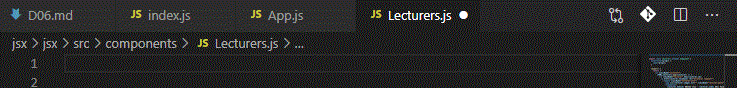

[← BACK](./README.md)

# DAY 06 (2020-10-26, 월)

> _복습이 필요한 부분에는 🤯가 달려있습니다._ > _알면 좋은 귤팁에는 🍊이 달려있습니다._

## 1. 컴포넌트 & 전달 속성 (props)

<ins>컴포넌트는 UI를 구성하는 조각(piece)에 해당되며, 독립적으로 분리되어 재사용을 됨을 목적으로 사용</ins>된다. React 앱에서 컴포넌트는 개별적인 JavaScript 파일로 분리되어 관리한다. (예: Header, HeaderTitle, Wrapper, List, ListItem 컴포넌트)

### React 함수형 컴포넌트

React 컴포넌트는 개념상 JavaScript 함수와 유사하다. 컴포넌트 외부로부터 속성(props)을 전달 받아 어떻게 UI를 구성해야 할지 설정하여 React 요소(JSX를 Babel이 변환 처리)로 반환한다. 이러한 문법 구문을 사용하는 컴포넌트를 React는 '함수형(functional)'으로 분류힌다.

> 컴포넌트 이름은 항상 대문자로 시작하는 `TitleCase` 문법 사용이 권장된다. (HTML 표준 요소와 구분)
>
> ```sh
> <BaseButton>메뉴 펼치기</BaseButton>
> ```

```sh
#index.js
...

// JSX => Compoment
function App() {
  return (
    <div className="app">
      <h1>Front-End Masters League 강사진</h1>
      <ul className="lecturers">
        {FEML_lecturers.map((lecturer) => (
          <li className="lecturer" key={lecturer.id}>
            <a href={lecturer.facebook} rel="noreferer noopener">
              <figure className="lecturer-info">
                
                <figcaption>
                  {lecturer.module} 모듈을 담당할 {lecturer.name} 강사 Facebook
                  바로가기
                </figcaption>
              </figure>
            </a>
          </li>
        ))}
      </ul>
    </div>
  );
}

...
```

위 코드에서 내부에 있는 `ul` 요소도 외부로 분리할 수 있다.

```sh
#index.js
...

function Lecturers() {
  return (
    <ul className="lecturers">
      {FEML_lecturers.map((lecturer) => (
        <li className="lecturer" key={lecturer.id}>
          <a href={lecturer.facebook} rel="noreferer noopener">
            <figure className="lecturer-info">
              
              <figcaption>
                {lecturer.module} 모듈을 담당할 {lecturer.name} 강사 Facebook
                바로가기
              </figcaption>
            </figure>
          </a>
        </li>
      ))}
    </ul>
  );
}

// JSX => Compoment
function App() {
  return (
    <div className="app">
      <h1>Front-End Masters League 강사진</h1>
      <Lecturers />
    </div>
  );
}

...
```

🤖**React Developer Tools**를 설치하면 `Components`, `Profiler`와 같은 패널이 브라우저 개발자 도구에 표시된다. 위에서 작성한 코드를 개발자 도구의 `Components`패널에서 살펴보면 `App` 컴포넌트 내부에 `Lecturers` 컴포넌트가 있는 걸 확인할 수 있다. <br /><br />


---

### React 클래스 컴포넌트

위에서 사용했던 함수형 컴포넌트 대신 사용할 수 있다. ES6 부터 지원되는 [클래스 문법](https://developer.mozilla.org/ko/docs/Web/JavaScript/Reference/Classes)을 사용해 컴포넌트를 정의하는 방식이다. <ins>아래의 예시와 같이 `Pure to Class` 익스텐션을 사용하여 손쉽게 클래스 컴포넌트로 변환할 수 있다.</ins><br /><br />
<br /><br />
`Pure to Class` 익스텐션을 사용하여 클래스 컴포넌트로 변환하고자 할 때에는, 변환하려는 부분을 블록 처리한 다음 `F1 key`를 누르고 `Pure to Class`를 찾아 누르면 된다. 그러면 블록 처리한 부분이 클래스 컴포넌트로 변환되면서 `render()` 메서드와 `class`, `extends`가 생성됨을 확인할 수 있다.<br /><br />

아래와 같이 `React.Component`를 `Component`로 바꾸고 `React`를 호출(`import`)하는 과정에서 `{ Component }`를 추가할 수 있다. <br /><br />
<br /><br />

```sh
#index.js
...

class Lecturers extends Component {
  constructor(props) {
    super(props);
  }

  render() {
    return (
      <ul className="lecturers">
        {FEML_lecturers.map((lecturer) => (
          <li className="lecturer" key={lecturer.id}>
            <a href={lecturer.facebook} rel="noreferer noopener">
              <figure className="lecturer-info">
                
                <figcaption>
                  {lecturer.module} 모듈을 담당할 {lecturer.name} 강사 Facebook
                  바로가기
                </figcaption>
              </figure>
            </a>
          </li>
        ))}
      </ul>
    );
  }
}

...
```

클래스 컴포넌트 가운데 `render()` 메서드는 JSX 코드를 반환시키는 역할을 한다. `constructor`는 클래스를 통해 생성된 인스턴스가 생성 과정에서 필요로 하는 초기 수행과정을 처리하게 된다. 이 같은 경우에 `constructor`는 `Component`가 전달받는 속성인 `props`를 `super` 메서드를 사용해서 전달을 해줘야지만 React의 컴포넌트로서 역할을 수행할 수 있게 된다. <br /><br />

> **함수형 컴포넌트와 클래스 컴포넌트의 차이는?** <br />
> 둘은 거의 유사하지만, <ins>클래스 컴포넌트의 경우 함수형에는 없는 기능을 추가적으로 사용할 수 있다는 점에서 차이가 있다.</ins>

---

### React 컴포넌트 import, export / props

#### 컴포넌트 렌더링

> 🍊여기서 잠깐! `import React, { Component } from 'react'` 한 번에 쓰고 싶을 때 `imrc`

> <br /><br />

아래의 예시에서 정의 (또는 선언) 된 `Lecturers` 컴포넌트는 React 요소 `<Lecturers />`을 사용해 렌더링한다.

```sh
#App.js
import React from "react";
import Lecturers from "./components/Lecturers";

function App() {
  return (
    <div className="app">
      <h1>Front-End Masters League 강사진</h1>
      <Lecturers />
    </div>
  );
}

// export React Component (Functional)
export default App;
```

`"./components/Lecturers"`에 있는 코드를 살펴보면 다음과 같다.

```sh
import React, { Component } from "react";

const FEML_lecturers = [
  {
    id: "lecturer-az01871",
    name: "김데라사",
    module: "A",
    facebook: "https://facebook.com/seulbinim",
    image: "https://yamoo9.github.io/images/photo-deresa@2x.png",
  },
  {
    id: "lecturer-az01872",
    name: "야무",
    module: "B, C",
    facebook: "https://facebook.com/yamoo9",
    image: "https://yamoo9.github.io/images/photo-yamoo9@2x.png",
  },
];

export default class Lecturers extends Component {
  constructor(props) {
    super(props);
  }

  render() {
    return (
      <ul className="lecturers">
        {FEML_lecturers.map((lecturer) => (
          <li className="lecturer" key={lecturer.id}>
            <a href={lecturer.facebook} rel="noreferer noopener">
              <figure className="lecturer-info">
                
                <figcaption>
                  {lecturer.module} 모듈을 담당할 {lecturer.name} 강사 Facebook
                  바로가기
                </figcaption>
              </figure>
            </a>
          </li>
        ))}
      </ul>
    );
  }
}

```

#### 전달 속성 (props) 🤯

`props`는 컴포넌트에 전달되는 속성을 말한다.<br />
React는 컴포넌트의 트리로 구성이 되는데, 컴포넌트는 계층구조가 형성이 되면서 부모와 자식의 관계를 갖게 된다. 이때 상위에 있는 컴포넌트, 즉 부모 컴포넌트가 자식 컴포넌트에서 `props`를 전달하여 데이터를 넘겨줄 수 있다. 마찬가지로 자식 컴포넌트는 자손 컴포넌트한테 `props`를 전달하는 방식으로 데이터를 넘겨줄 수 있다.

> **부모 컴포넌트가 전달한 데이터는 자식 컴포넌트가 수정할 수 없다!** <br />
> 컴포넌트에 전달된 속성 `props` 객체는 읽기 전용(read only)이다. 다시 말해 전달받은 속성 값을 수정할 수 없다. 수정하는 대신 컴포넌트 상태 `state`를 활용해야 한다.

---

### React 컴포넌트 관리 (추출)

이미 작성된 컴포넌트 내부에서 컴포넌트로 사용할 수 있는 것이 보인다면 분리하는 것이 좋다. <br /><br />

> 🍊여기서 잠깐! `React 함수형 컴포넌트 만들기`는 `rafc` <br />

> <br />

> 🍊여기서 잠깐! `React 클래스형 컴포넌트 만들기`는 `rcc` <br />

> <br />

```sh
#DiliveryComment.js
import React from "react";
import Avatar from "./Avatar";
import RatingStars from "./RatingStars";
import ReplyComment from "./ReplyComment";

export const DiliveryComment = (props) => {
  return (
    <div className="delivery-comment">
      <div className="commentary">
        <Avatar user={props.user} />
        <RatingStars rating={props.rating} />
        <strong className="user-name">{props.user.name}</strong>
        <time className="comment-date">{props.user.createdAt}</time>
        <p className="comment-content">{props.user.content}</p>
        <ReplyComment />
      </div>
    </div>
  );
};

export default DiliveryComment;
```

위 코드에서 분리한 `Avatar`, `RatingStars`, `ReplyComment` 부분의 예시는 다음과 같다.

```sh
#ReplyComment.js
import React, { Component } from "react";

export default class ReplyComment extends Component {
  render() {
    return
        <div className="reply-comment">{/* ... */}</div>;
  }
}

```

```sh
#RatingStars.js
import React from "react";

export const RatingStars = (props) => {
  return (
    <span
      className={["rating-stars", props.rating.score]}
      ariaLabel={props.rating.label}
    />
  );
};

```

---

## 2. 전달 속성 (props)

### JavaScript 타입 검사

---

### PropTypes를 활용해 컴포넌트 props 검사

---

### PropTypes 속성 기본 값 defaultProps 설정

```

```
