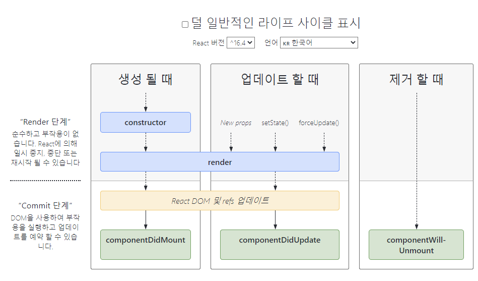

[← BACK](./README.md)

# DAY 07 (2020-10-28, 수)

> _질문에는 ❓, 답변에는 🤖가 달려있습니다._

## state & 라이프 사이클 훅

### 클래스 컴포넌트의 state 란?

컴포넌트는 외부로부터 속성 `props`을 전달받아 사용할 수 있지만, 이렇게 전달받은 속성은 읽기 전용이라 그 값을 업데이트할 수 없다.

> `props`는 단방향 흐름으로 정달되며, 변경할 수 없음(Immutable)은 React 앱의 설계 패턴이다.

❓UI는 사용자 요구에 따라 수시로 변하는데,`props`가 변경 불가하다면 앱 화면은 어떻게 업데이트할 수 있을까?<br />
🤖컴포넌트는 자신의 `state`를 초기화하거나 업데이트할 수 있다. 이때 `state`의 적용 범위는 해당 컴포넌트에 한정된다!

#### 함수형 vs. 클래스 컴포넌트

❓함수형과 클래스의 차이점은?<br />
🤖함수형과 달리 클래스는 자신만의 상태 `state`와 라이프 사이클 훅(lifeCycle hook)을 가진다. 상기한 바와 같이 <ins>클래스 컴포넌트의 상태 정보는 클래스 안에서만 접근 가능</ins>하다.<br />
🤖일반적으로 상태를 가지지 않는 컴포넌트일 경우 함수형을 사용한다. 함수형으로 작성하면 코드가 보다 간결해지기 때문이다. <br /><br />

| 컴포넌트 유형   | 설명                                                          |
| --------------- | ------------------------------------------------------------- |
| 함수형 컴포넌트 | `this` 키워드 사용 X                                          |
| 클래스 컴포넌트 | `this` 키워드로 접근 가능. 상태 및 라이프 사이클 훅 설정 가능 |

#### 클래스 필드

클래스 필드 문법을 사용하면 클래스 컴포넌트의 상태를 손쉽게 설정할 수 있다. 이 구문을 사용하면 생성자 `constructor()` 메서드를 사용하지 않아도 된다.

```sh
import React, { Component } from 'react'

class GlobalNav extends Component {
  // 컴포넌트만 접근 가능한 데이터 객체
  // 생성자 메서드대신 클래스 필드 문법 사용
  state = {
    activeIndex: 0,
  }
  // 렌더
  render() {
    return (
      <nav
        className="global-nav"
        dataActiveIndex={this.state.activeIndex}
      >
        {props.children}
      </nav>
    )
  }
}
```

---

### 컴포넌트 라이프 사이클 훅(Life Cycle Hooks) 이란?

#### 컴포넌트 라이프 사이클

컴포넌트는 프로세스의 특정 시간에 코드를 실행하는 다양한 라이프 사이클 훅이 제공된다. [도식 참조](https://projects.wojtekmaj.pl/react-lifecycle-methods-diagram/)<br /><br />

<br /><br />
라이프 사이클 훅은 다음의 세 가지 단계로 구분된다.

1. 마운팅(Mounting) → 생성
2. 업데이팅(Updating) → 갱신
3. 언 마운팅(Unmounting) → 제거

---

### 생성 시점의 라이프 사이클 훅

#### 1. 마운팅

컴포넌트 인스턴스를 만들고 DOM에 삽입할 때 다음 순서대로 훅 메서드가 실행된다.

| 라이프 사이클 훅                  | 설명                                              |
| --------------------------------- | ------------------------------------------------- |
| `constructor()`                   | 컴포넌트 생성 시점에 호출                         |
| `static getDerivedStateFromProps` | 전달된 상태 및 속성을 가져와 설정하는 시점에 호출 |
| `render()`                        | 컴포넌트 렌더링 시점에 호출                       |
| `componentDidMount()`             | DOM에 마운트 된 이후 시점에 호출                  |

```sh
class LifeCycleHook extends Component {
  // 1.1 컴포넌트 생성
  constructor(props) {
    super(props)
    console.log('컴포넌트 생성')
  }
  // 1.2 전달된 속성, 상태를 가져와 설정
  static getDerivedStateFromProps(props, state) {
    console.log('전달된 속성 및 상태를 가져와 설정')
  }
  // 1.3 컴포넌트 렌더링
  render() {
    console.log('컴포넌트 렌더링')
    return <div />
  }
  // 1.4 컴포넌트 마운팅 됨
  componentDidMount() {
    console.log('컴포넌트 마운팅 됨')
  }
}
```

---

### 업데이트, 제거 시점의 라이프 사이클 훅

#### 2. 업데이팅

업데이트 혹은 `props` 또는 `state`가 변경될 경우 발생한다.

| 라이프 사이클 훅                    | 설명                                                            |
| ----------------------------------- | --------------------------------------------------------------- |
| `static getDerivedStateFromProps()` | 전달된 상태 및 속성을 가져와 설정하는 시점에 호출 (업데이트)    |
| `shouldComponentUpdate()`           | 컴포넌트 업데이트 예정 시점에 호출 (업데이트 하거나, 안 하거나) |
| `render()`                          | 컴포넌트 렌더링 (업데이트)                                      |
| `getSnapshotBeforeUpdate()`         | 컴포넌트 업데이트 된 스냅샷 가져오는 시점에 호출                |
| `componentDidUpdate()`              | 컴포넌트 업데이트 이후 시점에 호출                              |

<br />

```sh
class LifeCycleHook extends Component {
  // 2.1 속성, 상태 설정
  static getDerivedStateFromProps(props, state) {
    console.log('(업데이트) 전달된 속성 및 상태를 가져와 설정')
    return null
  }
  // 2.2 업데이트 할 예정
  shouldComponentUpdate(nextProps, nextState) {
    console.log('성능 최적화 용도로 사용 됨')
    return true // false를 반환할 경우 컴포넌트 렌더링이 취소
  }
  // 2.3 렌더링
  render() {
    console.log('(업데이트) 렌더링')
    return <div />
  }
  // 2.4 DOM에 커밋되기 전
  getSnapshotBeforeUpdate(nextProps, nextState) {
    console.log('DOM에 커밋되기 전 스냅샷 가져오기')
    return null
  }
  // 2.5 업데이트 됨
  componentDidUpdate(prevProps, prevState, snapshot) {
    console.log('업데이트 됨')
  }
}
```

#### 상태 업데이트

컴포넌트의 `state`에 접근하려면 다음과 같이 한다.

```sh
this.state.activeIndex
```

컴포넌트의 `state`를 업데이트하려면 <ins>변경 대신 새롭게 교체하는 방법을 사용해 불변 객체를 유지</ins>한다. 아래와 같이 **setState()** 메서드를 사용하여 `state`를 업데이트 (교체)한다.

```sh
this.setState({
    activeIndex: 10,
})
```

#### 언 마운팅

컴포넌트가 DOM에서 제거될 때 실행되는 훅이다.

| 라이프 사이클 훅         | 설명                           |
| ------------------------ | ------------------------------ |
| `componentWillUnmount()` | 컴포넌트 제거 예정 시점에 호출 |

---

### 오류 발생 시점의 라이프 사이클 훅

컴포넌트 렌더링, 라이프 사이클 훅이 실행될 때 오류가 발생한 경우 호출한다. 오류가 없으면 무시된다.

| 라이프 사이클 훅                    | 설명                            |
| ----------------------------------- | ------------------------------- |
| `static getDerivedStateFromError()` | 자손 컴포넌트 오류 발생 시 호출 |
| `componentDidCatch()`               | 자손 컴포넌트 오류 발생 시 호출 |

`getDerivedStateFromError()` 메서드는 자식 컴포넌트에서 오류가 발생되면 이를 감지하여 컴포넌트의 `state.hasError`를 업데이트. `render()` 메서드는 업데이트 된 `hasError` 값을 조건 처리하여 오류를 렌더링.

```sh
class LifeCycleHook extends Component {
  state = { hasError: false }
  // 자식 컴포넌트의 오류를 throw한 후 실행
  static getDerivedStateFromError(error) {
    // throw된 오류가 감지되면, hasError 상태 값을 true 처리
    return { hasError: true }
  }
  render() {
    // 오류 발생 시, 렌더링 과정에서 오류 메시지를 반환
    if (this.state.hasError) {
      return <h1>오류가 발생했습니다.</h1>
    }
    return <div />
  }
}
```

`componentDidCatch()` 메서드는 자식 컴포넌트 오류가 발생된 이후 실행됩니다. `error`, `info` 2개의 매개변수가 전달되며 `info`는 어떤 컴포넌트가 오류를 발생시켰는지에 대한 정보를 가진 `componentStack` 속성을 가진 객체입니다.

```sh
class LifeCycleHook extends Component {
  state = { hasError: false }
  static getDerivedStateFromError(error) {
    return { hasError: true }
  }
  // 자식 컴포넌트의 오류를 throw한 후 실행
  componentDidCatch(error, info) {
    // info 매개변수:
    //  어떤 컴포넌트가 오류를 발생시켰는지에 대한 정보를 가진 componentStack 속성을 가진 객체

    // Example "componentStack":
    //   in ComponentThatThrows (created by App)
    //   in ErrorBoundary (created by App)
    //   in div (created by App)
    //   in App
    logComponentStackToService(info.componentStack)
  }
  render() {
    if (this.state.hasError) {
      return <h1>오류가 발생했습니다.</h1>
    }
    return <div />
  }
}
```

---

### 오늘 느낀 점

실습을 어느 순간부터 놓치기 시작했다. 다행히도 영상강의 위에 붙어있는 다른 예제들로 라이프 사이클 훅이라는 개념을 이해할 수 있었다. 하루 일과의 마지막으로 강의를 듣고 개발일지를 썼는데, 이제부터는 하루 일과의 시작에 강의를 듣고 개발일지를 쓰는 것으로 학습 패턴을 바꿔보려고 한다. 그렇게 했을 때 좀 더 집중할 수 있고, 더 천천히 오랜 시간을 들여서 공부할 수 있을 것 같다. 역시 시간을 많이 투자하는 것말고는 답이 없다...🍊
