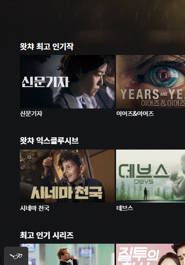

[← BACK](./README.md)

# DAY 10 (2020-10-31, 토)

> _질문에는 ❓, 답변에는 🤖가 달려 있습니다._
>
> _이해가 완전하지 않은 개념에는 🤯, 귤 팁에는 🍊이 달려 있습니다._

## React 접근성 (A11Y)

React 앱 개발 시 모든 사용자를 고려한 접근성 준수가 필요하다 ([접근성 React 공식문서](https://ko.reactjs.org/docs/accessibility.html)). 접근성을 준수하면 보조기기 (AT)에서 정보를 해석할 수 있어 보조기기 사용자의 접근성을 향상시킬 수 있으며, 검색 엔진 최적화 (SEO)도 향상시킬 수 있다. React는 접근성을 갖춘 웹 사이트, 앱을 만들 수 있도록 모든 지원을 하고 있으며, 대부분 표준 HTML 기술이 사용된다.<br /><br />

❓그런데 별칭 A11Y은 무슨 의미일까?
🤖접근성에 대한 별칭 A11Y는 A로 시작해서 11자가 이어지고 Y로 끝나는 말 ACCESSIBILITY를 표현한다.

### 헤딩 레벨(Heading Level)

❓웹 사이트 또는 애플리케이션 구축 시 제목의 계층 구조 형성이 왜 중요할까? React 앱을 어떻게 구성하면 좋을까?<br />
🤖서비스의 각 영역이 가지고 있는 제목이 반드시 시각적으로 눈에 보이지는 않는다. <ins>그렇다면 볼 수 없는 제목을 왜 작성해야 할까? 스크린 리더 사용자는 눈에 보이지 않는 제목까지 듣고 콘텐츠를 탐색하게 되기 때문</ins>이다. 스크린 리더 사용자는 스크린 리더의 로터 (가상 제어 기능) 기능을 사용하여 헤딩 레벨의 콘텐츠(서비스의 제목, 검색 필드의 제목, 동영상 섹션의 제목 등)만 들어보는 식으로 원하는 콘텐츠를 빠르게 찾을 수 있다.<br /><br />

❓보이지 않는 제목까지 잘 설정하는 방법이 있을까?<br />
🤖[tota11y](https://khan.github.io/tota11y/)라는 구글 익스텐션이 있다.<br /><br />
<br /><br />
접근성에 대한 시각화 툴킷으로, 이 익스텐션을 사용하면 웹사이트에 보이지 않는 제목까지 포함된 제목 구성을 한눈에 검토할 수 있다.

0. chrome web store에서 <ins>totally Plugin, from Khan Academy</ins>를 설치한다.
   <br /><br />

1. tota11y plugin 익스텐션 아이콘을 클릭한다.<br /><br />
   <br /><br />
2. 웹 사이트 좌측 하단에 생긴 안경 아이콘을 누르고 접근성 검사를 원하는 항목을 클릭한다. <br /><br />
   <br /><br />
3. 검사결과를 확인한다. 아래 예시는 OTT 플랫폼 왓챠의 홈페이지에서 Headings 레벨의 접근성 검사를 한 결과를 보여준다.<br /><br />
   <br /><br />
   제목에 대한 계층구조도 확인할 수 있다.<br /><br />
   <br /><br />
   헤딩 레벨의 접근성이 적절한 경우는 다음과 같이 보인다. <br /><br />
   <br /><br />

❓React를 사용하여 레벨 간 흐름을 관리하는 방법이 있을까?<br />
🤖React 라이브러리인 [tenon-ui](https://www.tenon-ui.info/) 프레임워크를 사용하면 헤딩 레벨의 흐름을 보다 편리하게 구성할 수 있다.

```sh
import { Heading } from '@tenon-io/tenon-ui'

<Heading.H>I will be an h1</Heading.H>
<Heading.LevelBoundary>
    <Heading.H>
        I will be an h2
    </Heading.H>
    <Heading.LevelBoundary>
        <Heading.H>
            I will be an h3
        </Heading.H>
    </Heading.LevelBoundary>
    <Heading.H>
        I will be an h2
    </Heading.H>
</Heading.LevelBoundary>
```

- `Tenon-UI`에서 `Heading.H`는 `h`요소를 대체한다.
- `Tenon-UI`에서 `Heading.LevelBoundary`는 자동으로 레벨을 계산하며, 위 코드에서 확인할 수 있다시피 새로운 레벨이 사용될 때마다 적용되어야 한다.

  - `Heading.LevelBoundary`는 처음 적용될 시 바로 다음에 나오는 `Heading.H`가 `h2`로 렌더링되도록 한다. 만약 다른 레벨로 설정하고 싶다면 `levelOverride` 속성을 사용할 수 있다. 아래 코드와 같이 `levelOverride={3}`라고 설정하면, 바로 다음에 나오는 `Heading.H`는 `h3` 레벨이 된다.
    ```sh
    <Heading.LevelBoundary levelOverride={3}>
        <Heading.H>
            I will be an h3
        </Heading.H>
            <Heading.LevelBoundary>
                <Heading.H>
                    I will be an h4
                </Heading.H>
            </Heading.LevelBoundary>
        <Heading.H>
            I will be an h3
        </Heading.H>
    </Heading.LevelBoundary>
    ```

### 히든 콘텐츠 (Hidden Contents)

화면에서 감추되, 스크린 리더에서 읽혀야 하는 숨김 콘텐츠 처리 방법에 대해 이야기하고 React 앱에서 처리하는 방법에데 대해 다룹니다.

### 버튼 컴포넌트 (Button Component)

### 사용에 주의가 필요한 HTML 표준 문법

### 접근성 자동 검사 (React-axe)
