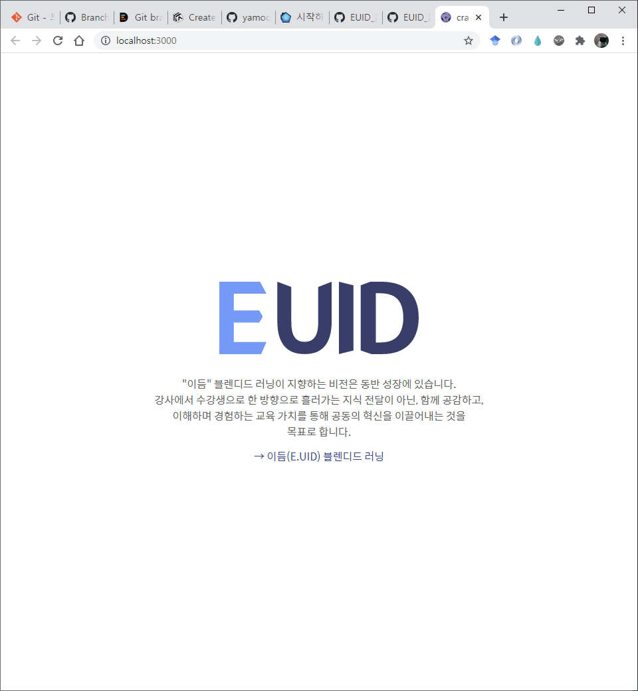
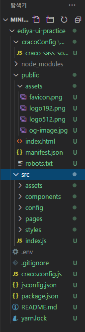
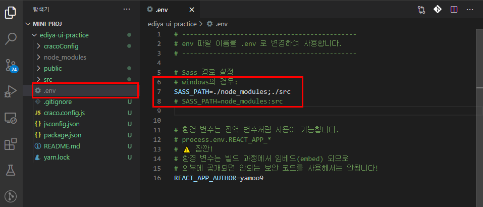
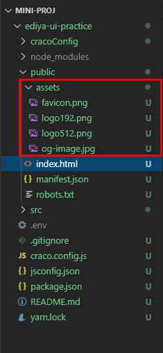
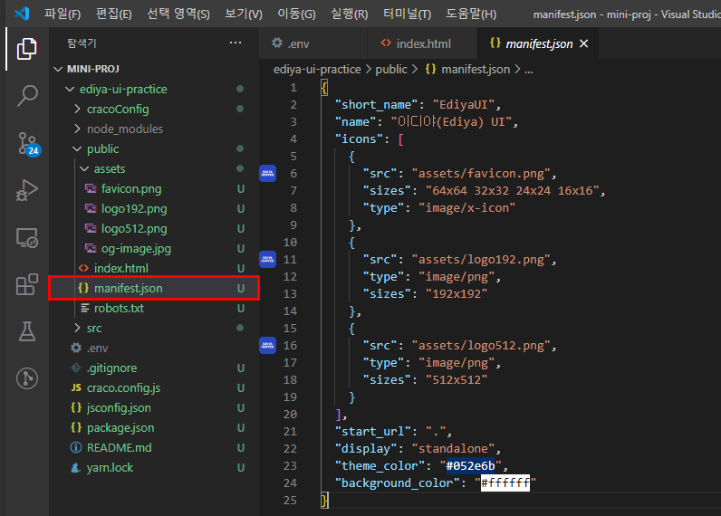
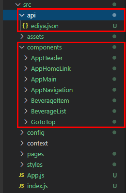
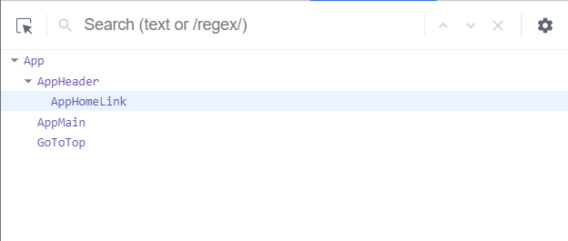

[← BACK](./README.md)

# DAY 11 (2020-11-02, 월)

> _질문에는 ❓, 답변에는 🤖가 달려 있습니다._
>
> _이해가 완전하지 않은 개념에는 🤯, 귤 팁에는 🍊이 달려 있습니다._

## Mini Project

### 프로젝트 시작하기 

CRA 커스텀 탬플릿 `cra-template-ko-craco`를 사용해 ediya-ui-practice 신규 프로젝트를 생성한다.
```sh
npx create-react-app ediya-ui-practice --template cra-template-ko-craco
```
<br /><br />
자동으로 서버가 열리고 다음과 같은 프로젝트 창이 열린다.<br /><br />
<br /><br />
<br /><br />


---

### 문서 헤드 구성 
`<head>` 영역 안에 다음의 콘텐츠를 구성한다. 

#### 환경 변수 .env 설정
1. 환경 변수 파일인 `env`이름을 `.env`로 변경한다.
2. 나는 Windows 사용자라서 `Sass` 경로 설정을 다음과 같이 변경 사용했다.
<br /><br />
❓환경 변수?<br />
🤖특정 프로세스를 위한 `key=value` 형태의 변수를 말한다.


#### PUBLIC 구성
<br /><br />

<br /><br />

#### 검색엔진 최적화 (SEO)

```sh
  <!-- 검색 엔진 최적화(SEO) -->
  <meta name="description" content="이듬(E.UID) 블렌디드 러닝 '이디야(Ediya) UI ← React 실습' 시연으로 제작한 결과물입니다." />
  <meta name="keywords" content="웹, 웹 개발, 프론트엔드, 프론트엔드 개발, UI, 접근성, 블렌디드 러닝, 이듬, 이디야, Ediya, React" />
```
#### 오픈 그래프 (Open Graph)

```sh
  <!-- 오픈 그래프 프로토콜(Open Graph Protocol: https://ogp.me/) -->
  <meta property="og:title" content="이디야(Ediya) UI ← React 실습" />
  <meta property="twitter:title" content="이디야(Ediya) UI ← React 실습" />
  <meta property="og:type" content="website" />
  <meta property="og:url" content="https://yamoo9.github.io/EdiyaUI" />
  <meta property="og:locale" content="ko-KR" />
  <meta property="og:description" content="'이디야(Ediya) UI ← React 실습' 시연으로 제작한 결과물입니다." />
  <meta property="og:image" content="//yamoo9.github.io/EUID/og-image.jpg" />
  <meta property="og:article:author" content="야무(yamoo9)" />
```
<br />

---

### 디렉토리 구성 
컴포넌트 폴더 및 API 폴더를 프로젝트로 복사/붙여넣기 한다.<br /><br />

<br /><br />

---

### 컴포넌트 구성 Part 1
#### 컴포넌트 등록 AppHeader, AppMain, GoToTop 
```sh
// index.js
import "react-app-polyfill/ie11";
import "styles/index.scss";
import React from "react";
import ReactDOM from "react-dom";
import App from "~/App/App";
import * as serviceWorker from "~/config/serviceWorker";

ReactDOM.render(<App />, document.getElementById("reactApp"));

// 앱을 오프라인에서 작동시키고 보다 빠르게 로드 하고자 한다면?
// 아래 코드의 unregister()를 register()로 변경합니다.
// [⚠️주의! 이 방법은 몇 가지 문제를 발생할 수 있습니다.]
// 서비스 워커에 대해 자세히 알아보기: https://bit.ly/CRA-PWA
if (process.env.NODE_ENV === "production") {
  serviceWorker.register();
}
```
위 코드에서 `import * as serviceWorker from "~/config/serviceWorker";` 구문을 <ins>동적 import 구문</ins>으로 다음과 같이 바꿀 수 있다. 

```sh
// index.js
import "react-app-polyfill/ie11";
import "styles/index.scss";
import React from "react";
import ReactDOM from "react-dom";
import App from "~/App/App";

ReactDOM.render(<App />, document.getElementById("reactApp"));

// 앱을 오프라인에서 작동시키고 보다 빠르게 로드 하고자 한다면?
// 아래 코드의 unregister()를 register()로 변경합니다.
// [⚠️주의! 이 방법은 몇 가지 문제를 발생할 수 있습니다.]
// 서비스 워커에 대해 자세히 알아보기: https://bit.ly/CRA-PWA
if (process.env.NODE_ENV === "production") {
  import("~/config/serviceWorker").then((serviceWorker) =>
    serviceWorker.register()
  );
}
```

---

```sh
// App.js
import React from "react";
import logo from "assets/logo.svg";

const App = (props) => (
  <div className="App">
    <header className="App__Header">
      ...
    </header>
  </div>
);

export default App;
```

위 코드의 `App.js` 파일의 `<header>` 부분을 삭제하고 `AppHeader.jsx`, `AppMain.jsx`, `GoToTop.jsx`에서 불러온 `<AppHeader />`, `<AppMain />`, `<GoToTop />`으로 대체한다. 각각의 파일은 동명의 폴더 안에 새로 만들어지며, 해당 폴더 안에 들어있는 `scss` 파일을 import한다. 아래 코드는 `AppHeader.jsx`의 예시다.

```sh
// AppHeader.jsx
import './AppHeader.scss'
import React from 'react'

const AppHeader = () => {
    return (
        <div>
            앱 헤더
        </div>
    )
}

export default AppHeader
```

🍊`rafce` React 함수형 컴포넌트 만들기<br /><br />
<br /><br />

#### JSX 코드 정리 AppHeader, AppMain, GoToTop 
위에서 만든 `AppHeader.jsx`, `AppMain.jsx`, `GoToTop.jsx`에 `index.html`에 있던 코드를 이식하는 과정이다. 다음의 예시는 (홈페이지에서 따로 다운로드받은 폴더 안에 있는) `index.html`의 `<header>` 부분을 잘라서 `AppHeader.jsx`에 이식한 결과를 보여준다. `html`에서 `jsx`로 옮기면서 구문의 용법에 차이가 생기므로 주의해야 한다. 이를테면 `class`는 `className`으로 바꿔준다. 또 ``와 같이 열어주고 닫아주는 태그가 한 쌍으로 존재하지 않는 경우 ``와 같은 형태로 바꿔준다.

```sh
// index.html
...
    <header class="app-header">
      <h1 class="brand">
        <a href="https://www.ediya.com/" title="홈 페이지로 이동" target="_blank">
          <span class="a11y-hidden" lang="en">EDIYA COFFEE</span>
        </a>
      </h1>
      <button class="button is-open-menu" type="button" title="메뉴 열기" aria-label="메뉴 열기">
        <span class="ir"></span>
      </button>
      <!-- 내비게이션 -->
      <nav class="app-navigation" hidden>
        <h2 class="a11y-hidden">메인 메뉴</h2>
        <ul class="reset-list">
          <li><a href="#menu">메뉴</a></li>
          <li><a href="#members">이디야멤버스</a></li>
          <li><a href="#coffee-lab">이디야커피랩</a></li>
          <li><a href="#culture-lab">이디야컬쳐랩</a></li>
          <li><a href="#notice">공지사항</a></li>
          <li><a href="#find-store">매장찾기</a></li>
        </ul>
        <button class="button is-close-menu" type="button" title="메뉴 닫기" aria-label="메뉴 닫기">
          <span class="close" aria-hidden="true"> × </span>
        </button>
      </nav>
      <!--  -->
    </header>
...
```

```sh
// AppHeader.jsx
import './AppHeader.scss'
import React from 'react'

const AppHeader = () => {
  return (
    <header className="app-header">
      <h1 className="brand">
        <a
          href="/"
          title="홈 페이지로 이동"
          target="_blank"
          rel="noopener noreferrer"
        >
          <span className="a11y-hidden" lang="en">
            EDIYA COFFEE
          </span>
        </a>
      </h1>
      <button
        className="button is-open-menu"
        type="button"
        title="메뉴 열기"
        aria-label="메뉴 열기"
      >
        <span className="ir"></span>
      </button>
      <nav className="app-navigation" hidden>
        <h2 className="a11y-hidden">메인 메뉴</h2>
        <ul className="reset-list">
          <li>
            <a href="#menu">메뉴</a>
          </li>
          <li>
            <a href="#members">이디야멤버스</a>
          </li>
          <li>
            <a href="#coffee-lab">이디야커피랩</a>
          </li>
          <li>
            <a href="#culture-lab">이디야컬쳐랩</a>
          </li>
          <li>
            <a href="#notice">공지사항</a>
          </li>
          <li>
            <a href="#find-store">매장찾기</a>
          </li>
        </ul>
        <button
          className="button is-close-menu"
          type="button"
          title="메뉴 닫기"
          aria-label="메뉴 닫기"
        >
          <span className="close" aria-hidden="true">
            ×
          </span>
        </button>
      </nav>
    </header>
  )
}

export default AppHeader

```
---

### 컴포넌트 구성 Part 2
#### 컴포넌트 추가 등록 AppHomeLink, AppNavigation, BeverageList, BeverageItem
컴포넌트 구성 Part 1에서와 마찬가지로 컴포넌트 구성을 나눠주는 과정을 반복한다. 이를테면 `AppHeader.jsx`파일에 있던 `<h1>` 링크 부분을 지우고, `AppHomeLink` 폴더 아래 `AppHomeLink.jsx` 파일을 새로 생성하여 링크 부분을 붙여넣는 식이다. 제대로 import되었다면 브라우저 개발자 도구의 React Components에서 아래와 같이 컴포넌트 구성을 확인할 수 있다. <br /><br />

<br /><br />


#### 컴포넌트 스타일 검토 🤯
스타일 `scss` 파일을 보고 `className`을 재정리하는 과정이다. `scss` 파일은 처음이라 `css` 파일과 무엇이 다른지 좀 더 알아봐야 할 것 같다.

---

### 오늘 실습의 결과물
<br /><br />

---

### 오늘 느낀 점
주말 오프라인 수업에서 실습을 할 때, 이 내용을 미리 보고 갔더라면 덜 허둥지둥댔을 것같다는 생각이 들었다. 하긴 하루 주어진 학습량도 겨우 따라가는 상황에서 내가 예습을 했을리가 없지..😉 확실히 프로젝트를 들어가니까 재밌고, 뭔가 이해도 직관적으로 더 잘 되는 것같다. 사실 주말에 수업하고 돌아오는 길에는 자신감이 수직하락해서 '앞으로 더 어려워질 텐데 어떡하면 좋지' 하고 걱정이 됐는데, 오늘 다시 해보니 어제 삽질한 게 그래도 머리에 좀 들어갔는지 이해가 돼서 마음이 편해졌다😚 <br />
기존에 `html`, `css`, `javascript`로 작성하는 중이었던 프로젝트를 `react`로 이식해보겠다는 생각이 있었는데, 오늘 복습을 하면서 생각해보니 내가 쓴 `html` 파일은 수업에서 본 `index.html` 처럼 정갈하지가 않아서 상당히 어렵겠다는 생각이 들었다. 취미로 했던 개발을 개발자가 되겠다는 생각으로 새롭게 하게 되니 문법을 제대로 손에 익혀두지 않은 게 꽤 아쉽게 느껴지고, 기존에 써놓은 코드가 얼마나 구식이고 엉망인지 조금씩 보여서 부끄럽기도 하다. 그래도 이렇게 저렇게 막 해보면서 배울 때 재미를 느껴서 여기까지 오게 되었으니 취미로 하던 개발의 묘미는 그 나름대로 좋은 추억으로 간직하고 지금 이 시기에 잘 훈련해야 겠다는 생각이 든다🌝  
