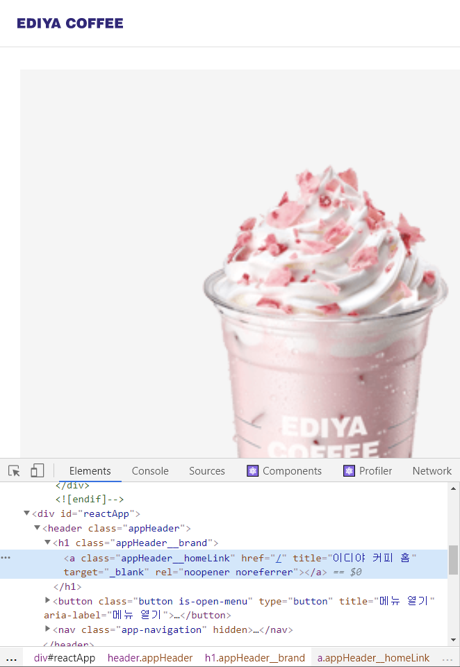

[← BACK](./README.md)

# DAY 12 (2020-11-03, 일)

> _질문에는 ❓, 답변에는 🤖가 달려 있습니다._
>
> _이해가 완전하지 않은 개념에는 🤯, 귤 팁에는 🍊이 달려 있습니다._

## Mini Project
어제에 이어서 Ediya Coffee 웹 만들기 미니 프로젝트 실습을 계속한다 (2일차).

### Yesterday I Learned...🤓 
[어제](./D11.md)는 미니 프로젝트 실습을 1일차였다. 가장 먼저 CRA (Create-React-App) 커스텀 탬플릿을 사용해 신규 프로젝트를 생성하였고, 이어서 `html` 파일에 작성되어 있던 앱의 구성을 `jsx` 파일에 이식하는 과정이 주를 이루었다. 또한 각 `jsx` 파일에 적용되는 `scss` 파일을 검토하여 여러 컴포넌트의 `className`에 스타일 속성이 잘 붙었는지 확인했다.<br /> 

<details start>
<summary>어제의 Ediya Coffee☕ (미니 프로젝트 실습 1일차 결과물)</summary>


</details>

---

### 컴포넌트 props 디자인

#### 컴포넌트 props 설계 AppHomeLink
<details start>
<summary> AppHomeLink.jsx에 props를 통해 데이터를 전달하고 관리할 수 있도록 해보자. </summary>

`AppHomeLink.jsx` 컴포넌트는 `AppHeader.jsx` 컴포넌트의 하위에 있으며, 현재까지 작성된 두 컴포넌트의 코드 구성은 다음과 같다:
```sh
// AppHeader.jsx
import './AppHeader.scss'
import React from 'react'
import AppHomeLink from './../AppHomeLink/AppHomeLink'
import AppNavigation from './../AppNavigation/AppNavigation'

const AppHeader = () => {
  return (
    <header className="appHeader">
      <AppHomeLink />
      <AppNavigation />
    </header>
  )
}

export default AppHeader
```

```sh
// AppHomeLink.jsx
import './AppHomeLink.scss'
import React from 'react'

const AppHomeLink = () => {
  return (
    <h1 className="appHeader__brand">
      <a
        className="appHeader__homeLink"
        href="/"
        title="홈 페이지로 이동"
        target="_blank"
        rel="noopener noreferrer"
      >
        <span className="a11yHidden" lang="en">
          EDIYA COFFEE
        </span>
      </a>
    </h1>
  )
}

export default AppHomeLink
```

`props` 속성은 부모 컴포넌트에서 자식 컴포넌트로 전달된다. 지금 보고 있는 경우에서 부모 컴포넌트는 보다 상위 단계인 `AppHeader.jsx`이며 자식 컴포넌트는 `AppHomeLink.jsx`이다. `AppHomeLink.jsx`의 함수형 컴포넌트 인자에 `AppHeader.jsx`로부터 전달받을 속성 `props`를 넣어주고, 컴포넌트 내 속성이 필요한 부분에 `{ props.children }`을 작성한다. 여기서 전달받는 속성 `props`는 `AppHomeLink`의 함수형 컴포넌트 내에 기술되어 있던 `<span>` 부분이다. 한편 부모 컴포넌트에서 `AppHomeLink`를 import하여 화면상에 나타내기 위해 넣어준 구문 `<AppHomeLink />`는 다음과 같이 바꾸어 작성해주게 된다:

```sh
// AppHeader.jsx
import './AppHeader.scss'
import React from 'react'
import AppHomeLink from './../AppHomeLink/AppHomeLink'
import AppNavigation from './../AppNavigation/AppNavigation'

const AppHeader = () => {
  return (
    <header className="appHeader">
      <AppHomeLink>
        <span className="a11yHidden" lang="en">
          EDIYA COFFEE
        </span>
      </AppHomeLink>
      <AppNavigation />
    </header>
  )
}

export default AppHeader
```

또한 `props` 속성을 전달받는 것으로 변경한 `AppHomeLink` 컴포넌트의 구문은 다음과 같다:
```sh
import './AppHomeLink.scss'
import React from 'react'

const AppHomeLink = (props) => {
  return (
    <h1 className="appHeader__brand">
      <a
        className="appHeader__homeLink"
        href="/"
        title="홈 페이지로 이동"
        target="_blank"
        rel="noopener noreferrer"
      >
        {props.childeren}
      </a>
    </h1>
  )
}

export default AppHomeLink
```
서버에서 `Components`를 확인하면 `AppHomeLink`가 `props.children`로 `<span> ... </span>`을 받고 있음을 알 수 있다.<br /><br />
<br /><br />

이제 위의 과정을 반복하여 `props`에 여러 속성을 전달할 수 있다. 이번에는 `AppHomeLink`의 `<a>` 안에 있던 내용 (`href`, `title`, `target`)을 `props`로 전달해보자.

```sh
// AppHeader.jsx
...

const AppHeader = () => {
  return (
    <header className="appHeader">
      <AppHomeLink href="/" title="이디야 커피 홈" external>
        <span className="a11yHidden" lang="en">
          EDIYA COFFEE
        </span>
      </AppHomeLink>
      <AppNavigation />
    </header>
  )
}

export default AppHeader
```
```sh
// AppHomeLink.jsx
...

const AppHomeLink = (props) => {
  return (
    <h1 className="appHeader__brand">
      <a
        className="appHeader__homeLink"
        href={props.href}
        title={props.title}
        target={props.external ? '_blank' : null}
        rel={props.external ? 'noopener noreferrer' : null}
      >
        {props.childeren}
      </a>
    </h1>
  )
}

export default AppHomeLink
```

`AppHomeLink.jsx`에서 `target={props.external ? '_blank' : null}` 구문의 뜻은 다음과 같다: `external`이 있을 경우는 `target`을 `_blank` 처리하고, 없을 경우는 `null`로 처리한다. `rel={props.external ? 'noopener noreferrer' : null}` 구문도 그런 식으로 해석하면 된다. 여기까지 하고 서버에서 `Elements`탭을 확인하면 화면 좌측 상단에 있는 홈 링크 이미지의 `<a>`에 다음과 같은 속성이 적용되어 있는 걸 알 수 있다:<br /><br />
<br /><br />

사용자가 부모 컴포넌트에 해당하는 파일에 아무런 값도 설정해놓지 않아 `props`로 전달할 속성의 내용이 없는 경우를 대비(?)하여 자식 컴포넌트에서 미리 기본값을 설정해놓을 수 있다. 예를 들어, `AppHeader.jsx`에서 `<AppHomeLink>` 부분에 있던 `<span>` 구문이 없다면, 즉 `{props.children}` 대신 `AppHomeLink.jsx`를 다음과 같이 처리할 수도 있다. 

```sh
// AppHeader.jsx
...

const AppHeader = () => {
  return (
    <header className="appHeader">
      <AppHomeLink href="/" title="이디야 커피 홈" external></AppHomeLink>
      <AppNavigation />
    </header>
  )
}

export default AppHeader
```  
```sh
...

const AppHomeLink = (props) => {
  return (
    <h1 className="appHeader__brand">
      <a
        className="appHeader__homeLink"
        href={props.href}
        title={props.title}
        target={props.external ? '_blank' : null}
        rel={props.external ? 'noopener noreferrer' : null}
      >
        {props.childeren || <span className="a11yHidden">홈 링크</span>}
      </a>
    </h1>
  )
}

export default AppHomeLink
```
아래 구문의 해석은 다음과 같다: 부모 컴포넌트로부터 전달받은 `props.children`이 있으면 그대로 적용하고, 없다면 감추기 속성인 `a11yHidden`이 적용되어 있는 '홈 링크'를 화면에 띄운다 (물론 감추기 속성이 적용되었기 때문에 눈에 보이지 않음). 
```sh
{props.childeren || <span className="a11yHidden">홈 링크</span>}
```

다음과 같이 **스프레드 연산자** { ...props}를 사용하여 자식 컴포넌트에서 `props`를 한 번에 처리할 수도 있다. 

```sh
// AppHomeLink.jsx
...

const AppHomeLink = (props) => {
  return (
    <h1 className="appHeader__brand">
      <a
        className="appHeader__homeLink"
        {...props}
        target={props.external ? '_blank' : null}
        rel={props.external ? 'noopener noreferrer' : null}
      >
        {props.childeren || <span className="a11yHidden">홈 링크</span>}
      </a>
    </h1>
  )
}

export default AppHomeLink
```

❓스프레드 연산자 다시 한 번 짚고 넘어가기<br />
🤖스프레드 연산자는 세 개의 점(...)으로 이루어진 연산자로, 몇 가지 다른 역할을 담당한다. 
<details start>
<summary>먼저 스프레드 연산자를 사용해 배열의 내용을 조합할 수 있고,</summary> \

```sh
var peaks = ["대청봉", "중청봉", "소청봉"]
var canyons = ["천불동계곡", "가야동계곡"]
var seoraksan = [...peaks, ...canyons]

console.log(seoraksan.join(',')) // 대청봉, 중청봉, 소청봉, 천불동계곡, 가양동계곡
```
</details>

<details start>
<summary>배열의 나머지 원소를 얻을 수도 있고,</summary> 

```sh
var lakes = ["경포호", "화진포", "송지호", "청초호"]
var [first, ...rest] = lakes

console.log(rest.join(",")) // "화진포, 송지호, 청초호"
```
</details>

<details start>
<summary>함수의 인자를 배열로 모을 수도 있고,</summary>

```sh
function directions(...args) {
    var [start, ...remaining] = args
    var [finish, ...stops] = remaining.reverse()

    console.log(`${args.length} 도시를 운행합니다.`)
    console.log(`${start}에서 출발합니다.`)
    console.log(`목적지는 ${finish}입니다.`)
    console.log(`중간에 ${stops.length}군데 돌립니다`)
}

directions(
    "서울",
    "수원",
    "천안",
    "대전",
    "대구",
    "부산"
)
```
</details>

<details start>
<summary>또한 객체에 사용할 수도 있다.</summary> 

```sh
var morning = {
    breakfast: "미역국",
    lunch: "삼치구이와 보리밥"
}

var dinner = "스테이크 정식"

var backpackingMeals = {
    ...morning, 
    dinner
}

console.log(backpackingMeals)

// {breakfast: "미역국", lunch: "삼치구이와 보리밥", dinner: "스테이크 정식"}
```
</details>

</details>


#### 컴포넌트 props 설계 (classnames 라이브러리, as 속성 등)

---

### 컴포넌트 이벤트 핸들링 & 타임 컨트롤

---

### 리스트 렌더링 & 컨텍스트 Part 1