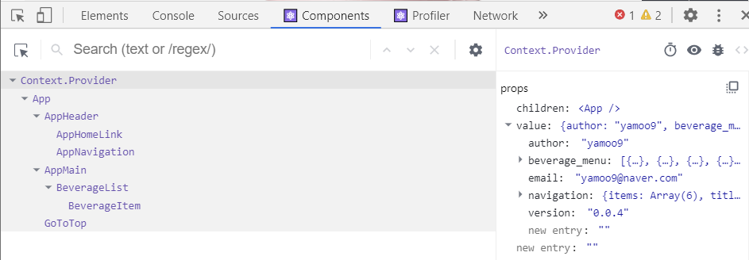

[← BACK](./README.md)

# DAY 12 (2020-11-04, 수)

> _질문에는 ❓, 답변에는 🤖가 달려 있습니다._
>
> _이해가 완전하지 않은 개념에는 🤯, 귤 팁에는 🍊이 달려 있습니다._

## Mini Project
어제에 이어서 Ediya Coffee 웹 만들기 미니 프로젝트 실습을 계속한다 (2일차).

### Yesterday I Learned...🤓 

<details start>
<summary>어제 실습한 내용 훑어보기🐌</summary>

[어제](./D11.md)는 미니 프로젝트 실습을 1일차였다. 가장 먼저 CRA (Create-React-App) 커스텀 탬플릿을 사용해 신규 프로젝트를 생성하였고, 이어서 `html` 파일에 작성되어 있던 앱의 구성을 `jsx` 파일에 이식하는 과정이 주를 이루었다. 또한 각 `jsx` 파일에 적용되는 `scss` 파일을 검토하여 여러 컴포넌트의 `className`에 스타일 속성이 잘 붙었는지 확인했다.
</details>

<details start>
<summary>어제의 Ediya Coffee☕ (미니 프로젝트 실습 1일차 결과물)</summary>


</details>

---

### 컴포넌트 props 디자인

#### 컴포넌트 props 설계 AppHomeLink
<details start>
<summary> AppHomeLink.jsx에 props를 통해 데이터를 전달하고 관리할 수 있도록 해보자. </summary>

`AppHomeLink.jsx` 컴포넌트는 `AppHeader.jsx` 컴포넌트의 하위에 있으며, 현재까지 작성된 두 컴포넌트의 코드 구성은 다음과 같다:
```sh
// AppHeader.jsx
import './AppHeader.scss'
import React from 'react'
import AppHomeLink from './../AppHomeLink/AppHomeLink'
import AppNavigation from './../AppNavigation/AppNavigation'

const AppHeader = () => {
  return (
    <header className="appHeader">
      <AppHomeLink />
      <AppNavigation />
    </header>
  )
}

export default AppHeader
```

```sh
// AppHomeLink.jsx
import './AppHomeLink.scss'
import React from 'react'

const AppHomeLink = () => {
  return (
    <h1 className="appHeader__brand">
      <a
        className="appHeader__homeLink"
        href="/"
        title="홈 페이지로 이동"
        target="_blank"
        rel="noopener noreferrer"
      >
        <span className="a11yHidden" lang="en">
          EDIYA COFFEE
        </span>
      </a>
    </h1>
  )
}

export default AppHomeLink
```

`props` 속성은 부모 컴포넌트에서 자식 컴포넌트로 전달된다. 지금 보고 있는 경우에서 부모 컴포넌트는 보다 상위 단계인 `AppHeader.jsx`이며 자식 컴포넌트는 `AppHomeLink.jsx`이다. `AppHomeLink.jsx`의 함수형 컴포넌트 인자에 `AppHeader.jsx`로부터 전달받을 속성 `props`를 넣어주고, 컴포넌트 내 속성이 필요한 부분에 `{ props.children }`을 작성한다. 여기서 전달받는 속성 `props`는 `AppHomeLink`의 함수형 컴포넌트 내에 기술되어 있던 `<span>` 부분이다. 한편 부모 컴포넌트에서 `AppHomeLink`를 import하여 화면상에 나타내기 위해 넣어준 구문 `<AppHomeLink />`는 다음과 같이 바꾸어 작성해주게 된다:

```sh
// AppHeader.jsx
import './AppHeader.scss'
import React from 'react'
import AppHomeLink from './../AppHomeLink/AppHomeLink'
import AppNavigation from './../AppNavigation/AppNavigation'

const AppHeader = () => {
  return (
    <header className="appHeader">
      <AppHomeLink>
        <span className="a11yHidden" lang="en">
          EDIYA COFFEE
        </span>
      </AppHomeLink>
      <AppNavigation />
    </header>
  )
}

export default AppHeader
```

또한 `props` 속성을 전달받는 것으로 변경한 `AppHomeLink` 컴포넌트의 구문은 다음과 같다:
```sh
import './AppHomeLink.scss'
import React from 'react'

const AppHomeLink = (props) => {
  return (
    <h1 className="appHeader__brand">
      <a
        className="appHeader__homeLink"
        href="/"
        title="홈 페이지로 이동"
        target="_blank"
        rel="noopener noreferrer"
      >
        {props.childeren}
      </a>
    </h1>
  )
}

export default AppHomeLink
```
서버에서 `Components`를 확인하면 `AppHomeLink`가 `props.children`로 `<span> ... </span>`을 받고 있음을 알 수 있다.<br /><br />
<br /><br />

이제 위의 과정을 반복하여 `props`에 여러 속성을 전달할 수 있다. 이번에는 `AppHomeLink`의 `<a>` 안에 있던 내용 (`href`, `title`, `target`)을 `props`로 전달해보자.

```sh
// AppHeader.jsx
...

const AppHeader = () => {
  return (
    <header className="appHeader">
      <AppHomeLink href="/" title="이디야 커피 홈" external>
        <span className="a11yHidden" lang="en">
          EDIYA COFFEE
        </span>
      </AppHomeLink>
      <AppNavigation />
    </header>
  )
}

export default AppHeader
```
```sh
// AppHomeLink.jsx
...

const AppHomeLink = (props) => {
  return (
    <h1 className="appHeader__brand">
      <a
        className="appHeader__homeLink"
        href={props.href}
        title={props.title}
        target={props.external ? '_blank' : null}
        rel={props.external ? 'noopener noreferrer' : null}
      >
        {props.childeren}
      </a>
    </h1>
  )
}

export default AppHomeLink
```

`AppHomeLink.jsx`에서 `target={props.external ? '_blank' : null}` 구문의 뜻은 다음과 같다: `external`이 있을 경우는 `target`을 `_blank` 처리하고, 없을 경우는 `null`로 처리한다. `rel={props.external ? 'noopener noreferrer' : null}` 구문도 그런 식으로 해석하면 된다. 여기까지 하고 서버에서 `Elements`탭을 확인하면 화면 좌측 상단에 있는 홈 링크 이미지의 `<a>`에 다음과 같은 속성이 적용되어 있는 걸 알 수 있다:<br /><br />
<br /><br />

사용자가 부모 컴포넌트에 해당하는 파일에 아무런 값도 설정해놓지 않아 `props`로 전달할 속성의 내용이 없는 경우를 대비(?)하여 자식 컴포넌트에서 미리 기본값을 설정해놓을 수 있다. 예를 들어, `AppHeader.jsx`에서 `<AppHomeLink>` 부분에 있던 `<span>` 구문이 없다면, 즉 `{props.children}` 대신 `AppHomeLink.jsx`를 다음과 같이 처리할 수도 있다. 

```sh
// AppHeader.jsx
...

const AppHeader = () => {
  return (
    <header className="appHeader">
      <AppHomeLink href="/" title="이디야 커피 홈" external></AppHomeLink>
      <AppNavigation />
    </header>
  )
}

export default AppHeader
```  
```sh
// AppHomeLink.jsx
...

const AppHomeLink = (props) => {
  return (
    <h1 className="appHeader__brand">
      <a
        className="appHeader__homeLink"
        href={props.href}
        title={props.title}
        target={props.external ? '_blank' : null}
        rel={props.external ? 'noopener noreferrer' : null}
      >
        {props.childeren || <span className="a11yHidden">홈 링크</span>}
      </a>
    </h1>
  )
}

export default AppHomeLink
```
아래 구문의 해석은 다음과 같다: 부모 컴포넌트로부터 전달받은 `props.children`이 있으면 그대로 적용하고, 없다면 감추기 속성인 `a11yHidden`이 적용되어 있는 '홈 링크'를 화면에 띄운다 (물론 감추기 속성이 적용되었기 때문에 눈에 보이지 않음). 
```sh
{props.childeren || <span className="a11yHidden">홈 링크</span>}
```

다음과 같이 **스프레드 연산자** { ...props}를 사용하여 자식 컴포넌트에서 `props`를 한 번에 처리할 수도 있다. 

```sh
// AppHomeLink.jsx
...

const AppHomeLink = (props) => {
  return (
    <h1 className="appHeader__brand">
      <a
        className="appHeader__homeLink"
        {...props}
        target={props.external ? '_blank' : null}
        rel={props.external ? 'noopener noreferrer' : null}
      >
        {props.childeren || <span className="a11yHidden">홈 링크</span>}
      </a>
    </h1>
  )
}

export default AppHomeLink
```

❓스프레드 연산자 다시 한 번 짚고 넘어가기<br />
🤖스프레드 연산자는 세 개의 점(...)으로 이루어진 연산자로, 몇 가지 다른 역할을 담당한다. 
<details start>
<summary>먼저 스프레드 연산자를 사용해 배열의 내용을 조합할 수 있고,</summary> \

```sh
var peaks = ["대청봉", "중청봉", "소청봉"]
var canyons = ["천불동계곡", "가야동계곡"]
var seoraksan = [...peaks, ...canyons]

console.log(seoraksan.join(',')) // 대청봉, 중청봉, 소청봉, 천불동계곡, 가양동계곡
```
</details>

<details start>
<summary>배열의 나머지 원소를 얻을 수도 있고,</summary> 

```sh
var lakes = ["경포호", "화진포", "송지호", "청초호"]
var [first, ...rest] = lakes

console.log(rest.join(",")) // "화진포, 송지호, 청초호"
```
</details>

<details start>
<summary>함수의 인자를 배열로 모을 수도 있고,</summary>

```sh
function directions(...args) {
    var [start, ...remaining] = args
    var [finish, ...stops] = remaining.reverse()

    console.log(`${args.length} 도시를 운행합니다.`)
    console.log(`${start}에서 출발합니다.`)
    console.log(`목적지는 ${finish}입니다.`)
    console.log(`중간에 ${stops.length}군데 돌립니다`)
}

directions(
    "서울",
    "수원",
    "천안",
    "대전",
    "대구",
    "부산"
)
```
</details>

<details start>
<summary>또한 객체에 사용할 수도 있다.</summary> 

```sh
var morning = {
    breakfast: "미역국",
    lunch: "삼치구이와 보리밥"
}

var dinner = "스테이크 정식"

var backpackingMeals = {
    ...morning, 
    dinner
}

console.log(backpackingMeals)

// {breakfast: "미역국", lunch: "삼치구이와 보리밥", dinner: "스테이크 정식"}
```
</details>

위에서 이야기한 스프레드 연산자의 여러 가지 기능을 조금 더 활용할 수 있다. 이를테면 아래와 같이 전달받은 속성 가운데 표준이 아니라서 오류를 발생시키는 값(`AppHeader.jsx`의 `external`)을 제외한 나머지 속성을 배열로 모을 수 있다. 

```sh
// AppHeader.jsx
...

const AppHeader = () => {
  return (
    <header className="appHeader">
      <AppHomeLink href="/" title="이디야 커피 홈" external>
        <span className="a11yHidden" lang="ko">
          EDIYA COFFEE
        </span>
      </AppHomeLink>
      <AppNavigation />
    </header>
  )
}

export default AppHeader
```
`props` 가운데 `external`과 `children`을 제외한 속성을 `domProps`로 받아 바인딩시켜 주었다.
```sh
// AppHomeLink.jsx
...

const AppHomeLink = ({ external, children, ...domProps }) => {
  return (
    <h1 className="appHeader__brand">
      <a
        {...domProps}
        className="appHeader__homeLink"
        target={external ? '_blank' : null}
        rel={external ? 'noopener noreferrer' : null}
      >
        {childeren || <span className="a11yHidden">홈 링크</span>}
      </a>
    </h1>
  )
}

export default AppHomeLink
```
아래와 같이 `prop-types`를 import하여, 부모 컴포넌트로부터 전달받은 `props`가 적절한 `datatype`을 갖도록 설정할 수 있다. 여기서는 `href`의 `datatype`이 `string`이여야 한다는 조건을 설정하고 있다.

```sh
// AppHomeLink.jsx
...
import { string } from 'prop-types'

...

AppHomeLink.propTypes = {
  href: string.isRequired,
}

export default AppHomeLink

```
</details>


#### 컴포넌트 props 설계 (classnames 라이브러리, as 속성 등)
<details start>
<summary> classnames 라이브러리를 활용하여 props로 전달받은 클래스명을 자식 컴포넌트에서 기본으로 지정되어 있던 값과 함께 클래스로 설정하는 방법을 알아보자. as 구문을 활용하여 props로 전달받은 속성으로 자식 컴포넌트의 태그를 바꿔보자. </summary>

부모 컴포넌트로부터 전달받은 속성 가운데 `className`이 있는데, 자식 컴포넌트에서 설정된 `className`값이 따로 있다면 나중에 설정된 값 (자식 컴포넌트의 설정값)으로 `className`을 덮어쓰게 된다. 부모 컴포넌트로부터 받은 값과 자식 컴포넌트에서의 기본 값 모두 `className`으로 사용하고 싶다면  `classnames`를 import하여 쉽게 구현할 수 있다. 

```sh
import classNames from 'classnames'
``` 

`AppHomeLink.jsx`에서의 `const combineClassNames = classNames('appHeader__link', className)`는 앞서 import한 `classNames`를 활용하여 부모 컴포넌트로부터 전달받은 클래스 속성인 `className`, 그리고 기본 클래스 값으로 지정한 `appHeader__link`를 모두 클래스로 하며, 이를 상수 `combineClassNames`로 설정하는 구문이다.<br /> 
한편 `const combineWrapperClassNames = classNames('appHeader__brand', wrapperClassName || '',)`는 `wrapperClassName`값이 없는 경우, 기본 클래스 값으로 설정된 `appHeader__brand`를 클래스로 할 것을 설정하는 구문이다. `wrapperClassName`은 부모 컴포넌트의 `header`에서 전달받은 속성 `wrapperProps`의 `className`값으로 만일 존재하는 경우 기본 클래스 값과 함께 `combineWrapperClassNames`로 설정된다.<br /> <br />

만약 부모 컴포넌트로부터 전달받은 속성에 따라 자식 컴포넌트의 `tag`값을 바꾸고 싶다면 어떻게 해야 할까? 이런 때에 `as`를 활용할 수 있다. `AppHeader.jsx`의 `<AppHomeLink href="/" title="이디야 커피 홈" wrapperProps={{ as: 'div', }}>` 구문은 `as`를 다른 속성과 구분지어 `wrapperProps`라는 이름으로 자식 컴포넌트에 전달하고 있으며, `AppHomeLink.jsx`에서는 `wrapperProps`의 `as`를 `WrapperComponent`라는 이름으로 받고 있다. 따라서 `WrapperComponent`를 `tag`로 하면 부모로부터 전달받은 속성대로 설정되는 `tag`값이 달라질 수 있다.<br />
그런데 부모 컴포넌트로부터 전달받은 속성이 없다면 오류가 발생하게 될 것이다. 따라서 <ins>항상 부모 컴포넌트로부터 전달받은 속성이 없는 경우를 고려하여 자식 컴포넌트에 기본 값을 설정해둘 필요가 있다.</ins> `defaultProps`를 활용하여 손쉽게 기본 값을 정해놓을 수 있다. 


```sh
// AppHeader.jsx
import './AppHeader.scss'
import React from 'react'
import AppHomeLink from './../AppHomeLink/AppHomeLink'
import AppNavigation from './../AppNavigation/AppNavigation'

const AppHeader = () => {
  return (
    <header className="appHeader">
      <AppHomeLink
        href="/"
        title="이디야 커피 홈"
        wrapperProps={{
          as: 'div',
        }}
      >
        <span className="a11yHidden" lang="ko">
          EDIYA COFFEE
        </span>
      </AppHomeLink>
      <AppNavigation />
    </header>
  )
}

export default AppHeader

```
```sh
// AppHomeLink.jsx
import './AppHomeLink.scss'
import React from 'react'
import { string } from 'prop-types'
import classNames from 'classnames'

const AppHomeLink = ({
  wrapperProps: {
    as: WrapperComponent,
    className: wrapperClassName,
    ...restWrapperProps
  },
  external,
  children,
  className,
  ...domProps
}) => {
  const combineClassNames = classNames('appHeader__homeLink', className)
  const combineWrapperClassNames = classNames(
    'appHeader__brand',
    wrapperClassName || '',
  )

  return (
    <WrapperComponent
      {...restWrapperProps}
      className={combineWrapperClassNames}
    >
      <a
        {...domProps}
        className={combineClassNames}
        target={external ? '_blank' : null}
        rel={external ? 'noopener noreferrer' : null}
      >
        {children || <span className="a11yHidden">홈 링크</span>}
      </a>
    </WrapperComponent>
  )
}

AppHomeLink.propTypes = {
  href: string.isRequired,
}


AppHomeLink.defaultProps = {
  wrapperProps: {
    as: 'h1',
  },
}

export default AppHomeLink

```

</details>

---

### 컴포넌트 이벤트 핸들링 & 타임 컨트롤

<details start>
<summary>클래스 컴포넌트에서 상태를 설정하여 이벤트 발생에 따라 스르륵 열리고 닫히는 네비게이터를 만들어보자.</summary>

<br /><br />
앱의 네비게이터 역할을 하는 AppNavigation은 열리거나 닫힐 때에 따라 다른 상태를 가져야 하는 컴포넌트다. 상태를 갖기 위해서는 클래스 컴포넌트로 작성되어야 한다. <br />

> 🍊명령 팔레트(`Ctrl` + `Shift` + `P`)에서 `React Pure to Class`를 실행하여 함수형 컴포넌트를 클래스 컴포넌트로 바꾼다. <br />
> <br />

다음과 같은 방식으로 상태 `state`를 설정해준다. <br /><br />

<br /><br />

네비게이터가 닫혀있을 때 `nav`의 `hidden` 속성은 `true`가 되어야 하므로 다음과 같이 설정할 수 있다. 

```sh
// AppNavigation.js
...

<nav className="appNavigation" hidden={!this.state.isOpen}>

...
```

반대로 네비게이터가 열렸을 때 `nav`의 `hidden` 속성은 `false`가 되어야 한다. 네비게이터를 클릭했을 때의 이벤트를 설정 `{this.handleOpenMenu}`하고, 클래스필드 문법을 사용해서 이벤트 객체 `e`를 전달받도록 한다. 이벤트가 발생했을 때 `state`를 바꾸기 위해 `setState` 메서드를 사용한다.

```sh
// AppNavigation.jsx
...

  handleOpenMenu = (e) => {
    this.setState({
      isOpen: true,
    })
  }

  render() {
    return (
      <Fragment>
        <button
          className="button is-open-menu"
          type="button"
          title="메뉴 열기"
          aria-label="메뉴 열기"
          onClick={this.handleOpenMenu}
        >
          <span className="ir"></span>
        </button>

        ...
```

열림을 위한 함수가 있으면 닫힘을 위한 함수도 있어야 한다. 네비게이터가 열린 상태일 때 보이는 `x` (닫힘) 버튼에 이벤트를 설정 `{this.handleCloseMenu}`한다.  

```sh
// AppNavigation.jsx
...

 handleCloseMenu = (e) => {
    this.setState({
      isOpen: false,
    })
  }

  ...

    <button
        className="button is-close-menu"
        type="button"
        title="메뉴 닫기"
        aria-label="메뉴 닫기"
        onClick={this.handleCloseMenu}
        >
            <span className="close" aria-hidden="true">
                ×
            </span>
    </button>

  ...
```

네비게이션 버튼을 클릭했을 때 스르륵 열리는 애니메이션이 구현되기 위해서는 `nav`의 `hidden` 속성이 먼저 제거된 이후에 `className`에 `is-active`가 추가되어야 한다. 반대로 스르륵 닫히는 애니메이션을 위해서는 `className`에서 `is-active`가 먼저 제거된 이후에 `hidden` 속성이 살아나야 한다.

```sh
// AppNavigation.jsx
...

state = {
    isOpen: false,
    classes: 'appNavigation',
  }

  handleOpenMenu = (e) => {
    this.setState(
      {
        isOpen: true,
      },
      () => {
        window.setTimeout(() => {
          this.setState({
            classes: 'appNavigation is-active',
          })
        }, 100)
      },
    )
  }

  handleCloseMenu = (e) => {
    this.setState(
      {
        classes: 'appNavigation',
      },
      () => {
        window.setTimeout(() => {
          this.setState({
            isOpen: false,
          })
        }, 400)
      },
    )
  }
  
...
```

</details>

<details start>
<summary>여기까지의 실습 결과물☕</summary>


</details>

---

### 리스트 렌더링 & 컨텍스트 Part 1

<details start>
<summary>Context API를 이용한 동적 데이터 처리를 알아보자</summary>

`ediya.json`에 있는 navigation 데이터를 `AppNavigation.jsx` 컴포넌트로 import한다.
이를 React다운 방식으로 처리하기 위해서 Context를 생성 `React.createContext(value)`한 후, 컨텍스트 공급자 `<Context.Provider value={value}>`, 수요자 `<Context.Consumer>`를 통해 데이터를 공유할 수 있다.<br /><br />

`ediyaContext.js`에서는 `ediya.json`으로부터 데이터를 import한다. 그리고 `createContext()`를 통해 해당 데이터를 context로 생성한다. 
```sh
// ediyaContext.js
import data from '../api/ediya.json'
import {createContext} from 'react'

export const ediyaData = { ...data };

export default createContext(ediyaData);
```
`index.js`에서는 앞서 생성한 context를 import하여 `<Context.Provider value={value}>`를 통해 `<App>`에 있는 모든 하위 컴포넌트와 데이터를 공유할 수 있도록 한다.   
```sh
// index.js
import "react-app-polyfill/ie11";
import "styles/index.scss";
import React from "react";
import ReactDOM from "react-dom";
import App from "~/App";
import EdiyaContext, {ediyaData} from './context/ediyaContext'

ReactDOM.render(
  <EdiyaContext.Provider value={ediyaData}>
    <App />
  </EdiyaContext.Provider>, document.getElementById("reactApp"));

// 앱을 오프라인에서 작동시키고 보다 빠르게 로드 하고자 한다면?
// 아래 코드의 unregister()를 register()로 변경합니다.
// [⚠️주의! 이 방법은 몇 가지 문제를 발생할 수 있습니다.]
// 서비스 워커에 대해 자세히 알아보기: https://bit.ly/CRA-PWA
if (process.env.NODE_ENV === "production") {
  import("~/config/serviceWorker").then((serviceWorker) =>
    serviceWorker.register()
  );
}
```

서버에서 컴포넌트 구조를 보면 가장 상위에서 `Context.Provider`가 `beverage_menu`, `navigation` 등에 대한 데이터를 하위 컴포넌트들에 전달하고 있음을 확인할 수 있다. <br /><br />



이제 `AppNavigation` 컴포넌트에서 `Context.Provider`가 전달한 속성 가운데 하나인 `navigation`데이터를 받아 처리하는 과정이 남았다. 

```sh
// AppNavigation.js
import './AppNavigation.scss'
import React, { Component, Fragment } from 'react'
import EdiyaContext from '../../context/ediyaContext'

class AppNavigation extends React.Component {
  static contextType = EdiyaContext
  state = {
    isOpen: false,
    classes: 'appNavigation',
  }

  handleOpenMenu = (e) => {
    this.setState(
      {
        isOpen: true,
      },
      () => {
        window.setTimeout(() => {
          this.setState({
            classes: 'appNavigation is-active',
          })
        }, 100)
      },
    )
  }

  handleCloseMenu = (e) => {
    this.setState(
      {
        classes: 'appNavigation',
      },
      () => {
        window.setTimeout(() => {
          this.setState({
            isOpen: false,
          })
        }, 400)
      },
    )
  }

  render() {
    const {
      navigation: { title, items },
    } = this.context
    return (
      <Fragment>
        <button
          className="button is-open-menu"
          type="button"
          title="메뉴 열기"
          aria-label="메뉴 열기"
          onClick={this.handleOpenMenu}
        >
          <span className="ir"></span>
        </button>
        <nav className={this.state.classes} hidden={!this.state.isOpen}>
          <h2 className="a11yHidden">{title}</h2>
          <ul className="resetList">
            {items.map(({ link, text }, index) => (
              <li key={`${link}-${index}`}>
                <a href={link}>{text}</a>
              </li>
            ))}
          </ul>
          <button
            className="button is-close-menu"
            type="button"
            title="메뉴 닫기"
            aria-label="메뉴 닫기"
            onClick={this.handleCloseMenu}
          >
            <span className="close" aria-hidden="true">
              ×
            </span>
          </button>
        </nav>
      </Fragment>
    )
  }
}

export default AppNavigation

``` 
여기까지 하여 동적인 데이터 처리가 어떻게 이루어지는지 살펴보았다. 이렇게 할 경우 `json` 데이터에 변동사항이 생기면 모든 게 샤라락 알아서 처리된다.<br />

`AppNavigation.jsx` 컴포넌트에는 `button`이 두 개 있는데, 버튼 하나의 컴포넌트를 재사용하도록 해보자.

```sh
// AppButton.js
import React from 'react'
import classNames from 'classnames'

const AppButton = ({children, className, label, ...restProps}) => {
    const combineClassNames = classNames('resetButton', className)
    return (
        <button
        {...restProps}
          className={combineClassNames}
          type="button"
          title={label || null}
          aria-label={label || null}
        >
            {children}
        </button>
    )
}

export default AppButton
```

위에서 만든 `AppButton`을 불러와 아래와 같이 재사용할 수 있다. `AppButton`의 내부 속성은 재설정할 수 있다.

```sh
// AppNavigation.js
...

import AppButton from './../AppButton/AppButton'

class AppNavigation extends React.Component {
  ...

  handleOpenMenu = (e) => {
    ...
  }

  handleCloseMenu = (e) => {
    ...
  }

  render() {
    const {
      navigation: { title, items },
    } = this.context
    return (
      <Fragment>
        <AppButton
          className="is-open-menu"
          label="메뉴 열기"
          onClick={this.handleOpenMenu}
        >
          <span className="ir" />
        </AppButton>

        <nav className={this.state.classes} hidden={!this.state.isOpen}>
          ...

          <AppButton
            className="is-close-menu"
            label="메뉴 닫기"
            onClick={this.handleCloseMenu}
          >
            <span className="close" aria-hidden="true">
              ×
            </span>
          </AppButton>
        </nav>
      </Fragment>
    )
  }
}

export default AppNavigation

```

</details>

---

### 오늘 느낀 점 

모니터가 두 대였음 좋겠다, 내 눈...🤶