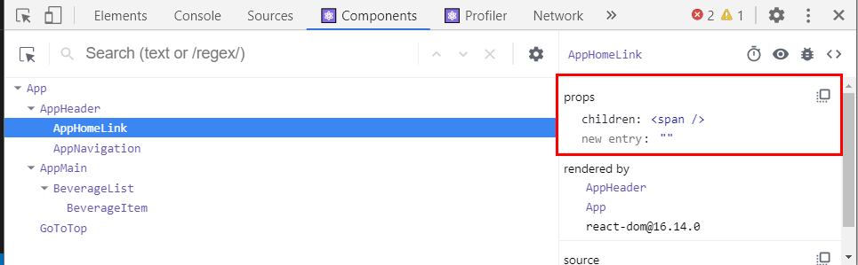

[← BACK](./README.md)

# DAY 12 (2020-11-03, 일)

> _질문에는 ❓, 답변에는 🤖가 달려 있습니다._
>
> _이해가 완전하지 않은 개념에는 🤯, 귤 팁에는 🍊이 달려 있습니다._

## Mini Project
어제에 이어서 Ediya Coffee 웹 만들기 미니 프로젝트 실습을 계속한다 (2일차).

### Yesterday I Learned...🤓 
[어제](./D11.md)는 미니 프로젝트 실습을 1일차였다. 가장 먼저 CRA (Create-React-App) 커스텀 탬플릿을 사용해 신규 프로젝트를 생성하였고, 이어서 `html` 파일에 작성되어 있던 앱의 구성을 `jsx` 파일에 이식하는 과정이 주를 이루었다. 또한 각 `jsx` 파일에 적용되는 `scss` 파일을 검토하여 여러 컴포넌트의 `className`에 스타일 속성이 잘 붙었는지 확인했다.<br /> 

<details start>
<summary>어제의 Ediya Coffee☕ (미니 프로젝트 실습 1일차 결과물)</summary>


</details>

---

### 컴포넌트 props 디자인

#### 컴포넌트 props 설계 AppHomeLink
<details start>
<summary> AppHomeLink.jsx에 props를 통해 데이터를 전달하고 관리할 수 있도록 해보자. </summary>

`AppHomeLink.jsx` 컴포넌트는 `AppHeader.jsx` 컴포넌트의 하위에 있으며, 현재까지 작성된 두 컴포넌트의 코드 구성은 다음과 같다:
```sh
// AppHeader.jsx
import './AppHeader.scss'
import React from 'react'
import AppHomeLink from './../AppHomeLink/AppHomeLink'
import AppNavigation from './../AppNavigation/AppNavigation'

const AppHeader = () => {
  return (
    <header className="appHeader">
      <AppHomeLink />
      <AppNavigation />
    </header>
  )
}

export default AppHeader
```

```sh
// AppHomeLink.jsx
import './AppHomeLink.scss'
import React from 'react'

const AppHomeLink = () => {
  return (
    <h1 className="appHeader__brand">
      <a
        className="appHeader__homeLink"
        href="/"
        title="홈 페이지로 이동"
        target="_blank"
        rel="noopener noreferrer"
      >
        <span className="a11yHidden" lang="en">
          EDIYA COFFEE
        </span>
      </a>
    </h1>
  )
}

export default AppHomeLink
```

`props` 속성은 부모 컴포넌트에서 자식 컴포넌트로 전달된다. 지금 보고 있는 경우에서 부모 컴포넌트는 보다 상위 단계인 `AppHeader.jsx`이며 자식 컴포넌트는 `AppHomeLink.jsx`이다. `AppHomeLink.jsx`의 함수형 컴포넌트 인자에 `AppHeader.jsx`로부터 전달받을 속성 `props`를 넣어주고, 컴포넌트 내 속성이 필요한 부분에 `{ props.children }`을 작성한다. 여기서 전달받는 속성 `props`는 `AppHomeLink`의 함수형 컴포넌트 내에 기술되어 있던 `<span>` 부분이다. 한편 부모 컴포넌트에서 `AppHomeLink`를 import하여 화면상에 나타내기 위해 넣어준 구문 `<AppHomeLink />`는 다음과 같이 바꾸어 작성해주게 된다:

```sh
// AppHeader.jsx
import './AppHeader.scss'
import React from 'react'
import AppHomeLink from './../AppHomeLink/AppHomeLink'
import AppNavigation from './../AppNavigation/AppNavigation'

const AppHeader = () => {
  return (
    <header className="appHeader">
      <AppHomeLink>
        <span className="a11yHidden" lang="en">
          EDIYA COFFEE
        </span>
      </AppHomeLink>
      <AppNavigation />
    </header>
  )
}

export default AppHeader
```

또한 `props` 속성을 전달받는 것으로 변경한 `AppHomeLink` 컴포넌트의 구문은 다음과 같다:
```sh
import './AppHomeLink.scss'
import React from 'react'

const AppHomeLink = (props) => {
  return (
    <h1 className="appHeader__brand">
      <a
        className="appHeader__homeLink"
        href="/"
        title="홈 페이지로 이동"
        target="_blank"
        rel="noopener noreferrer"
      >
        {props.childeren}
      </a>
    </h1>
  )
}

export default AppHomeLink
```
서버에서 `Components`를 확인하면 `AppHomeLink`가 `props`로 `span`을 받고 있음을 알 수 있다.<br /><br />


</details>


#### 컴포넌트 props 설계 (classnames 라이브러리, as 속성 등)

---

### 컴포넌트 이벤트 핸들링 & 타임 컨트롤

---

### 리스트 렌더링 & 컨텍스트 Part 1