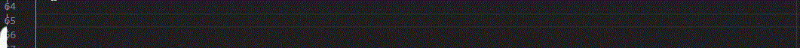
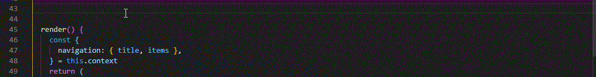
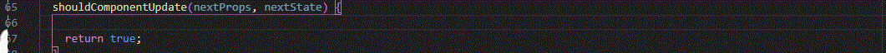
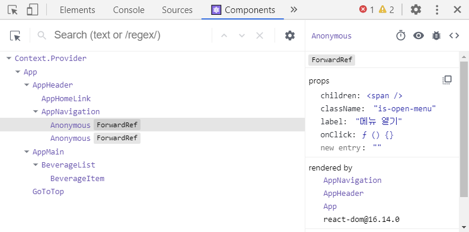
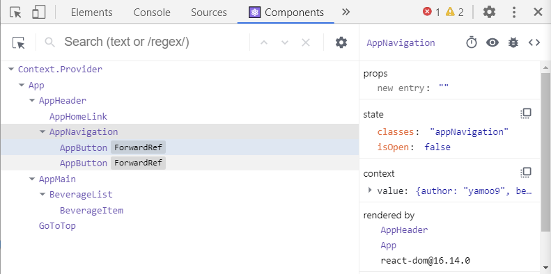
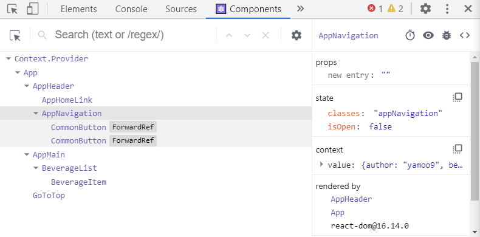

[← BACK](./README.md)

# DAY 13 (2020-11-05, 목)

> _질문에는 ❓, 답변에는 🤖가 달려 있습니다._
>
> _이해가 완전하지 않은 개념에는 🤯, 귤 팁에는 🍊이 달려 있습니다._

## Mini Project
어제에 이어서 Ediya Coffee 웹 만들기 미니 프로젝트 실습을 계속한다 (3일차).

### Yesterday I Learned...🤓 

<details start>
<summary>어제 실습한 내용 훑어보기🐌</summary>
<br />
[어제](./D12.md)는 미니 프로젝트 실습을 2일차였다. <ins> `props`로 데이터를 전달하고, 스프레드 연산자의 다양한 기능을 활용하여 전달받은 데이터를 관리</ins>할 수 있었다. 또한 네비게이션 바의 스르륵🐌 열고 닫힘을 만드는 과정을 통해, <ins>클래스 컴포넌트에서 상태 `state`를 설정하고 `setState` 메서드를 사용하여 이벤트 발생시 상태를 바꿔주는 법</ins>도 배웠다. 특히 스르륵🐌 애니메이션을 구현하기 위해 <ins>`window.setTimeout(() => {...}, delay)`을 이용하여 타임 컨트롤</ins>을 해보았다. 마지막으로 <ins>컨텍스트 API👀 데이터를 저장해둔 파일인 `json`을 import하여, `React.createContext`로 해당 데이터를 context로 생성하고, `Context.Provider value = { value }`로 하위 컴포넌트에 데이터를 공유</ins>하는 것까지 해보았다.     
</details>

<details start>
<summary>어제의 Ediya Coffee☕ (미니 프로젝트 실습 2일차 결과물)</summary>
<br />


</details>

---

### 컴포넌트 접근성 개선

#### 키보드 접근성 설정 ref, forwardRef, shouldComponentUpdate 🤯

<details start>
<summary> Tab, Shift, ESC 키를 이용하여 키보드 사용만으로 네비게이션 바를 자유자재로 이용할 수 있게 만들어보자🤸‍♀️</summary>
<br />
<details start>
<summary>AppNavigation.jsx 코드 전문👀</summary>

```sh
// AppNavigation.jsx
import './AppNavigation.scss'
import React, { Component, Fragment } from 'react'
import EdiyaContext from '../../context/ediyaContext'
import AppButton from './../AppButton/AppButton'

class AppNavigation extends React.Component {
  static contextType = EdiyaContext
  state = {
    isOpen: false,
    classes: 'appNavigation',
  }

  handleOpenMenu = (e) => {
    this.setState(
      {
        isOpen: true,
      },
      () => {
        window.setTimeout(() => {
          this.setState({
            classes: 'appNavigation is-active',
          })
        }, 100)
      },
    )
  }

  handleCloseMenu = (e) => {
    this.setState(
      {
        classes: 'appNavigation',
      },
      () => {
        window.setTimeout(() => {
          this.setState({
            isOpen: false,
          })
        }, 400)
      },
    )
  }

  handleFocusCloseMenuButton = (e) => {
    if (e.shiftKey && e.keyCode == 9) {
      e.preventDefault()
      this.refs.closeButton.focus()
    }
  }

  handleFocusFirstLink = (e) => {
    if (!e.shiftKey && e.keyCode == 9) {
      e.preventDefault()
      this.refs.firstLink.focus()
    }
  }

  handleEscCloseMenu = (e) => {
    console.log('keydown')
    if (e.keyCode == 27) {
      this.handleCloseMenu()
    }
  }

  shouldComponentUpdate(nextProps, { isOpen }) {
    const methodName = isOpen ? 'addEventListener' : 'removeEventListener'

    window.addEventListener('keydown', this.handleEscCloseMenu)
    return true
  }

  render() {
    const {
      navigation: { title, items },
    } = this.context
    return (
      <Fragment>
        <AppButton
          className="is-open-menu"
          label="메뉴 열기"
          onClick={this.handleOpenMenu}
        >
          <span className="ir" />
        </AppButton>

        <nav className={this.state.classes} hidden={!this.state.isOpen}>
          <h2 className="a11yHidden">{title}</h2>
          <ul className="resetList">
            {items.map(({ link, text }, index) => (
              <li key={`${link}-${index}`}>
                <a
                  ref={index == 0 ? 'firstLink' : null}
                  href={link}
                  onKeyDown={
                    index == 0 ? this.handleFocusCloseMenuButton : null
                  }
                >
                  {text}
                </a>
              </li>
            ))}
          </ul>

          <AppButton
            ref="closeButton"
            className="is-close-menu"
            label="메뉴 닫기"
            onClick={this.handleCloseMenu}
            onKeyDown={this.handleFocusFirstLink}
          >
            <span className="close" aria-hidden="true">
              ×
            </span>
          </AppButton>
        </nav>
      </Fragment>
    )
  }
}

export default AppNavigation
```
</details>

<details start>
<summary>AppButton.js 코드 전문👀</summary>

```sh
// AppButton.js
import React, { forwardRef } from 'react'
import classNames from 'classnames'

const AppButton = ({children, className, label, ...restProps}, ref) => {
    const combineClassNames = classNames('resetButton', className)
    return (
        <button
        ref={ref}
        {...restProps}
          className={combineClassNames}
          type="button"
          title={label || null}
          aria-label={label || null}
        >
            {children}
        </button>
    )
};

export default forwardRef(AppButton)
```
</details>

1. 네비게이션 바의 첫번째 요소 (`메뉴`)에 `ref`값으로 `firstLink`를 부여하고, `onkeyDown` 이벤트를 연결한다. 이 이벤트는 사용자가 네비게이션 바의 첫번째 요소 (`메뉴`)에서 `Shift`와 `Tab` 키를 눌렀을 때 브라우저의 기본 동작을 차단하고 마지막 버튼 `closeButton` (`ref`값이 `closeButton`인 요소)으로 이동하도록 한다. 여기서 말하는 마지막 버튼은 네비게이션 바를 닫는 `x` 버튼을 말한다. 

```sh
// AppNavigation.jsx
...

// `Shift`와 `Tab` 키를 눌렀을 때 브라우저의 기본 동작을 차단하고 마지막 버튼 `closeButton` (`ref`값이 `closeButton`인 요소)이 `focus`되도록 한다. 
 handleFocusCloseMenuButton = (e) => {
    if (e.shiftKey && e.keyCode == 9) {
      e.preventDefault()
      this.refs.closeButton.focus()
    }
  }

  ...


// `index`값이 0인 경우에만 `handleFocusCloseMenuButton`을 실행한다.
<a
    ref={index == 0 ? 'firstLink' : null}
    href={link}
    onKeyDown={
    index == 0 ? this.handleFocusCloseMenuButton : null
    }
>

...
```

>🍊 `Tab`키의 keyCode가 9인 건 어떻게 알 수 있을까?<br /> 자바스크립트 이벤트 keyCode 정보는 여기로 👉[http://keycode.info/](http://keycode.info/)
>

2. 네비게이션 바의 마지막 버튼 (네비게이션 바 닫는 버튼 `x`)의 `ref`값을 `closeButton`으로 설정한다.

```sh
// AppNavigation.jsx
...

// 마지막 버튼에도 참조 가능한 `ref`를 설정한다.  
<AppButton
    ref="closeButton"
    className="is-close-menu"
    label="메뉴 닫기"
    onClick={this.handleCloseMenu}
>
    <span className="close" aria-hidden="true">
        ×
    </span>
</AppButton>

...
```

3. `x` 버튼을 감싸고 있는 `AppButton`은 `AppButton.js`로부터 import해온 요소다. 그러므로 `x` 버튼의 `AppButton`에 `ref`값을 설정하려면 먼저 `AppButton.js`에 `ref`값이 설정되어 있어야 오류가 발생하지 않는다. `AppButton.js` 컴포넌트는 전달받은 값을 `ref`값으로 설정하게 된다. `ref`를 전달받기 위해 사용하는 것이 `React.forwardRef`다. `React.forwardRef`는 첫번째 인자로 `props`를, 두번째 인자로는 `ref`를 전달한다. 따라서 `AppButton.js` 컴포넌트를 `React.forwardRef`로 래핑하고, 두번째로 전달받은 인자를 `ref` 값으로 설정하면 된다. (`React.forwardRef` 개념 추가 학습 필요🤯)

```sh
// AppButton.js
import React, { forwardRef } from 'react'
import classNames from 'classnames'

const AppButton = ({children, className, label, ...restProps}, ref) => {
    const combineClassNames = classNames('resetButton', className)
    return (
        <button
        ref={ref}
        {...restProps}
          className={combineClassNames}
          type="button"
          title={label || null}
          aria-label={label || null}
        >
            {children}
        </button>
    )
};

export default forwardRef(AppButton)
```

4. 여기까지 하면 네비게이션 바의 첫번째 요소에서 `Shift` + `Tab` 키를 눌렀을 때 닫는 버튼 `x`으로 이동하게 된다. 이제는 `x` 버튼에서 `Tab`을 눌렀을 때 네비게이션 바의 첫번째 요소인 `menu`로 돌아갈 수 있도록 제어해보자. 아래와 같이 마지막 버튼에 `onKeyDown` 이벤트를 연결한다.  

```sh
// AppNavigation.jsx
...
// `Tab` 키를 누르면 기본 브라우저 동작을 차단하고 `ref`가 `firstLink`인 요소가 `focus`되도록 한다.
handleFocusFirstLink = (e) => {
    if (!e.shiftKey && e.keyCode == 9) {
        e.preventDefault()
        this.refs.firstLink.focus()
    }
}

...

<AppButton
    ref="closeButton"
    className="is-close-menu"
    label="메뉴 닫기"
    onClick={this.handleCloseMenu}
    onKeyDown={this.handleFocusFirstLink}
>
    <span className="close" aria-hidden="true">
        ×
    </span>
</AppButton>

...
```

5. 마지막으로 `esc` 키를 눌렀을 때 네비게이션 바를 나갈 수 있도록 해보자. 컴포넌트를 업데이트할지 말지를 결정하는 라이프 사이클 푹인 `shouldComponentUpdate`를 사용하여 네비게이션 바가 열렸을 때, 즉 `isOpen`이 `true`인 상태에서만 `keydown` 이벤트가 발생하여 핸들러 `handleEscCloseMenu`가 실행될 수 있도록 한다. (`라이프 사이클 훅` 개념 추가 학습 필요🤯)

>🍊 `scu`로 `shouldComponentUpdate`하기
>

<details start>
<summary>ESC 키의 keyCode 확인하기</summary>
<br />

</details>

```sh
// AppNavigation.js
...

  // `isOpen`의 상태를 `false`로 변경하여 네비게이션 바가 닫히도록 한다
  handleCloseMenu = (e) => {
    this.setState(
      {
        classes: 'appNavigation',
      },
      () => {
        window.setTimeout(() => {
          this.setState({
            isOpen: false,
          })
        }, 400)
      },
    )
  }

  // `keyCode`가 27인 `esc` 키를 눌렀을 때 `handleCloseMenu`가 실행된다
  handleEscCloseMenu = (e) => {
    console.log('keydown')
    if (e.keyCode == 27) {
      this.handleCloseMenu()
    }
  }
  
  // `isOpen`이 `true`면 `addEventListener`, `false`면 `removeEventListener`
  shouldComponentUpdate(nextProps, { isOpen }) {
    const methodName = isOpen ? 'addEventListener' : 'removeEventListener'

    window.addEventListener('keydown', this.handleEscCloseMenu)
    return true
  }

...
```
<details start>
<summary>위에서 언급은 안했지만, 영상 강의에서 나온 팁을 담은 귤바구니🍊</summary>
<br />
>🍊 `cdm`로 `componentDidMount`하기 
>

>🍊 `clg`로 `console.log`하기 
>
</details>


</details>

<details start>
<summary>여기까지의 Ediya Coffee☕</summary>
<br />


</details>

#### 컴포넌트 참조 전달 forwardRef 과 개발 도구에서 이름 표시 설정

<details start>
<summary> 개발자 도구의 Components에서 컴포넌트 참조 전달의 이름이 표시될 수 있도록 해보자. 또한 원하는 이름으로 표시될 수 있도록 하자.</summary>
<br />

아래와 같이 `forwardRef`을 적용하는 경우, 개발자 도구 `Components`에서 해당 컴포넌트의 이름은 `Anonymous`로 뜬다.

```sh
// AppButton.js
import React, { forwardRef } from 'react'
import classNames from 'classnames'

const AppButton = forwardRef(({children, className, label, ...restProps}, ref) => {
    const combineClassNames = classNames('resetButton', className)
    return (
        <button
        ref={ref}
        {...restProps}
          className={combineClassNames}
          type="button"
          title={label || null}
          aria-label={label || null}
        >
            {children}
        </button>
    )
});

export default AppButton;

```
<br /><br />

위와는 다르게 해당 컴포넌트의 이름이 제대로 표시되게 하려면 다음과 같이 `forwardRef`를 적용해야 한다.

```sh
// AppButton.js
import React, { forwardRef } from 'react'
import classNames from 'classnames'

const AppButton = ({children, className, label, ...restProps}, ref) => {
    const combineClassNames = classNames('resetButton', className)
    return (
        <button
        ref={ref}
        {...restProps}
          className={combineClassNames}
          type="button"
          title={label || null}
          aria-label={label || null}
        >
            {children}
        </button>
    )
};

export default forwardRef(AppButton)

```
</details>

<br /><br />

또한 `displayName`을 활용하여 개발자 도구에 표시되는 참조 전달 컴포넌트의 이름을 원하는 대로 지정할 수 있다. 

```sh
// AppButton.js
import React, { forwardRef } from 'react'
import classNames from 'classnames'

const AppButton = (
    ...
};

AppButton.displayName = "CommonButton"

export default forwardRef(AppButton)
```

<br /><br />


---

### 리스트 렌더링 & 컨텍스트 Part 2

#### 컴포넌트 리스트 렌더링 + Context API

<details start>
<summary> 컴포넌트 참조 전달 forwardRef 과 개발 도구에서 이름 표시 설정 </summary>
<br />
</details>

#### 다이얼로그 인터랙션

<details start>
<summary> 다이얼로그 인터랙션</summary>
<br />
</details>

--- 

### 페이지 상단 스크롤 이동

#### 페이지 상단 이동 인터랙션 GoToTop

<details start>
<summary> 페이지 상단 이동 인터랙션 GoToTop </summary>
<br />
</details>

#### React 훅 활용 useState, useEffect

<details start>
<summary> React 훅 활용 useState, useEffect </summary>
<br />
</details>

