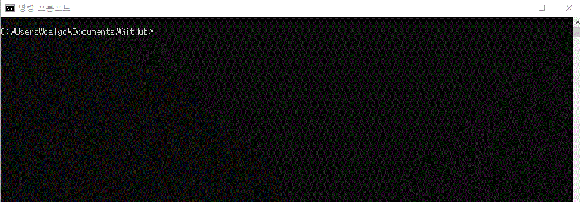
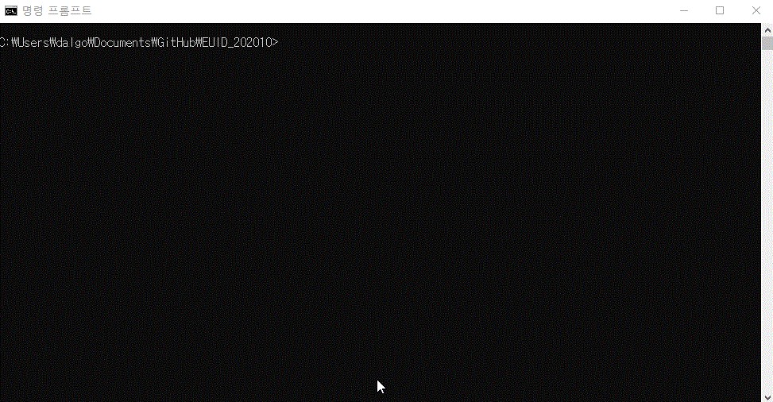
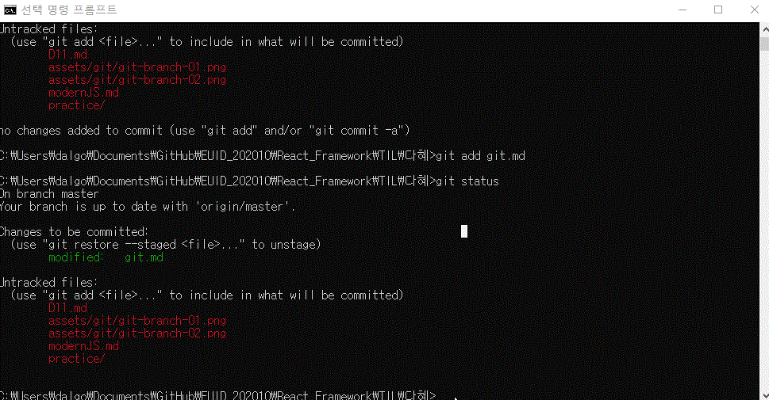
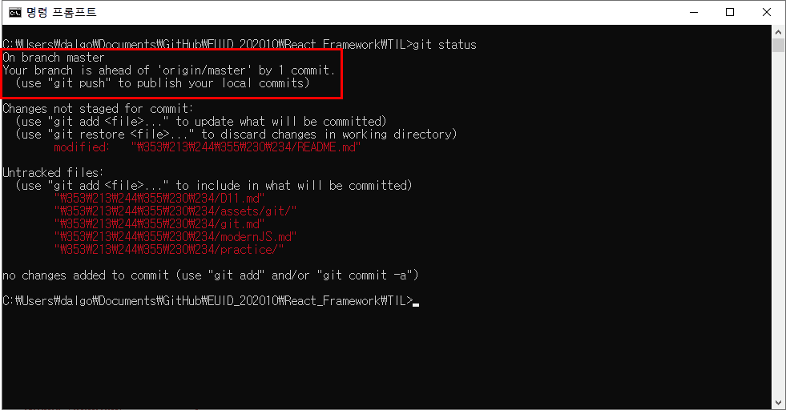
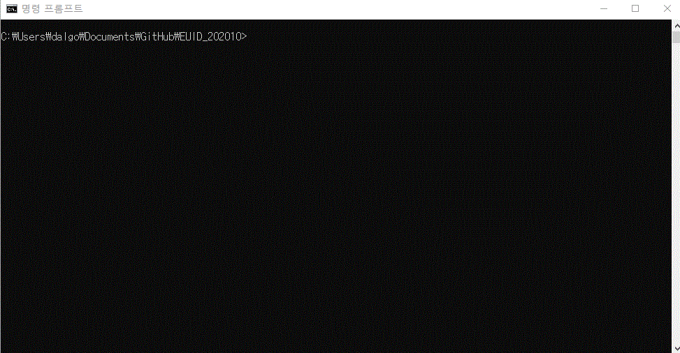
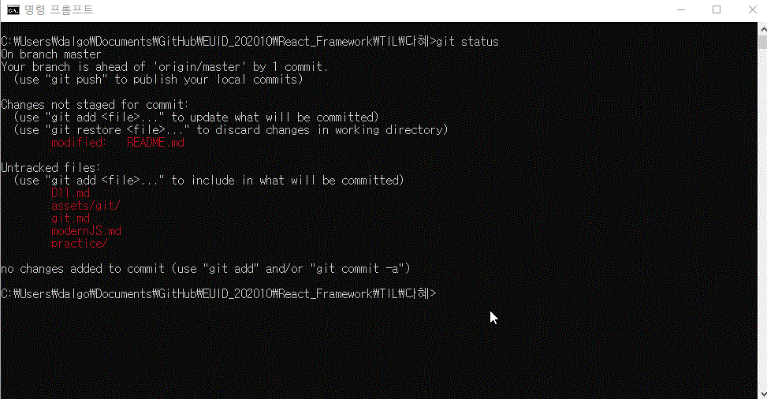
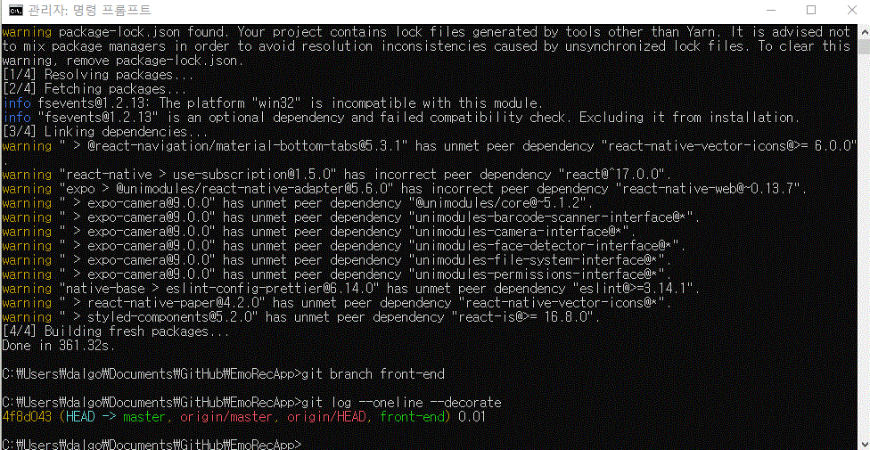

[← BACK](./README.md)

# Git CLI 커맨드 모음 
sourcetree나 github for Desktop같은 git GUI보다는 CLI (command-line interface) 커맨드로 git 관리를 하는 데에 익숙해져야 한다고 해서 자료를 찾고 써먹는 대로 일단 다 기록해두는 git CLI 커맨드 방앗간🦥  
CLI를 써야 git의 모든 기능을 다 제어할 수 있다고 하던데...하면서 알게 되겠지...🤖 

`git clone` 

 기존 저장소를 clone하기

  
  

`git status`

 

파일의 상태 확인하기
 

`git add` 

파일을 새로 추적하기

`git restore --staged`

파일 언스테이지하기

`git commit -m` 

메시지를 인라인으로 첨부하여 변경사항 커밋하기

  

`git commit --amend -m` 

메시지를 인라인으로 첨부하여 커밋 되돌리기

`git pull` 

리모트 저장소를 Pull하기 

`git push` 

리모트 저장소에 Push하기

`git branch`

새 브랜치 생성하기

`git log --online --decorate`

브랜치가 어떤 커밋을 가리키는지 확인하기

`git checkout`

작업 중인 브랜치 변경하기

## git 자료
[git documentation](https://git-scm.com/book/ko/v2)

