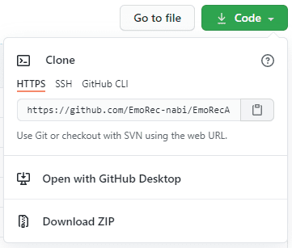

[← BACK](./README.md)

# Git CLI 커맨드 모음 
sourcetree나 github for Desktop같은 git GUI보다는 CLI (command-line interface) 커맨드로 git 관리를 하는 데에 익숙해져야 한다고 해서 자료를 찾고 써먹는 대로 일단 다 기록해두는 git CLI 커맨드 방앗간🦥  
CLI를 써야 git의 모든 기능을 다 제어할 수 있다고 하던데...하면서 알게 되겠지...🤖 

`git clone` 기존 저장소를 clone하기 
  
  
  

`git status` 파일의 상태 확인하기  
  

`git add` 파일을 새로 추적하기  
  

`git commit -m` 메시지를 인라인으로 첨부하여 변경사항 커밋하기 
  
  

`git commit --amend -m` 메시지를 인라인으로 첨부하여 커밋 되돌리기 
  

`git pull` 리모트 저장소를 Pull하기  
  

`git push` 리모트 저장소에 Push하기  
  

## git 자료
[git documentation](https://git-scm.com/book/ko/v2)

