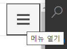

[← BACK](./README.md)

# DAY 12 (2020-11-04, 수)

> _질문에는 ❓, 답변에는 🤖가 달려 있습니다._
>
> _이해가 완전하지 않은 개념에는 🤯, 귤 팁에는 🍊이 달려 있습니다._

## Mini Project
어제에 이어서 Ediya Coffee 웹 만들기 미니 프로젝트 실습을 계속한다 (2일차).

### Yesterday I Learned...🤓 

<details start>
<summary>어제 실습한 내용 훑어보기🐌</summary>

[어제](./D11.md)는 미니 프로젝트 실습을 1일차였다. 가장 먼저 CRA (Create-React-App) 커스텀 탬플릿을 사용해 신규 프로젝트를 생성하였고, 블라블라블라...
</details>

<details start>
<summary>어제의 Ediya Coffee☕ (미니 프로젝트 실습 1일차 결과물)</summary>


</details>

---

### 컴포넌트 props 디자인

#### 컴포넌트 props 설계 AppHomeLink
<details start>
<summary> AppHomeLink.jsx에 props를 통해 데이터를 전달하고 관리할 수 있도록 해보자. </summary>

`props` 속성은 부모 컴포넌트에서 자식 컴포넌트로 전달된다. 블라블라블라...

```sh
// AppHeader.jsx
import './AppHeader.scss'
import React from 'react'
import AppHomeLink from './../AppHomeLink/AppHomeLink'
import AppNavigation from './../AppNavigation/AppNavigation'

const AppHeader = () => {
  return (
    <header className="appHeader">
      <AppHomeLink>
        <span className="a11yHidden" lang="en">
          EDIYA COFFEE
        </span>
      </AppHomeLink>
      <AppNavigation />
    </header>
  )
}

export default AppHeader
```

❓스프레드 연산자 다시 한 번 짚고 넘어가기<br />
🤖스프레드 연산자는 세 개의 점(...)으로 이루어진 연산자로, 몇 가지 다른 역할을 담당한다. 
<details start>
<summary>먼저 스프레드 연산자를 사용해 배열의 내용을 조합할 수 있고,</summary> \

```sh
var peaks = ["대청봉", "중청봉", "소청봉"]
var canyons = ["천불동계곡", "가야동계곡"]
var seoraksan = [...peaks, ...canyons]

console.log(seoraksan.join(',')) // 대청봉, 중청봉, 소청봉, 천불동계곡, 가양동계곡
```
</details>

<details start>
<summary>배열의 나머지 원소를 얻을 수도 있고,</summary> 

```sh
var lakes = ["경포호", "화진포", "송지호", "청초호"]
var [first, ...rest] = lakes

console.log(rest.join(",")) // "화진포, 송지호, 청초호"
```
</details>

<details start>
<summary>함수의 인자를 배열로 모을 수도 있고,</summary>

```sh
function directions(...args) {
    var [start, ...remaining] = args
    var [finish, ...stops] = remaining.reverse()

    console.log(`${args.length} 도시를 운행합니다.`)
    console.log(`${start}에서 출발합니다.`)
    console.log(`목적지는 ${finish}입니다.`)
    console.log(`중간에 ${stops.length}군데 돌립니다`)
}

directions(
    "서울",
    "수원",
    "천안",
    "대전",
    "대구",
    "부산"
)
```
</details>

<details start>
<summary>또한 객체에 사용할 수도 있다.</summary> 

```sh
var morning = {
    breakfast: "미역국",
    lunch: "삼치구이와 보리밥"
}

var dinner = "스테이크 정식"

var backpackingMeals = {
    ...morning, 
    dinner
}

console.log(backpackingMeals)

// {breakfast: "미역국", lunch: "삼치구이와 보리밥", dinner: "스테이크 정식"}
```
</details>

</details>


#### 컴포넌트 props 설계 (classnames 라이브러리, as 속성 등)
<details start>
<summary> classnames 라이브러리를 활용하여 props로 전달받은 클래스명을 자식 컴포넌트에서 기본으로 지정되어 있던 값과 함께 클래스로 설정하는 방법을 알아보자. as 구문을 활용하여 props로 전달받은 속성으로 자식 컴포넌트의 태그를 바꿔보자. </summary>

부모 컴포넌트로부터 전달받은 속성 가운데 `className`이 있는데, 블라블라블라...

```sh
import classNames from 'classnames'
``` 

</details>

---

### 컴포넌트 이벤트 핸들링 & 타임 컨트롤

<details start>
<summary>클래스 컴포넌트에서 상태를 설정하여 이벤트 발생에 따라 스르륵 열리고 닫히는 네비게이터를 만들어보자.</summary>

<br /><br />
앱의 네비게이터 역할을 하는 AppNavigation은 열리거나 닫힐 때에 따라 다른 상태를 가져야 하는 컴포넌트다. 상태를 갖기 위해서는 클래스 컴포넌트로 작성되어야 한다. <br />

> 🍊명령 팔레트(`Ctrl` + `Shift` + `P`)에서 `React Pure to Class`를 실행하여 함수형 컴포넌트를 클래스 컴포넌트로 바꾼다. <br />
> <br />


</details>

<details start>
<summary>여기까지의 실습 결과물☕</summary>


</details>

---

### 리스트 렌더링 & 컨텍스트 Part 1

<details start>
<summary>Context API를 이용한 동적 데이터 처리를 알아보자</summary>

Context를 생성 `React.createContext(value)`한 후, 컨텍스트 공급자 `<Context.Provider value={value}>`, 수요자 `<Context.Consumer>`를 통해 데이터를 공유할 수 있다. 블라블라블라...

</details>

---

### 오늘 실습의 결과물

<details start>
<summary>오늘의 Ediya Coffee☕</summary>


</details>

---

### 오늘 느낀 점 

모니터가 두 대였음 좋겠다, 내 눈...🤶