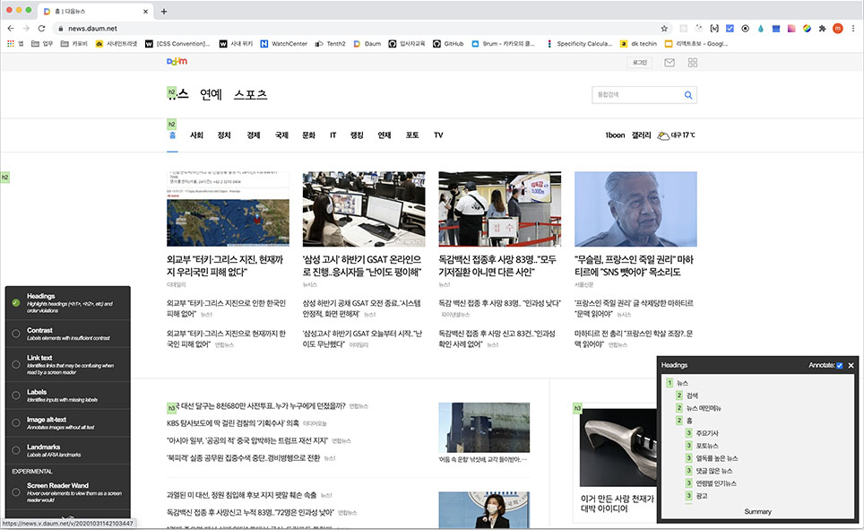

[← BACK](./README.md)

# 10일차 학습

React Framework 블렌디드 러닝 Today I Learned

## React 앱 접근성 개선

React 앱 개발시 모든 사용자를 고려한 접근성 준수가 필요하다.

접근성을 준수하면 보조기기에서 정보를 해석 할 수 있어 보조기기 사용자의 접근성을 향상시킬 수 있으며, 더불어 검색엔진 최적화도 향상 시킬 수 있다.

### 문서 아웃라인 구성 헤딩 레벨

서비스제공자는 사용자가 컨텐츠를 쉽게 탐색 할 수 있게 하거나 이해하기 용이하도록 서비스를 구성할 필요가 있다.

스크린리더 사용자가 스크린리더의 lotor 기능을 사용해서 제목 간 탐색을 하여 필요한 컨텐츠에 빠르게 살펴 볼 수 있도록 문서의 헤딩레벨을 적절하게 구조화시키는 작업을 해줘야 한다.

웹사이트에는 시각적으로는 보이지 않는 제목도 존재하므로 이를 일일히 확인하는건 매우 불편하다.

[tota11y 크롬 확장도구](https://chrome.google.com/webstore/detail/tota11y-plugin-from-khan/oedofneiplgibimfkccchnimiadcmhpe?hl=ko) 와 같은 도구를 사용하면 웹페이지의 제목구조를 손쉽게 확인 할 수 있다.



⚠️하지만 중첩된 각 섹션의 헤딩레벨을 구분해 구성하는것은 생각보다 쉽지 않다. (h3를 써야하나!?, h4를 써야하나!?)

React 라이브러리 중 `tenon-ui` 라이브러리를 사용하면 헤딩레벨의 바운더리만 생각해놓으면 헤딩레벨에 대한 고민을 덜 수 있다.

`levelOverride` 옵션을 줄경우 해당 헤딩레벨로 오버라이드 시켜주기도 한다.

```zsh
npm install @tenon-io/tenon-ui
```

```jsx
import React from 'react';
import { Heading } from '@tenon-io/tenon-ui';

function App() {
  return (
    <div className='App'>
      <Heading.H>뉴스</Heading.H>

      <Heading.LevelBoundary>
        <Heading.H>검색</Heading.H>
        <Heading.H>뉴스 메인메뉴</Heading.H>
        <Heading.H>홈</Heading.H>

        <Heading.LevelBoundary levelOverride={4}>
          <Heading.H>주요기사</Heading.H>
          <Heading.H>포토뉴스</Heading.H>
          <Heading.H>열독률 높은 뉴스</Heading.H>
          <Heading.H>댓글 많은 뉴스</Heading.H>
          <Heading.H>연령별 인기 뉴스</Heading.H>
        </Heading.LevelBoundary>
      </Heading.LevelBoundary>
    </div>
  );
}

export default App;
```

### 히든 콘텐츠

화면에 보이진 않지만, 스크린 리더에 읽히는 콘텐츠를 히든콘텐츠라고 한다.

올바른 히든 콘텐츠를 제공하지 않으면 스크린 리더 사용자에게 혼란을 야기한다.

#### 잘못된 vs 잘된 히든 콘텐츠 처리

```html
<!-- 화면에서는 감춰지지만 스크린리더가 읽을 수 없다 -->
<div style="display:none">...</div>
<div style="visibility:none">...</div>
<div hidden>...</div>
```

```css
/* 이와 같은 클래스를 콘텐츠에 사용하면 화면에서도 숨겨지고 스크린리더에서도 콘텐츠를 읽는게 가능하다. */
.a11yHidden {
  position: absolute;
  clip: rect(0 0 0 0);
  width: 1px;
  height: 1px;
  overflow: hidden;
  margin: -1px;
  border: 0;
  padding: 0;
  white-space: nowrap;
}
```

A11yHidden 컴포넌트를 활용한 숨김처리

```jsx
// A11yHidden.js
import React, { Component } from 'react';

const styles = {
  position: 'absolute',
  clip: 'rect(0 0 0 0)',
  width: 1,
  height: 1,
  overflow: 'hidden',
  margin: '-1px',
  border: 0,
  padding: 0,
  whiteSpace: 'nowrap',
};

class A11yHidden extends Component {
  // 포커스 상태
  state = { isFocus: false };

  // 포커스 상태일 경우 true
  changeStateFocused = () => {
    this.setState({ isFocus: true });
  };

  // 포커스 블러 상태일 경우 false
  changeStateBlured = () => {
    this.setState({ isFocus: false });
  };

  render() {
    let attrs = {};
    for (let [key, value] of Object.entries(this.props)) {
      // 전달된 props를 for...of 문으로 반복문을 돌려 key값이 tag나 focusable 일 경우 attrs 객체에 key:value 형태로 추가
      if (key === 'tag' || key === 'focusable') {
        continue;
      }
      attrs[key] = value;
    }
    const { tag, focusable } = this.props;
    const { isFocus } = this.state;
    const Tag = tag || 'props';

    return (
      <Tag
        style={!focusable ? styles : isFocus ? null : styles}
        // 전개연산자로 나머지 props들 그대로 전달받음
        {...attrs}
        // focusable props가 있을경우 포커스 이벤트와 블러이벤트 시 상태 변화메서드
        onFocus={focusable && this.changeStateFocused}
        onBlur={focusable && this.changeStateBlured}
      />
    );
  }
}

export default A11yHidden;

// App.js
import React from 'react';
import { Heading } from '@tenon-io/tenon-ui';

function App() {
  return (
    <div className='App'>
      <A11yHidden tag="a" href="#none">...<A11yHidden>
    </div>
  );
}

export default App;
```

화면에 보이지 않더라도, 읽혀야 되는 콘텐츠는 **올바른 감춤처리**가 되야 한다

### 버튼 컴포넌트 접근성 개선

버튼컴포넌트: 클릭, 포커싱 가능하며 기능 동작 수행이 되야 한다.

하지만 모양은 버튼인데 `a`태그로 사용하여 모양만 버튼으로 작업한 경우가 많다.

```html
<a href="#none" class="btn_comm btn_prev">이전보기</a>
<a href="#none" class="btn_comm btn_next">다음보기</a>
<a href="#none" class="btn_comm btn_play">롤링 플레이</a>
```

이럴 경우 스크린리더에서는 버튼이라 인식 못하고 링크로 인식하여 출력을 해 사용자게 혼란을 야기하므로 `button`으로 작업하는게 올바르다.

```html
<button type="button" class="btn_comm btn_prev">이전보기</button>
<button type="button" class="btn_comm btn_next">다음보기</button>
<button type="button" class="btn_comm btn_play">롤링 플레이</button>
```

### 사용에 주의가 필요한 HTML 문법

- `li` 리스트 아이템 요소는 `ul`, `ol`요소의 내부로만 들어갈 수 있다.
- `dl` 요소 안에는 `dt`(key), `dd`(value)가 쌍으로 들어가며 필요에 따라서 `div`로 `dt`, `dd`를 감쌀 수 있다.
- `figcaption`은 `figure` 내부에서만 사용 할 수 있다.
- `table`의 내부에는 `caption`요소가 필요하다.

**React 컴포넌트 시스템을 사용하여 개발 할 때 HTML 표준문법을 올바르게 검수하며 사용하도록 하자!**

### React 접근성 자동 검사 (React-axe)

리액트에서는 **axe-core** 라이브러리를 래핑한 **[React-axe](https://github.com/dequelabs/react-axe)** 접근성 자동검사 라이브러리가 있다.

```zsh
# 설치
npm i react-axe -D
```

```jsx
import React from 'react';
import ReactDOM from 'react-dom';
import './index.css';
import App from './App';
import reportWebVitals from './reportWebVitals';
import reactAxe from 'react-axe';

// 배포환경이 아닌 개발환경에서만 reactAxe 실행
if (process.env.NODE_ENV !== 'production') {
  reactAxe(React, ReactDOM, 1000);
}
ReactDOM.render(
  <React.StrictMode>
    <App />
  </React.StrictMode>,
  document.getElementById('root')
);

// If you want to start measuring performance in your app, pass a function
// to log results (for example: reportWebVitals(console.log))
// or send to an analytics endpoint. Learn more: https://bit.ly/CRA-vitals
reportWebVitals();
```

React-axe는 접근성 이슈가 있을경우 console 창에 해당 에러를 출력해준다. (명도대비, alt, text label, id중복 등)
