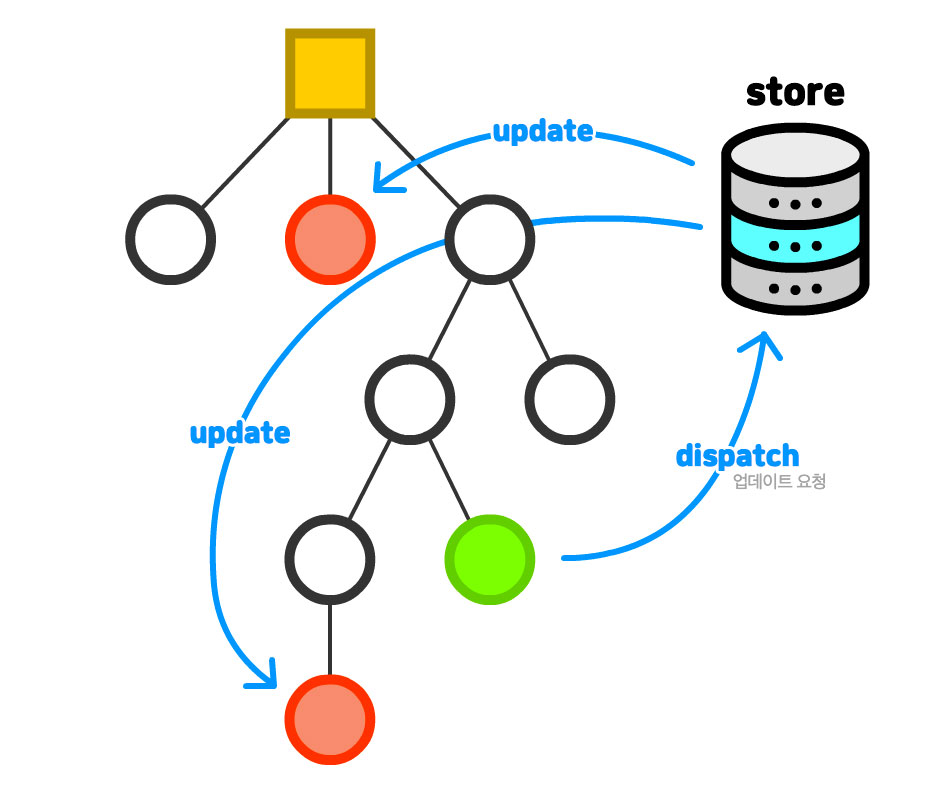
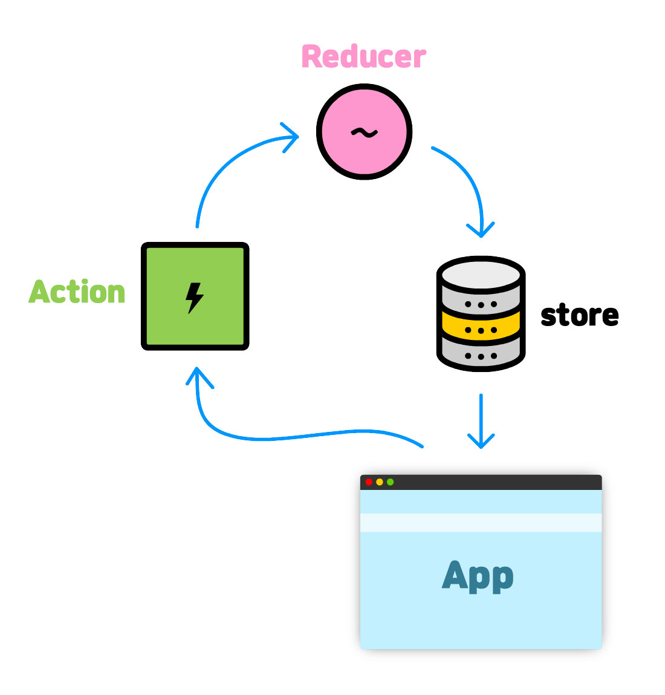
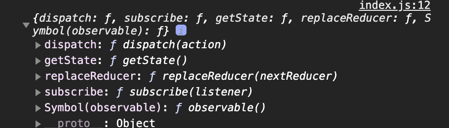

[← BACK](./README.md)

# 18일차 학습

React Framework 블렌디드 러닝 Today I Learned

## Redux 기본 개념

Redux는 애플리케이션의 상태를 관리하기 위한 견고하고 안정적인 솔루션을 제공해준다. 여기 저기 혼란스럽게 흩어져 있는 상태를 체계화 하여 애플리케이션을 관리하도록 도와 준다. (Redux는 React뿐만 아니라 Angular, Vue, Jquery, Vanilla JS 에서도 사용 가능하다.)

### 상태 관리 시스템의 필요성

애플리케이션의 컴포넌트가 늘어날 수록 각 컴포넌트이 가지고 있는 상태관리는 어려워진다. 이를 해결하기 위한 방안으로 각 컴포넌트의 상태를 하나의 저장소 `store`에서 저장을 하고 관리하도록 하는 상태 관리 시스템이 필요하다. 대표적인 상태관리로 `Redux`, `MobX`, `VueX` 등이 있다.



### Redux의 3원칙

- 애플리케이션 상태는 모두 한 곳에서 집중 관리된다. (동기화 필요 ❌)
- 상태는 불변(읽기 전용) 데이터 이며, 오직 액션만이 상태교체를 요청 할 수 있다. (예측 가능)
- 리듀서(함수)를 통해 상태의 최종 값만 설정한다. (단순화)



### 스토어

Redux 스토어는 애플리케이션의 상태를 관리하고, `getState()`, `dispatch()`, `subscribe()` 같은 메서드를 제공한다.

```js
import {createStore} as from 'redux'

const reducer = (state, action) => {
  // ...
  return state;
};

// Redux 스토어 생성
// - 리듀서 함수를 전달 받음
const store = createStore(reducer);
console.log(store);
```



스토어는 애플리케이션의 상태를 나타내는 key: value 쌍으로 구성 된 정보를 가진 하나의 큰 Javascript 객체이다. 스토어는 하나만 존재한다. 또한 스토어는 애플리케이션에 상태를 제공하며 상태가 업데이트 되면 UI는 리렌더링 된다.

### 상태

Redux 스토어에서 관리하는 상태로 일반적으로 `state`, `iniState` 이름으로 설정하며 리듀서(함수)의 첫번째 인자로 전달 된다.
상태 트리는 **불변 상태** 를 가져야 한다.

스토어의 `getState()` 메서드로 가져올 수 있다.

```js
const initialNews = '공정하고 정의로운 뉴스';

const changeNewsTitleAction = {
  type: 'CHANGE_NEWS_TITLE',
};

const reducer = (state = initialNews, action) => {
  console.log(action);
  return state;
};

const store = createStore(reducer);
console.log(store.getState());

store.dispatch(changeNewsTitleAction);
```

### 액션

액션은 **상태 변경을 설명하는 정보** 를 스토어로 보내는 Javascript 객체로 Redux에 dispatch로 알려 변화를 이끌어 낸다. 상태 값을 변경 할 경우, 교체 할 상태 값(payload)을 리듀서(함수)에 보낼 수 있다.

```js
const changeNewsTitleAction = {
  type: 'CHANGE_NEWS_TITLE',
};
```

상태 값을 동적으로 변경하고자 할 경우, 교체 할 상태 값을 payload에 담아 리듀서(함수)에 보낼 수 있다.

```js
const changeNewsTitleAction = {
  type: 'CHANGE_NEWS_TITLE',
  payload: '행복한 뉴스',
};
```

액션타입을 별도 관리하는 파일을 만들어 상수로 관리하는것이 유지보수에 좋다.

```js
// actionType.js
export const CHANGE_NEWS_TITLE = 'CHANGE_NEWS_TITLE';

// action.js
import { CHANGE_NEWS_TITLE } from './actionType.js';

const reducer = (state = initialNews, action) => {
  switch (action.type) {
    case CHANGE_NEWS_TITLE:
      state = action.payload;
      break;
  }
  return state;
};
```

## 리듀서

리듀서란 애플리케이션 상태를 교체하는 함수를 말한다. 리듀서는 상태와 액션을 전달받아 이전 상태(prevState) 를 새로운 상태 (state) 를 교체하여 반환한다.

리듀서는 **순수한 함수** 여야 한다. 순수함을 잃을 경우 사이드이펙트를 발생 시킬 수 있다.

- 전달 받은 매개변수 (state, action) 에 변형을 가하면 안된다.
- 네트워킹 (API 호출 ← 비동기 통신) 또는 라우팅을 변경하면 안된다.
- 반환 값은 반드시 새로운 상태 여야만 한다.

```js
const reducer = (prevState = initState, action){
  switch(action.type){
    case INCREASE_COUNT:
      return prevState + 1;
    case DECREASE_COUNT:
      return prevState - 1
    default:
      return state;
  }
}
```

## 구독

애플리케이션 상태 변경을 구독 하여 상태가 업데이트되면 등록된 리스너를 실행시킨다.

```js
const render = () => console.log(store.getState());
store.subscribe(render);
```

구독이 취소되면 더이상 상태변화를 감지 할 수 없다.

```js
const unsubscribe = store.subscribe(render);
unsubscribe();
```
