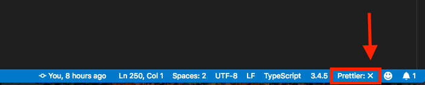
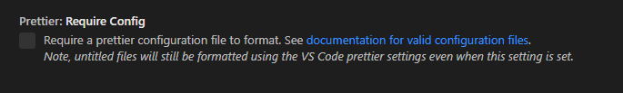

[← BACK](./README.md)

# 개발 도구 확장

## JavaScript 개발을 돕는 에디터 확장

### **Prettier - Code formatter**

설정된 규칙에 따라 자동으로 코드 스타일을 정리해주는 도구

1. 'format javascript' 검색 후 체크해제
2. 'format on save' 검색 후 체크
3. prettier 규칙 설정
4. 한참 오류가 발생하여 고생했는데 해결함
   오류사항 (문법오류(?)가 발생해서 prettier가 적용되지 않음)
   

   해결방법 (아래 설정값 체크해제)
   

### **Formatting Toggle**

: 클릭 한번으로 포맷터 등을 켜고 끌 수 있는 확장

### **React Snippets**

: React 앱 개발에서 자주 사용되는 코드 조각을 빠르게 작성하도록 도와주는 확장

<code>imp</code>

```js
import moduleName from './modulName.js'
```

<code>imn</code>

```js
import './module.js'
```

<code>imr</code>

```js
import React from 'react'
```

<code>imrd</code>

```js
import ReactDOM from 'react-dom'
```

<br><br>

### **React Pure To Class**

: React 함수형 컴포넌트를 클래스 컴포넌트로 손쉽게 변경하는 확장<br><br>

### **Auto Import**

: 필요한 모듈을 자동으로 불러 들이는 확장<br><br>

### **Import Cost**

: 가져온 모듈의 크기를 시각적으로 화면에 표시하는 확장<br><br>

### **Path Autocompoete**

: 불러온 모듈 파일 경로를 자동 완성하는 확장<br><br>

### **Auto Complete Tag**

: 태그 자동 닫기, 태그 자동 이름 변경 기능 확장<br><br>

### **Bracket Pair Colorizer2**

: 코드 블록 마다 색상을 부여해 구분을 손쉽게 하는 확장<br><br>

### **Color Highlight & Manager**

: 컬러 정보를 가진 텍스트의 색상을 미리보기 하고 Javascript 파일에서도 컬러 관리가 가능한 확장<br><br>

### **Image preview**

: 이미지 파일을 에디터에서 미리보기 하는 확장<br><br>

### **Translator**

: 클래스, 변수 및 함수 이름을 작성할 때 한글 -> 영어로 번역해주는 확장
