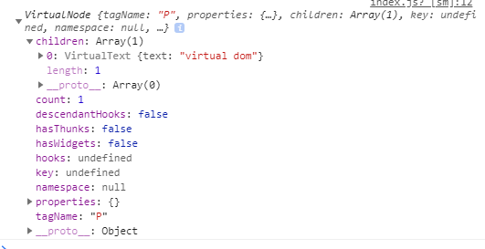
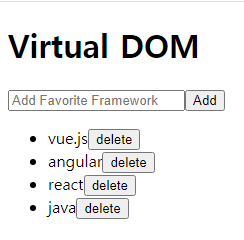
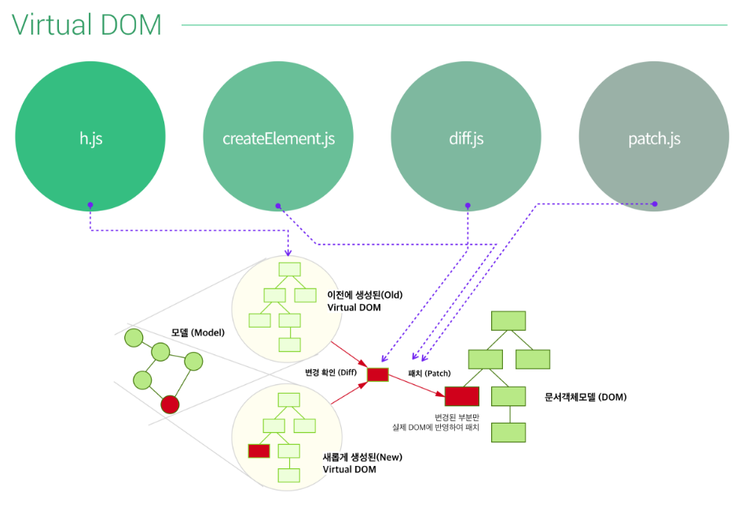

[← BACK](./README.md)

# Virtual DOM 강의, [Youtube]

## 환경 설정
### **Virtual-dom**

: A Javascript DOM model supporting element creation, diff computation and patch operations for efficient rerendering.<br />
 자바스크립트 DOM 모델에 대한 제어를 위해 엘리먼트를 생성하거나 변경된 사항에 대해서 계산을 하거나 변경된 사항들을 붙일 때의 기능등을 제공해주는 것.

 ``` 
 # npm init -y

 # npm i -D budo
   
   "start": "budo index.js --live (package.json)

 # npm i -S virtual-dom

 # npm start
 ```


## Real DOM 컨트롤

index.js
```
var actual_dom = document.createElement('p');

actual_dom.innerHTML = 'Actual Dom';

document.body.appendChild(actual_dom);
```

## Virtual DOM 컨트롤
   
### h.js see the virtual-hyperscript : creating virtual tree

  ```
  var h = require('virtual-dom/h');

  var tree = h('p','virtual dom');

  console.log(tree)

  ```
### create-element.js
   vdom (렌더링 역할 수행하고 변경시 알로리즘을 사용해서 패치하는 작업)
  ```
  var createElement = require('virtual-dom/create-element');

  // console.log(typeof createElement); //function

  var tree = h('p','virtual dom');

  var rootNode = createElement(tree);
  
  document.body.appendChild(rootNode);
  ```
  
 
## Virtual DOM Tree 비교 & 패치
 
### diff.js see the vtree
### patch.js

  ```
  var h = require('virtual-dom/h');
  var createElement = require('virtual-dom/create-element');
  var diff = require('virtual-dom/diff');
  var patch = require('virtual-dom/patch');

  // Actual DOM
  // var actual_dom = document.createElement('p');
  // actual_dom.innerHTML = 'Actual Dom';
  // document.body.appendChild(actual_dom);


  // Virtual DOM
  // console.log(typeof h); //function
  var count = 0;

  function render(n) {
    return h('p','virtual dom' + n);
  }

  function update() {
    //새로운 가상 트리를 생성
    var newTree = render(++count); // 1, 2, 3...
    // 기존 가상 트리, 새로운 가상 트리하고 변경점이 있는지 확인
    var patches = diff(tree, newTree);
    // 변경사항이 발생하면 rootNode에 패치(붙인다)
    patch(rootNode, patches)
  }

  var tree = render(count);
  // console.log(typeof createElement); //function
  var rootNode = createElement(tree);
  document.body.appendChild(rootNode);

  window.setInterval(function() {
    update();
  }, 1400);
```

## Virtual DOM 배열 순환

```
var h = require('virtual-dom/h');
var createElement = require('virtual-dom/create-element');
var diff = require('virtual-dom/diff');
var patch = require('virtual-dom/patch');

// Virtual DOM

var data = [
  'vue.js',
  'angular',
  'react'
]

function render(data) {
  var lists = data.map(function(item, index) {
    return h('li', item);
  })
  return h('ul', lists);
  // return h('p','virtual dom' + data);
}

function update() {
  //새로운 가상 트리를 생성
  var newTree = render(data); // 1, 2, 3...
  // 기존 가상 트리, 새로운 가상 트리하고 변경점이 있는지 확인
  var patches = diff(tree, newTree);
  // 변경사항이 발생하면 rootNode에 패치(붙인다)
  patch(rootNode, patches)
}

var tree = render(data);
// console.log(typeof createElement); //function
var rootNode = createElement(tree);
document.body.appendChild(rootNode);

```

## Virtual DOM 제거
```
var h = require('virtual-dom/h');
var createElement = require('virtual-dom/create-element');
var diff = require('virtual-dom/diff');
var patch = require('virtual-dom/patch');

// Virtual DOM

var data = [
  'vue.js',
  'angular',
  'react'
]
function render(data) {
  var lists = data.map(function(item, index) {
    return h('li', [
      item,
      h('button', {
        type: 'button',
        onclick: function(e){
          data.splice(index, 1);
          console.log(data);
          //화면 뷰 업데이트
          update();
        }
      }, 'delete')
    ]);
  });
  var list = h('ul', lists);
  return list;
}

function update() {
  //새로운 가상 트리를 생성
  var newTree = render(data); // 1, 2, 3...
  // 기존 가상 트리, 새로운 가상 트리하고 변경점이 있는지 확인
  var patches = diff(tree, newTree);
  // 변경사항이 발생하면 rootNode에 패치(붙인다)
  patch(rootNode, patches)
}

var tree = render(data);
// console.log(typeof createElement); //function
var rootNode = createElement(tree);
document.body.appendChild(rootNode);
```

## Virtual DOM 추가

```
var h = require('virtual-dom/h');
var createElement = require('virtual-dom/create-element');
var diff = require('virtual-dom/diff');
var patch = require('virtual-dom/patch');

// Actual DOM
// var actual_dom = document.createElement('p');
// actual_dom.innerHTML = 'Actual Dom';
// document.body.appendChild(actual_dom);


// Virtual DOM
// console.log(typeof h); //function
// var count = 0;

var data = [
  'vue.js',
  'angular',
  'react'
]
function render(data) {
  
  var lists = data.map(function(item, index) {
    return h('li', [
      item,
      h('button', {
        type: 'button',
        onclick: function(e){
          data.splice(index, 1);
          update();
        }
      }, 'delete')
    ]);
  });
  var list = h('ul', lists);
  var input = h('input.add-content',{
    type:'text',
    placeholder: 'Add Favorite Framework'
  });
  var add_btn = h('button.add-btn', {
    type:'button',
    onclick: function(e) {
      var input= document.querySelector('.add-content');
      // 모델 데이터 업데이트
      data.push(input.value);
      // 화면 업데이트
      update();
      // 인풋 초기화
      input.value = '';
      //콘솔 변경된 데이터 출력
      console.log(data);
    }
  }, 'Add');

  var container = h('div.container', [
    input,
    add_btn,
    list
  ]);
  
  return container;
}

function update() {
  //새로운 가상 트리를 생성
  var newTree = render(data); // 1, 2, 3...
  // 기존 가상 트리, 새로운 가상 트리하고 변경점이 있는지 확인
  var patches = diff(tree, newTree);
  // 변경사항이 발생하면 rootNode에 패치(붙인다)
  patch(rootNode, patches)
  // tree 변수 값 업데이트
  tree = newTree;
}

var tree = render(data);
// console.log(typeof createElement); //function
var rootNode = createElement(tree);
document.body.appendChild(rootNode);
```


# JSX ➪ React 요소
## JSX 소개
- JSX(JavaScript Syntax eXtension)
- JavaScript 문법 확장으로 구문이 HTML과 유사
- React 요소(Element)를 만드는데 React 요소는 실제 DOM 요소가 아니라, JavaScript 객체로 가상 돔임

## React 요소를 만드는 2가지 방법
1. React Element (React.createElement())
  ```
  const appHeading = React.createElement('h1', null, 'React.createElement() 메서드')
  const appElement = React.createElement('div', {
    'class': 'app'
  }, appHeading)
  ReactDOM.render(appElement, document.getElementById('root'));
  ```

2. JSX
  ```
    const app = (
      <div className="app">
        <h1>React 앱</h1>
      </div>
    )
    ReactDOM.render(app, document.getElementById('root'));
  ```
## 가상 DOM이란?
### DOM vs 가상 DOM
ReactDOM 모듈은 React 요소로 구성된 가상 DOM을 실제 DOM에 장착(Mount)시켜 렌더링(Rendering)하는 역할을 수행.

```
// #root 요소(실제 DOM) 내부에 container(JavaScript 객체, 가상 DOM)을 마운트
ReactDOM.render(container, document.getElementById('root'))
```

실제 DOM 조작(jQuery) 대신 가상 DOM을 사용하는 이유?

1. 수시로 변경(업데이트) 되는 UI가 업데이트 과정에서, 실제 DOM이 변경되면 업데이트 된 요소와 그 자식 요소를 다시 렌더링 해야 하는데, 이러한 일련의 과정이 UI 속도를 느리게 만든다. 

2. 가상 DOM은 실제 DOM에 직접적으로 조작하는 것이 아니라, 이전/이후 상태를 비교하여 변경 사항이 발생할 때 변경된 부분만 실제 DOM에 업데이트(patch) 하므로 UI 속도를 대폭 향상시킬 수 있다. 



## JSX 코드가 Babel 컴파일러를 만나면?

JSX가 리액트에서 사용되는 것일 뿐, 자바스크립트 환경에서 어떻게 동작하는가
- 바벨이 JSX => React.createElement(자바스크립트)로 컴파일해준다. 
  
- Babel REPL (JSX 실습 환경)