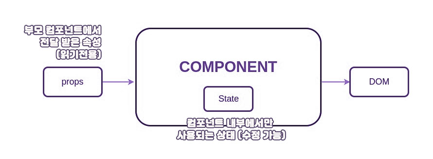
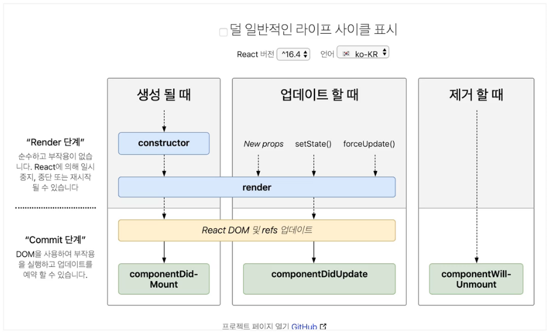
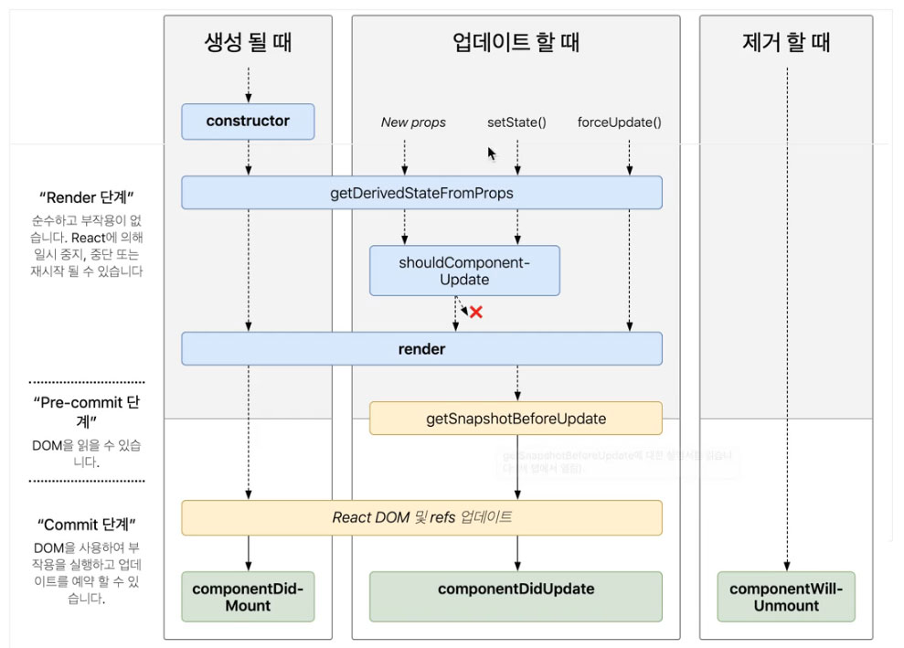
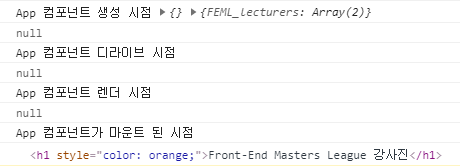

[← BACK](./README.md)

# state & 라이프 사이클 훅

## Props vs State

컴포넌트는 외부로 부터 속성(Props)을 전달 받아 사용할 수 있지만, 전달 받은 속성은 읽기 전용(Readonly)으로 값을 업데이트 할 수 없다.

> **React 앱의 설계(Architecture) 패턴**<br>
> props는 부모 ➪ 자식으로 단방향(1-Way) 흐름으로 전달되며 변경 할 수 없다.(Immutable)

<br>

앱 화면을 업데이트 하려면 외부로부터 전달 받은 속성은 읽기 전용이므로, 변경 가능한 데이터인 컴포넌트의 상태가 필요하다.<br>
즉, 업데이트가 필요한 컴포넌트는 상태(`state`)를 설정해 사용한다.

<br>

> **Props** : 전달받은 속성<br>
> **State** <br>
> - 컴포넌트 자신이 스스로 가지는 데이터, 상태
> - 컴포넌트가 소유한 로컬 데이터
> - 적용범위 : 현재 컴포넌트에 한정

<br><br>

<br><br>

## 함수형 vs 클래스 컴포넌트

React 컴포넌트는 함수형(functional)과 클래스(class)로 정의할 수 있다.<br>
함수형 컴포넌트와 달리 클래스 컴포넌트는 자신만의 상태(`state`)와 라이프 사이클 훅(lifeCycle hook)을 가진다.

<!-- 마크다운 문서에서 표는 아래와 같이 손쉽게 작성할 수 있습니다. -->

| 컴포넌트 유형 | 설명
| -- | --
| 함수형 컴포넌트 |	`this` 키워드 사용 ✘
| 클래스 컴포넌트 |	`this` 키워드로 접근 가능. 상태 및 라이프 사이클 훅 설정 가능.

<!-- <table style="width:100%">
  <thead>
    <tr>
      <th>컴포넌트 유형</th> <th>설명</th>
    </tr>
  </thead> 
  <tbody>
    <tr>
      <td>함수형 컴포넌트</td> <td><code>this</code> 키워드 사용 ✘</td>
    </tr> 
    <tr>
      <td>클래스 컴포넌트</td> <td><code>this</code> 키워드로 접근 가능. 상태 및 라이프 사이클 훅 설정 가능.</td>
    </tr>
  </tbody>
</table> -->

<br><br>

### 함수형 컴포넌트

함수형 컴포넌트(functional component)는 말 그대로 JavaScript 함수입니다. 
`props` 매개변수를 선택적으로 전달 받을 수 있습니다. 작성하는 방식은 2가지 입니다. 
하나는 함수 정의 방식으로 기존 JavaScript에서 함수를 정의할 때 많이 사용되는 방식입니다.

다른 하나는 ES6 부터 추가된 화살표 함수(arrow function)를 사용한 방식입니다. 
이 방법을 사용하면 `function`, `return` 키워드를 사용하지 않아도 되므로 현재 많이 사용되는 방식입니다.

> 이전 버전의 함수형 컴포넌트는 상태(state)를 가지지 못하지만, 
> React v16.7 버전 부터는 훅(Hook)을 사용해 업데이트 가능한 상태 를 설정할 수 있습니다. (※ React 훅은 라이프 사이클 훅과 다른 개념입니다.)

```js
import React, { useState } from 'react';
```

### 클래스 컴포넌트

- 함수형 컴포넌트와 달리 클래스 컴포넌트는 상태(`state`) 설정이 가능하다. 
- 클래스 컴포넌트의 상태 정보는 클래스 안에서만 접근 가능하다.

> 클래스 컴포넌트는 상태를 가질 수도 있고, 가지지 않을 수도 있습니다. 
> 일반적으로 상태를 가지지 않는 컴포넌트일 경우 함수형 컴포넌트를 사용합니다. 하지만 상태가 없더라도 클래스 컴포넌트를 사용할 수 있습니다.
> 다만, 함수형 컴포넌트로 작성할 경우 상태 정보를 가지고 있지 않을 경우, 함수형을 더 많이 사용합니다.

```js
  import React from 'react'
  import Lecturers from './components/Lecturers'

  class App extends React.Component {
    constructor(props) {
      super(props);

      this.state = {
        FEML_lecturers: [
          {
            id: 'lecturer-az01871',
            name: '김데라사',
            module: 'A',
            facebook: 'https://facebook.com/seulbinim',
            image: 'https://yamoo9.github.io/images/photo-deresa@2x.png',
          },
          {
            id: 'lecturer-az01872',
            name: '야무',
            module: 'B, C',
            facebook: 'https://facebook.com/yamoo9',
            image: 'https://yamoo9.github.io/images/photo-yamoo9@2x.png',
          },
        ]
      }
    }

    render() {
      return (
        <div className="app">
            <h1>Front-End Masters League 강사진</h1>
            <Lecturers instructor={this.state.FEML_lecturers} />
        </div>
      )
    }
  }

  export default App
```

### 클래스 필드

- 클래스 필드 문법을 사용하면 클래스 컴포넌트의 상태를 보다 손쉽게 설정할 수 있다. 
- 이 구문을 사용하면 생성자 메서드를 사용하지 않아도 된다.

> 클래스 필드는 ES 표준 명세에 제안된 문법이지만 아직 표준으로 채택되지는 않았습니다. 하지만 Babel을 사용하므로 정상 작동합니다.

```js
  import React, { Component } from 'react'
  import Lecturers from './components/Lecturers'

  class App extends Component {
    // Class Field
    state = {
      FEML_lecturers: [
        {
          id: 'lecturer-az01871',
          name: '김데라사',
          module: 'A',
          facebook: 'https://facebook.com/seulbinim',
          image: 'https://yamoo9.github.io/images/photo-deresa@2x.png',
        },
        {
          id: 'lecturer-az01872',
          name: '야무',
          module: 'B, C',
          facebook: 'https://facebook.com/yamoo9',
          image: 'https://yamoo9.github.io/images/photo-yamoo9@2x.png',
        },
      ]
    }

    render() {
      return (
        <div className="app">
            <h1>Front-End Masters League 강사진</h1>
            <Lecturers instructor={this.state.FEML_lecturers} />
        </div>
      )
    }
  }

  export default App
```

### 라이프 사이클

생명은 시간의 흐름에 따라 시시각각 변화한다.<br> 
생명은 **탄생 전/후(will / did)**, **성장(will / did) 전/후**, **죽음 전/후(will / did)**로 흘러간다.
  
#### 컴포넌트 라이프 사이클

- 마찬가지로 컴포넌트는 또한 프로세스의 특정 시간에 코드를 실행하는 다양한 라이프 사이클 훅이 제공된다. 
- 컴포넌트의 라이프 사이클을 크게 나눠보면 다음의 3단계로 진행된다.
  - 마운팅(Mounting) → 생성
  - 업데이팅(Updating) → 갱신
  - 언 마운팅(Unmounting) → 제거






#### 1. 마운팅

컴포넌트 인스턴스를 만들고 DOM에 삽입할 때 다음 순서대로 훅 메서드가 실행됩니다.

<table style="width:100%"><thead><tr><th>라이프 사이클 훅</th> <th>설명</th></tr></thead> <tbody><tr><td><a href="https://ko.reactjs.org/docs/react-component.html#constructor" target="_blank" rel="noopener noreferrer"><strong>constructor()</strong><svg xmlns="http://www.w3.org/2000/svg" aria-hidden="true" x="0px" y="0px" viewBox="0 0 100 100" width="15" height="15" class="icon outbound"><path fill="currentColor" d="M18.8,85.1h56l0,0c2.2,0,4-1.8,4-4v-32h-8v28h-48v-48h28v-8h-32l0,0c-2.2,0-4,1.8-4,4v56C14.8,83.3,16.6,85.1,18.8,85.1z"></path> <polygon fill="currentColor" points="45.7,48.7 51.3,54.3 77.2,28.5 77.2,37.2 85.2,37.2 85.2,14.9 62.8,14.9 62.8,22.9 71.5,22.9"></polygon></svg></a></td> <td>컴포넌트 생성 시점에 호출</td></tr> <tr><td><a href="https://ko.reactjs.org/docs/react-component.html#static-getderivedstatefromprops" target="_blank" rel="noopener noreferrer">static getDerivedStateFromProps()<svg xmlns="http://www.w3.org/2000/svg" aria-hidden="true" x="0px" y="0px" viewBox="0 0 100 100" width="15" height="15" class="icon outbound"><path fill="currentColor" d="M18.8,85.1h56l0,0c2.2,0,4-1.8,4-4v-32h-8v28h-48v-48h28v-8h-32l0,0c-2.2,0-4,1.8-4,4v56C14.8,83.3,16.6,85.1,18.8,85.1z"></path> <polygon fill="currentColor" points="45.7,48.7 51.3,54.3 77.2,28.5 77.2,37.2 85.2,37.2 85.2,14.9 62.8,14.9 62.8,22.9 71.5,22.9"></polygon></svg></a></td> <td>전달된 상태 및 속성을 가져와 설정하는 시점에 호출</td></tr> <tr><td><a href="https://ko.reactjs.org/docs/react-component.html#render" target="_blank" rel="noopener noreferrer"><strong>render()</strong><svg xmlns="http://www.w3.org/2000/svg" aria-hidden="true" x="0px" y="0px" viewBox="0 0 100 100" width="15" height="15" class="icon outbound"><path fill="currentColor" d="M18.8,85.1h56l0,0c2.2,0,4-1.8,4-4v-32h-8v28h-48v-48h28v-8h-32l0,0c-2.2,0-4,1.8-4,4v56C14.8,83.3,16.6,85.1,18.8,85.1z"></path> <polygon fill="currentColor" points="45.7,48.7 51.3,54.3 77.2,28.5 77.2,37.2 85.2,37.2 85.2,14.9 62.8,14.9 62.8,22.9 71.5,22.9"></polygon></svg></a></td> <td>컴포넌트 렌더링 시점에 호출</td></tr> <tr><td><a href="https://ko.reactjs.org/docs/react-component.html#componentdidmount" target="_blank" rel="noopener noreferrer"><strong>componentDidMount()</strong><svg xmlns="http://www.w3.org/2000/svg" aria-hidden="true" x="0px" y="0px" viewBox="0 0 100 100" width="15" height="15" class="icon outbound"><path fill="currentColor" d="M18.8,85.1h56l0,0c2.2,0,4-1.8,4-4v-32h-8v28h-48v-48h28v-8h-32l0,0c-2.2,0-4,1.8-4,4v56C14.8,83.3,16.6,85.1,18.8,85.1z"></path> <polygon fill="currentColor" points="45.7,48.7 51.3,54.3 77.2,28.5 77.2,37.2 85.2,37.2 85.2,14.9 62.8,14.9 62.8,22.9 71.5,22.9"></polygon></svg></a></td> <td>DOM에 마운트 된 이후 시점에 호출</td></tr></tbody></table>
<br>

### componentDidMount() : DOM에 접근 가능
<br>

```js
  import React, { Component } from 'react'
  import Lecturers from './components/Lecturers'

  class App extends Component {
    constructor(props) {
      super(props)
      console.log('App 컴포넌트 생성 시점', props, this.state)
      console.log(document.querySelector('h1'))
    }

    state = {
      FEML_lecturers: [
        {
          id: 'lecturer-az01871',
          name: '김데라사',
          module: 'A',
          facebook: 'https://facebook.com/seulbinim',
          image: 'https://yamoo9.github.io/images/photo-deresa@2x.png',
        },
        {
          id: 'lecturer-az01872',
          name: '야무',
          module: 'B, C',
          facebook: 'https://facebook.com/yamoo9',
          image: 'https://yamoo9.github.io/images/photo-yamoo9@2x.png',
        },
      ]
    }

    static getDerivedStateFromProps(props, state) {
      console.log('App 컴포넌트 디라이브 시점')
      console.log(document.querySelector('h1'))
      // return null
      // 컴포넌트 상태의 업데이트
      return {
        infrequentlyUsed: true
      }
    }

    render() {
      console.log('App 컴포넌트 렌더 시점')
      console.log(document.querySelector('h1'))
      return (
        <div className="app">
            <h1>Front-End Masters League 강사진</h1>
            <Lecturers instructor={this.state.FEML_lecturers} />
        </div>
      )
    }

    componentDidMount() {
      // 실제 돔이 되어서 원하는 요소에 접근 가능, DOM 스크립트를 사용할 수 있으나 사이드 이펙트가 발생할 수 있음
      console.log('App 컴포넌트가 마운트 된 시점')
      console.log(document.querySelector('h1'))
      document.querySelector('h1').style.color = 'orange'
    }
  }

  export default App
```

<br><br>

### 2. 업데이팅

업데이트 훅은 props 또는 state가 변경될 경우 발생한다. 즉, 컴포넌트가 다시 렌더링 될 때 다음 순서로 실행된다.

<table style="width:100%"><thead><tr><th>라이프 사이클 훅</th> <th>설명</th></tr></thead> <tbody><tr><td><a href="https://ko.reactjs.org/docs/react-component.html#static-getderivedstatefromprops" target="_blank" rel="noopener noreferrer">static getDerivedStateFromProps()<svg xmlns="http://www.w3.org/2000/svg" aria-hidden="true" x="0px" y="0px" viewBox="0 0 100 100" width="15" height="15" class="icon outbound"><path fill="currentColor" d="M18.8,85.1h56l0,0c2.2,0,4-1.8,4-4v-32h-8v28h-48v-48h28v-8h-32l0,0c-2.2,0-4,1.8-4,4v56C14.8,83.3,16.6,85.1,18.8,85.1z"></path> <polygon fill="currentColor" points="45.7,48.7 51.3,54.3 77.2,28.5 77.2,37.2 85.2,37.2 85.2,14.9 62.8,14.9 62.8,22.9 71.5,22.9"></polygon></svg></a></td> <td>전달된 상태 및 속성을 가져와 설정하는 시점에 호출 (업데이트)</td></tr> <tr><td><a href="https://ko.reactjs.org/docs/react-component.html#shouldcomponentupdate" target="_blank" rel="noopener noreferrer">shouldComponentUpdate()<svg xmlns="http://www.w3.org/2000/svg" aria-hidden="true" x="0px" y="0px" viewBox="0 0 100 100" width="15" height="15" class="icon outbound"><path fill="currentColor" d="M18.8,85.1h56l0,0c2.2,0,4-1.8,4-4v-32h-8v28h-48v-48h28v-8h-32l0,0c-2.2,0-4,1.8-4,4v56C14.8,83.3,16.6,85.1,18.8,85.1z"></path> <polygon fill="currentColor" points="45.7,48.7 51.3,54.3 77.2,28.5 77.2,37.2 85.2,37.2 85.2,14.9 62.8,14.9 62.8,22.9 71.5,22.9"></polygon></svg></a></td> <td>컴포넌트 업데이트 예정 시점에 호출 (업데이트 하거나, 안 하거나)</td></tr> <tr><td><a href="https://ko.reactjs.org/docs/react-component.html#render" target="_blank" rel="noopener noreferrer"><strong>render()</strong><svg xmlns="http://www.w3.org/2000/svg" aria-hidden="true" x="0px" y="0px" viewBox="0 0 100 100" width="15" height="15" class="icon outbound"><path fill="currentColor" d="M18.8,85.1h56l0,0c2.2,0,4-1.8,4-4v-32h-8v28h-48v-48h28v-8h-32l0,0c-2.2,0-4,1.8-4,4v56C14.8,83.3,16.6,85.1,18.8,85.1z"></path> <polygon fill="currentColor" points="45.7,48.7 51.3,54.3 77.2,28.5 77.2,37.2 85.2,37.2 85.2,14.9 62.8,14.9 62.8,22.9 71.5,22.9"></polygon></svg></a></td> <td>컴포넌트 렌더링 (업데이트)</td></tr> <tr><td><a href="https://ko.reactjs.org/docs/react-component.html#getsnapshotbeforeupdate" target="_blank" rel="noopener noreferrer">getSnapshotBeforeUpdate()<svg xmlns="http://www.w3.org/2000/svg" aria-hidden="true" x="0px" y="0px" viewBox="0 0 100 100" width="15" height="15" class="icon outbound"><path fill="currentColor" d="M18.8,85.1h56l0,0c2.2,0,4-1.8,4-4v-32h-8v28h-48v-48h28v-8h-32l0,0c-2.2,0-4,1.8-4,4v56C14.8,83.3,16.6,85.1,18.8,85.1z"></path> <polygon fill="currentColor" points="45.7,48.7 51.3,54.3 77.2,28.5 77.2,37.2 85.2,37.2 85.2,14.9 62.8,14.9 62.8,22.9 71.5,22.9"></polygon></svg></a></td> <td>컴포넌트 업데이트 전 스냅샷 가져오는 시점에 호출</td></tr> <tr><td><a href="https://ko.reactjs.org/docs/react-component.html#componentdidupdate" target="_blank" rel="noopener noreferrer"><strong>componentDidUpdate()</strong><svg xmlns="http://www.w3.org/2000/svg" aria-hidden="true" x="0px" y="0px" viewBox="0 0 100 100" width="15" height="15" class="icon outbound"><path fill="currentColor" d="M18.8,85.1h56l0,0c2.2,0,4-1.8,4-4v-32h-8v28h-48v-48h28v-8h-32l0,0c-2.2,0-4,1.8-4,4v56C14.8,83.3,16.6,85.1,18.8,85.1z"></path> <polygon fill="currentColor" points="45.7,48.7 51.3,54.3 77.2,28.5 77.2,37.2 85.2,37.2 85.2,14.9 62.8,14.9 62.8,22.9 71.5,22.9"></polygon></svg></a></td> <td>컴포넌트 업데이트 이후 시점에 호출</td></tr></tbody></table>
<br>

```js
  class LifeCycleHook extends Component {
    // 2.1 속성, 상태 설정
    static getDerivedStateFromProps(props, state) {
      console.log('(업데이트) 전달된 속성 및 상태를 가져와 설정')
      return null
    }
    // 2.2 업데이트 할 예정
    shouldComponentUpdate(nextProps, nextState) {
      console.log('성능 최적화 용도로 사용 됨')
      return true // false를 반환할 경우 컴포넌트 렌더링이 취소
    }
    // 2.3 렌더링
    render() {
      console.log('(업데이트) 렌더링')
      return <div />
    }
    // 2.4 DOM에 커밋되기 전
    getSnapshotBeforeUpdate(nextProps, nextState) {
      console.log('DOM에 커밋되기 전 스냅샷 가져오기')
      return null
    }
    // 2.5 업데이트 됨
    componentDidUpdate(prevProps, prevState, snapshot) {
      console.log('업데이트 됨')
    }
  }
```
```js
// state 업데이트 방법
  this.setState({
    activeIndex: 10,
  })
```

### 3. 언 마운팅

컴포넌트가 DOM에서 제거될 때 실행되는 훅이다.
<br><br>

```js
  class LifeCycleHook extends Component {
    // 3.1 DOM에서 언 마운트 되어 제거되기 직전에 실행
    componentWillUnmount() {
      console.log('DOM에서 언 마운트 되어 제거되기 직전에 실행 됨')
    }
  }
```

### 4. 오류 처리

컴포넌트 렌더링, 라이프 사이클 훅이 실행될 때 오류가 발생한 경우 호출된다.

<table style="width:100%"><thead><tr><th>라이프 사이클 훅</th> <th>설명</th></tr></thead> <tbody><tr><td><a href="https://ko.reactjs.org/docs/react-component.html#static-getderivedstatefromerror" target="_blank" rel="noopener noreferrer">static getDerivedStateFromError()<svg xmlns="http://www.w3.org/2000/svg" aria-hidden="true" x="0px" y="0px" viewBox="0 0 100 100" width="15" height="15" class="icon outbound"><path fill="currentColor" d="M18.8,85.1h56l0,0c2.2,0,4-1.8,4-4v-32h-8v28h-48v-48h28v-8h-32l0,0c-2.2,0-4,1.8-4,4v56C14.8,83.3,16.6,85.1,18.8,85.1z"></path> <polygon fill="currentColor" points="45.7,48.7 51.3,54.3 77.2,28.5 77.2,37.2 85.2,37.2 85.2,14.9 62.8,14.9 62.8,22.9 71.5,22.9"></polygon></svg></a></td> <td>자손 컴포넌트 오류 발생 시 호출</td></tr> <tr><td><a href="https://ko.reactjs.org/docs/react-component.html#componentdidcatch" target="_blank" rel="noopener noreferrer">componentDidCatch()<svg xmlns="http://www.w3.org/2000/svg" aria-hidden="true" x="0px" y="0px" viewBox="0 0 100 100" width="15" height="15" class="icon outbound"><path fill="currentColor" d="M18.8,85.1h56l0,0c2.2,0,4-1.8,4-4v-32h-8v28h-48v-48h28v-8h-32l0,0c-2.2,0-4,1.8-4,4v56C14.8,83.3,16.6,85.1,18.8,85.1z"></path> <polygon fill="currentColor" points="45.7,48.7 51.3,54.3 77.2,28.5 77.2,37.2 85.2,37.2 85.2,14.9 62.8,14.9 62.8,22.9 71.5,22.9"></polygon></svg></a></td> <td>자손 컴포넌트 오류 발생 시 호출</td></tr></tbody></table>

```js
  class LifeCycleHook extends Component {
    state = { hasError: false }
    
    // 자식 컴포넌트의 오류를 throw한 후 실행
    static getDerivedStateFromError(error) {
      // throw된 오류가 감지되면, hasError 상태 값을 true 처리
      return { hasError: true }
    }

    render() {
      // 오류 발생 시, 렌더링 과정에서 오류 메시지를 반환
      if (this.state.hasError) {
        return <h1>오류가 발생했습니다.</h1>
      }
      return <div />
    }
  }
```