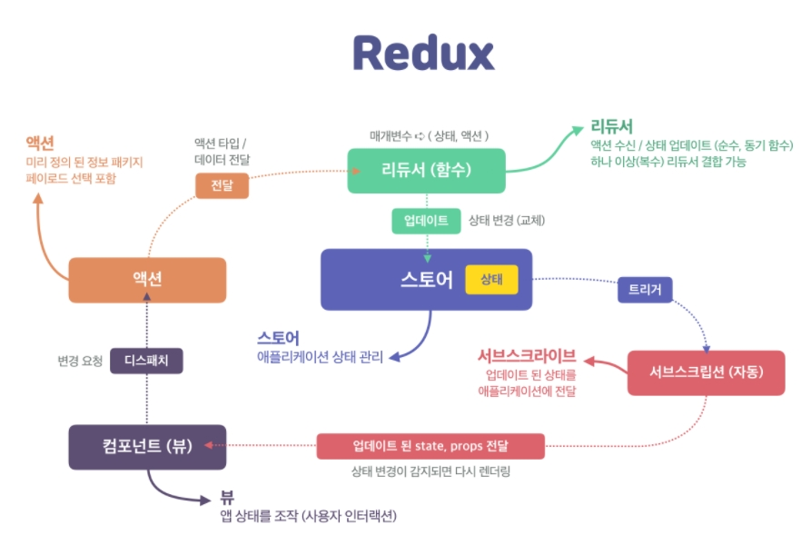

[← BACK](./README.md)

# Redux 라이브러리

## 상태 관리의 필요성

- 애플리케이션 상태 관리(Managing States)는 버그를 최소화 하면서 잘 만들어진 경험(UX)을 사용자에게 제공하는 데 절대적으로 중요
- Redux와 React는 독립적으로 사용될 수 있는 별개의 다른 라이브러리로, Angular (opens new window), Vue (opens new window), Ember (opens new window), jQuery (opens new window)또는 Vanilla JavaScript (opens new window)와 같은 다른 라이브러리, 프레임워크에서도 사용할 수 있다.
- Redux 특징
  - Predictable : 예측 가능한 점
  - Centralized : 중앙에서 체계적으로 관리되는 점
  - Debuggable : 디버깅이 편한 점
  - Flexible

## Redux의 작동 흐름 (3원칙)

- 애플리케이션 상태는 모두 한 곳에서 집중 관리된다. (동기화 필요 ✘)
- 상태는 불변(읽기 전용) 데이터 이며, 오직 액션 만이 상태 교체를 요청 할 수 있다. (예측 가능)
- 리듀서(함수)를 통해 상태의 최종 값만 설정한다. (단순화)

## Redux의 아키텍처 (설계 구성 방식)

효율적 애플리케이션 상태 관리를 위해 Redux는 스토어, 상태, 리듀서, 액션, 서브스크립션 등을 제공한다. 

- 스토어(store)
- 상태(state)
- 액션(action)
- 리듀서(reducer)
- 서브스크립션(subscription)
- 뷰(컴포넌트)



## 스토어

- Redux 스토어(store)는 애플리케이션의 상태를 관리하고, .getState(), .dispach(), .subscribe() 같은 메서드를 제공합니다.
- 스토어는 애플리케이션의 상태를 나타내는 많은 key:value 쌍으로 구성된 정보를 가진 하나의 큰 JavaScript 객체이다. 
- React 컴포넌트에 분산되어 있는 상태 객체와 달리 스토어는 하나만 존재한다. - 스토어는 애플리케이션에 상태를 제공하며 상태가 업데이트 되면 뷰(UI)가 다시 그려진다.

redux 설치
```sh
$ npm i redux
import * as Redux from 'redux'
console.log(Redux)
```

redux에서 store만 가져오기
```javascript
import { createStore } from 'redux'

// Redux 스토어 생성
// - 리듀서 함수를 전달 받음
const reducer = {state, action} => {}
const store = createStore(reducer)
```
## 스테이트

Redux 스토어에서 관리하는 상태(데이터) 이다

```jsx
// 상태
// - 일반적으로 state 또는 initState 이름으로 설정
// - 상태는 리듀서(함수)의 첫번째 인자로 전달 됨

// counter
const state = 0

// todos
const initState = []
```
상태 트리(state tree)는 "불변 상태(Immutable State). 즉 순수한 상태"를 가져야 한다. 애플리케이션의 UI, View 레이어 상태는 순수한 함수(리듀서)로 처리 될 때 예측 가능(사이드 이펙트 ✘) 하기 때문이다. 상태 관리는 불변 데이터 관리를 참고하세요.

스토어에 등록된 상태 정보는 .getState() 메서드를 사용해 가져올 수 있다.

```jsx
import {createStore} form 'redux'

const initalNews = "공정하고 정의로운 뉴스"
const reducer = {state, action} => {
  return state
}
const store = createStore(() => reducer(initalNews))

console.log(store.getState())
```

## 액션(action) — type, payload 속성을 가진 객체

- 액션은 애플리케이션에서 "상태 변경을 설명하는 정보"를 스토어로 보내는 JavaScript 객체로 Redux에 알려(dispatch) 변화를 이끌어낸다. 
- 상태 값을 변경(교체) 할 경우, 교체 할 상태 값(payload)을 리듀서(함수)에 보낼 수 있다.

- 애플리케이션 상태 트리를 변경하는 유일한 방법은 "액션을 보내는 것(Dispatching Action)" 이다.
```jsx
store.dispatch(action)
```

```jsx
//실습
import { createStore } from 'redux'

const initialNews = '공정하고 정의로운 뉴스'

//actionType.js
const CHANGE_NEWS_TITLE = 'change_news_title'

//action.js
const changeNewsTitleAction = {
  type: CHANGE_NEWS_TITLE,
  payload: '행복한 뉴스',
}
const reducer = (state = initialNews, action) => {
  switch (action.type) {
    case CHANGE_NEWS_TITLE:
      state = action.payload
      break
  }
  return state
}
const store = createStore(reducer)
console.log(store.getState())

window.setTimeout(() => {
  store.dispatch(changeNewsTitleAction)
  console.log(store.getState())
}, 3000)​
```

## 리듀서(reducer) — 순수한 함수

- 모든 Redux 애플리케이션은 리듀서(reducer)를 구현해야 한다는 ,공통점이 있다. 
- 리듀서란? '애플리케이션 상태를 교체하는 함수'를 말한다. 
- '이전 상태(prevState)'를 '새로운 상태(state)'로 교체(return) 한다.

```sh
리듀서 = (상태, 액션) {
  // 액션 타입 분석
  // 이전 상태 → 다음 상태로 교체
  // 다음 상태 반환
}
```

순수한 함수란?

> 순수 함수는 반환(reture) 값이 전달 인자(argument) 값에만 의존하는 함수를 말한다. 
순수 함수는 새로운 값을 계산한다. 
동일한 유형의 인자 집합을 사용해 순수 함수를 호출하면 예측 가능한 결과 값을 확신할 수 있다. 또한 순수 함수는 전달 된 인자 값을 변경하지 않는다. 예를 들어 squareAll 함수는 전달된 배열 인자를 변경하지 않고, map 메서드를 사용해 새로운 배열을 반환한다.

```jsx
const square = x => x * x
const squareAll = items => items.map(square)
```

> 반면 순수하지 못한 함수는 데이터베이스 또는 네트워크 통신 및 DOM 조작과 같은 경우를 말한다. <br>
예를 들어 square 함수 내부에서 데이터베이스에 전달된 인자 값을 업데이트 하거나, squareAll 함수 안에서 전달된 인자 집합을 순환하여 뭔가를 수행하지만 아무런 값을 반환하지 않는 경우이다. (사이드 이펙트가 있을 수 있음)

```jsx
const square = x => {
  updateXInDatabase(x)
  return x * x
}
const squareAll = items => {
  items.forEach(item => (item = square(item)))
}
```

## 리듀서는 순수 함수

- 리듀서(함수)는 순수해야 한다. 
- 순수함을 잃어버리게 되면 사이드 이펙트(부작용)를 발생시킬 수 있다.

  - 전달 받은 매개변수 state, action에 변형을 가하면 안된다.
  - 네트워킹(API 호출 ← 비동기 통신) 또는 라우팅을 변경하면 안된다.
  - 반드시 반환 값은 새로운 상태(state) 여야 한다.

  ### Redux 스토어 모듈 관리

  Redux 스토어 구조는 다음과 같이 작성할 수 있다.

  ```sh
  store/
  ├── index.js # 스토어 엔트리 (스토어 생성 ← 루트 리듀서)
  ├── actions/
  │   ├── index.js # 액션 엔트리 (액션 내보내기)
  │   ├── actionTypes.js # 액션 타입 (액션 타입: 상수)
  │   ├── counter.js
  │   ├── todos.js
  │   └── filter.js
  └── reducers/
      ├── index.js # 리듀서 엔트리 ([루트 리듀서:병합] 내보내기)
      ├── counter.js
      ├── todos.js
      └── filter.js
  ```

  ## 상태 업데이트 구독과 취소 — store.subscribe() 메서드

애플리케이션 상태 변경을 구독(subscribe, 감지) 하여 상태가 업데이트 되면 등록된 리스너(listener)를 실행시킨다.

```jsx
store.subscribe(render)
.subscribe() 메서드는 구독을 취소할 수 있는 unscribe 함수를 반환합니다.


const unsubscribe = store.subscribe(() => console.log(`상태 변경 감지: ${store.getState()}`))
unsubscribe 함수를 실행하면 상태가 업데이트 되어도 UI를 업데이트 하지 않습니다.

unsubscribe() // 구독 취소
React Redux 라이브러리를 추가해 사용하면 서브스크립션은 자동 처리됩니다.
```

```jsx
// 실습
let count = 1

function render() {
  console.log('store의 상태 업데이트 카운트: ', count)
  console.log('object', store.getState())
  if (count++ > 10) {
    console.log('구독 취소')
    unsubscribe()
  }
}

const unsubscribe = store.subscribe(render)
const rootEl = document.getElementById('root')

rootEl.addEventListener('click', () => {
  store.dispatch(changeNewsTitleAction)
})​
```