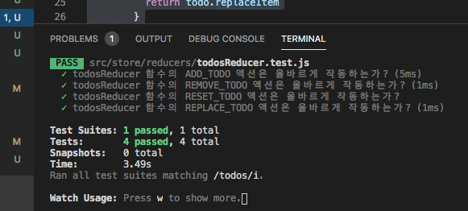

[← BACK](./README.md)

# 리듀서 함수

리듀서는 '액션을 전달 받아 상태를 교체하는 순수 함수'이다.

```jsx
// 카운터 리듀서
const counter = (state=0, action) => {
  // 액션 타입 확인
  switch(action.type) {
    // 카운트 증가 요청일 경우
    case 'INCREASE_COUNT':
      // 새로운 (다음) 상태 값 반환
      return state + 1
    // 카운트 감소 요청일 경우
    case 'DECREASE_COUNT':
      // 새로운 (다음) 상태 값 반환
      return state - 1
    // 증가, 감소 요청이 아닌 경우
    default:
      // 초기 상태 값 반환
      return state
  }
}

export default counter
```

## 유닛 테스트

expect (https://github.com/mjackson/expect)어설션(assertions) 도구를 사용해 counter 리듀서를 유닛 테스트 해봅니다. (.toEqual() (https://github.com/mjackson/expect#toequal)메서드 사용)

```jsx
import expect from 'expect'
import counter form './counter'

// 카운트 증가 테스트
expect(
  counter(9, { type: 'INCREASE_COUNT' })
).toEqual(10)

// 카운트 감소 테스트
expect(
  counter(10, { type: 'DECREASE_COUNT' })
).toEqual(9)

// 카운트 증가,감소가 아닌 경우 테스트
expect(
  counter(undefined, { type: 'UNKNOWN' })
).toEqual(0)

// 테스트에 오류가 없을 경우 '통과' 메시지 출력
console.log('테스트 통과!')
```
```jsx
// 실습
// actionType.js
export const ADD_TODO = 'ADD_TODO'
export const REMOVE_TODO = 'REMOVE_TODO'
export const RESET_TODO = 'RESET_TODO'
export const RELPACE_TODO = 'RELPACE_TODO'

​
// todosReducer.js
import {
  ADD_TODO,
  REMOVE_TODO,
  RESET_TODO,
  REPLACE_TODO,
} from '../actions/actionTypes'

export const initialState = ['Redux 라이브러리 설치', 'Redux 아키텍처 이해']

export const todosReducer = (state = initialState, { type, todo }) => {
  switch (type) {
    case ADD_TODO:
      state = [...state, todo]
      break
    case REMOVE_TODO:
      state = state.filter((item) => item !== todo)
      break
    case RESET_TODO:
      state = initialState
      break
    case REPLACE_TODO:
      state = state.map((item) => {
        if (item === todo.item) {
          // todo = {item, replaceItem}
          return todo.replaceItem
        }
        return item
      })
      break
    default:
      console.warn(
        '일치하는 액션 타입이 존재하지 않습니다. 확인 후 다시 시도해보세요'
      )
  }
  return state
}
​
import {
  ADD_TODO,
  REMOVE_TODO,
  RESET_TODO,
  REPLACE_TODO,
} from '../actions/actionTypes'

import { initialState as todos, todosReducer } from './todosReducer'

// Unit Test

it('todosReducer 함수의 ADD_TODO 액션은 올바르게 작동하는가?', () => {
  const addTodoTestValue = '액션과 액션 타입 활용'
  const addTodoTest = todosReducer(todos, {
    type: ADD_TODO,
    todo: addTodoTestValue,
  })
  expect(addTodoTest).toEqual([...todos, addTodoTestValue])
})

it('todosReducer 함수의 REMOVE_TODO 액션은 올바르게 작동하는가?', () => {
  const removeTodoTestValue = 'Redux 라이브러리 설치'
  const removeTodoTest = todosReducer(todos, {
    type: REMOVE_TODO,
    todo: removeTodoTestValue,
  })
  expect(removeTodoTest).toEqual(
    todos.filter((todo) => todo !== removeTodoTestValue)
  )
})

it('todosReducer 함수의 RESET_TODO 액션은 올바르게 작동하는가?', () => {
  const resetTodoTest = todosReducer(todos, {
    type: RESET_TODO,
  })
  expect(resetTodoTest).toEqual(todos)
})

it('todosReducer 함수의 REPLACE_TODO 액션은 올바르게 작동하는가?', () => {
  const replaceTodoTestValue = {
    item: 'Redux 아키텍처 이해',
    replaceItem: 'React Redux 활용',
  }
  const replaceTodoTest = todosReducer(todos, {
    type: REPLACE_TODO,
    todo: replaceTodoTestValue,
  })
  expect(replaceTodoTest).toEqual(['Redux 라이브러리 설치', 'React Redux 활용'])
})

​
명령어
$ npm t
```




# Redux 설치/활용

## Redux 설치

```sh
npm i redux
```

## 스토어 생성

```sh
import { createStore } from 'redux'

// Redux 스토어 생성 (리듀서 설정)
const store = createStore(counter)
```

### 생성될 Redux 스토어에 전달 할 리듀서와 상태
```jsx
// 초기 상태
const state = {
  count: 9
}

// counter 리듀서
const counter = (prevState = state, action) => {
  switch(action.type) {
    case 'INCREASE_COUNT':
      console.info('액션 타입: INCREASE_COUNT')
      console.info(`이전 상태: ${prevState.count}`)
      const count = prevState.count + 1
      console.info(`다음 상태: ${count}`)
      console.info('----------------------------')
      return { ...prevState, count }
    case 'DECREASE_COUNT':
      console.info('액션 타입: DECREASE_COUNT')
      console.info(`이전 상태: ${prevState.count}`)
      const count = prevState.count - 1
      console.info(`다음 상태: ${count}`)
      return { ...prevState, count }
    default:
      return prevState
  }
}
```

## 상태 가져오기

```jsx
// Redux 스토어의 상태 가져오기
console.log( store.getState() ) // { count: 9 }
```

## 액션 전달

```jsx
// Redux 액션 전달(dispatch)
store.dispatch({ type: 'INCREASE_COUNT' })

// 변경된 상태 출력
console.log( store.getState().count ) // 10
```

## 변경 감지

```jsx
const render = () => {
  document.body.innerHTML = `<output>${store.getState().count}</output>`
}

// 초기 1회 렌더링
render()

// render 리스너(함수)를 구독하여, 변경이 감지 되면 렌더 함수 실행
store.subscribe(render)
```

## 변경 감지 핸들링

```jsx
document.body.addEventListener('click', () => {
  // 리듀서에 액션 전달
  store.dispatch({type: 'INCREASE_COUNT'})
})
```

# Redux 패턴 리뷰

## Redux의 스토어 관리 핵심 패턴

- createStore(reducer) — 스토어 생성(리듀서)
- store.getState() — 스토어 상태 반환
- store.dispatch(action) — 스토어 상태 변경 전달(액션)
- store.subscribe(listener) — 스토어 상태 변경 감지(리스너)

## createStore()

Redux 없이 스토어 생성/관리 하는 함수를 만들기

```jsx
const createStore = (reducer) => {
  // 상태
  let state
  // 상태 반환 함수
  const getState = () => { ... }
  // 상태 변경 전달 함수
  const dispatch = (action) => { ... }
  // 상태 변경 감지 함수
  const subscribe = (listener) => { ... }
  // store 객체 반환
  return { getState, subscribe, dispatch }
}
```

정의한 createStore() 함수에 couter 리듀서를 전달해 스토어를 생성
```jsx
const store = createStore(counter)
```

## getState() : 스토어의 상태를 반환하는 함수

```jsx
const getState = () => state
```

## subscribe()

- 스토어의 상태 변경이 감지되면 처리되는 리스너(함수)를 등록하는 함수 
- 구독(subscribe) 할 리스너는 하나 이상 등록 가능하도록 리스너 집합(배열)을 정의한 후, subscribe 함수에 전달된 리스너를 집합에 추가(push) 하도록 코드를 작성 
- 이 함수의 반환 값은 구독을 취소하는 unsubscribe 함수로, 구독 등록한 리스너를 리스너 집합에서 제거하여 더 이상 실행되지 않도록 만들 필요가 있기 때문아다.

```jsx
// 리스너(함수)를 보관할 배열 데이터
const listeners = []

// 구독(subscribe) 함수가 실행되면
// 전달 받은 리스너를 리스너 집합 배열에 푸시
const subscribe = (listener) => {
  listeners.push(listener)
  // 구독 취소 함수 반환
  return (removeListener) => {
    listeners = listeners.filter(l => l !== removeListener)
  }
}
```

> subscribe 함수의 반환 값으로 구독 취소(unsubscribe) 함수를 설정한 것보다 직접 스토어의 subscribe 메서드를 구현하고 싶다면 다음과 같이 분리 된 함수로 구성할 수도 있다.
```jsx
const unsubscribe = (removeListener) => {
  listeners = listeners.filter(listener => listener !== removeListener)
}
```

## dispach()
dispach 함수의 역할
- 리듀서에 상태와 전달 받은 액션을 설정해 스토어의 상태를 변경(교체) 하는 것 
- 구독 등록된 모든 리스너를 일괄적으로 실행하는 것

```jsx
const dispatch = (action) => {
  // 리듀서를 사용해 상태 변경(교체)
  state = reducer(state, action)
  // 구독 등록된 리스너 모두 실행
  listeners.forEach(listener => listener())
}
```