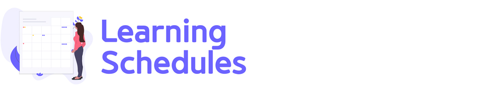

[← BACK](../README.md)

 

# 학습 스케줄

학습 일정을 안내합니다.

 

## 5주차

  
🎯 학습 세부 항목 (펼쳐보세요)

   

  5주차 학습은 온라인 + 오프라인 강의가 진행됩니다. 학습 내용은 'Styled Components & React Router' 입니다.

  - ☑︎ Styled Components 라이브러리
  - ☑︎ React Router 라이브러리

   

  ### ␥ 월요일

  

    
Styled Components 라이브러리에 대한 개념 정리 및 기본 활용법을 다져봅니다.

     

  - ☑︎ 스타일 라이브러리 (5분 14초)
  - ☑︎ Styled Components 기본 사용법 (4분 31초)
  - ☑︎ Styled Components의 작동 원리 (ES6 태그 템플릿) (8분 38초)
  - ☑︎ props 적용 (4분 20초)
  - ☑︎ 스타일 확장 (3분 37초)
  - ☑︎ 컴포넌트 스타일 확장 (6분 22초)
  

   

  ### ␥ 화요일

  

    
Styled Components 라이브러리에 대한 개념 정리 및 응용 활용법을 다져봅니다.

     

  - ☑︎ 컴포넌트 스타일 래퍼 (55초)
  - ☑︎ 가상 클래스/요소, 중첩 규칙 (5분 45초)
  - ☑︎ 정적/동적 props 할당 (3분 44초)
  - ☑︎ 믹스인 (Mixin) (4분 2초)
  - ☑︎ 애니메이션 (5분 25초)
  - ☑︎ 글로벌 스타일 (4분 49초)
  - ☑︎ 테마 (Theme) (10분 19초)
  

   

  ### ␥ 수요일

  

    
React Router 라이브러리에 대한 개념 정리 및 기본 활용법을 다져봅니다.

     

  - ☑︎ SPA 라이브러리 (4분 0초)
  - ☑︎ 라우터? 라우트? 라우팅? (4분 28초)
  - ☑︎ BrowserRouter & HashRouter 컴포넌트 (7분 19초)
  - ☑︎ Route 컴포넌트 Part 1 (9분 55초)
  - ☑︎ Route 컴포넌트 Part 2 (5분 39초)
  

   

### ␥ 목요일

  

    
React Router 라이브러리에 대한 개념 정리 및 기본 활용법을 다져봅니다.

     

  - ☑︎ Switch 컴포넌트 (4분 29초)
  - ☑︎ Link 컴포넌트 (9분 18초)
  - ☑︎ NavLink 컴포넌트 (9분 8초)
  - ☑︎ Redirect 컴포넌트 (4분 46초)
  

   

### ␥ 금요일

  

    
React Router 라이브러리에 대한 개념 정리 및 기본 활용법을 다져봅니다.

     

  - ☑︎ Route 컴포넌트 props 전달 (2분 15초)
  - ☑︎ Route 컴포넌트 매개변수(옵션 포함), 쿼리 스트링 (11분 28초)
  - ☑︎ 중첩된 라우팅 (5분 17초)
  - ☑︎ 보호된 라우팅 (9분 26초)
  - ☑︎ Redux 통합
  

 

---

 

## 4주차

  
🎯 학습 세부 항목 (펼쳐보세요)

   

  4주차 학습은 온라인 + 오프라인 강의가 진행됩니다. 학습 내용은 'React 훅, TIP, Redux, React Redux' 입니다.

  - ☑︎ React 훅(Hook)
  - ☑︎ React & CRA 팁(Tip)
  - ☑︎ Redux 라이브러리
  - ☑︎ React Redux 라이브러리

   

  ### ␥ 월요일

  

    
React 훅(Hook)에 대한 개념 정리 및 기본 활용법을 다져봅니다.

     

  - ☑︎ useState() 훅을 활용한 상태 관리 (9분 12초)
  - ☑︎ React 클래스 컴포넌트 → 함수형 컴포넌트로 전환 (상태 관리) (5분 55초)
  - ☑︎ useEffect() 훅을 활용한 사이드 이펙트 처리 (4분 30초)
  - ☑︎ useRef() 훅을 활용한 DOM 노드 접근/조작 (5분 19초)
  - ☑︎ useContext() 훅을 활용한 데이터 공유 (2분 42초)
  

   

  ### ␥ 화요일

  

    
React & CRA 팁(Tip)에 대해 살펴봅니다.

     

  - ☑︎ 절대경로 임포트 (jsconfig.json 설정) (2분 1초)
  - ☑︎ ReactComponent를 활용한 SVG 이미지 스타일링 & 애니메이션 (5분 15초)
  - ☑︎ CSS 모듈을 사용해 고유한 클래스 이름 생성(스타일 충돌 방지) (6분 49초)
  - ☑︎ classNames() 유틸리티 모듈 활용 (7분 5초)
  - ☑︎ Sass를 활용한 스타일 모듈화 (3분 59초)
  - ☑︎ craco를 활용해 설정 덮어쓰기 (Sass 소스맵 설정) (5분 14초)
  - ☑︎ React 컴포넌트 / 유닛 테스트 디버깅 (8분 55초)
  

   

  ### ␥ 수요일

  

    
Redux 라이브러리에 대한 개념 정리 및 기본 활용법을 다져봅니다.

     

  - ☑︎ Redux가 필요한 이유 (3분 40초)
  - ☑︎ Redux의 작동 흐름 (3원칙) (1분 58초)
  - ☑︎ Redux의 아키텍처 (설계 구성 방식) (3분 17초)
  - ☑︎ 스토어 객체 생성 — createStore() 메서드 (4분 27초)
  - ☑︎ 상태(state) 가져오기 — getState() 메서드 (2분 48초)
  - ☑︎ 액션(action) — type, payload 속성을 가진 객체 (7분 32초)
  - ☑︎ 리듀서(reducer) — 순수한 함수 (4분 48초)
  - ☑︎ Redux 스토어 모듈 관리 (7분 20초)
  - ☑︎ 상태 업데이트 구독과 취소 — subscribe() 메서드 (3분 25초)
  

   

### ␥ 목요일

  

    
Reducer, Redux 패턴에 대해 학습하고 정리합니다.

     

  - ☑︎ 리듀서 함수
    - ☑︎ TodoReducer 함수 — 작성 (6분 50초)
    - ☑︎ TodoReducer 함수 — 유닛 테스트 (9분 43초)
  - Redux 설치, 패턴 리뷰
    - ☑︎ Redux 설치/활용 (읽기, 실습)
    - ☑︎ Redux 패턴 리뷰 (8분 21초)
  

   

### ␥ 금요일

  

    
React 앱 + Redux에 대해 학습합니다.

     

  - ☑︎ 실습 예제 다운로드 및 의존 패키지 설치, 프로젝트 실행 (1분 18초)
  - ☑︎ 스토어, 리듀서 함수 생성 (2분 19초)
  - ☑︎ App 컴포넌트 상태, 메서드를 리듀서 함수 상태, 스위칭 처리 (6분 8초)
  - ☑︎ 스토어의 상태 업데이트 구독 후, UI를 다시 렌더링 처리 (5분 15초)
  - ☑︎ 루트 리듀서 (여러 개의 리듀서 병합) (4분 36초)
  - ☑︎ Top-Down 방식의 props 대신, Redux store 활용 (11분 18초)
  - ☑︎ 액션 크리에이터 활용 (dispatch + action creator) (10분 36초)
  

 

---

 

## 3주차

  
🎯 학습 세부 항목 (펼쳐보세요)

   

  3주차 학습은 온라인 + 오프라인 강의가 진행됩니다. 학습 내용은 'React 미니 프로젝트 실습, 고차 컴포넌트, React 폼 컨트롤' 입니다.

  - ☑︎ Mini Project {E1}

   

  ### ␥ 월요일

  

    
React Mini Project {E1}를 실습(1)하여 개념 정리 및 기본 활용법을 다져봅니다.

     

  - ☑︎ 프로젝트 시작하기 (32초)
  - ☑︎ 문서 헤드 구성 (3분 41초)
  - ☑︎ 디렉토리 구성 (1분 5초)
  - ☑︎ 컴포넌트 구성 Part 1
    - 컴포넌트 등록 `AppHeader`, `AppMain`, `GoToTop` (2분 54초)
    - JSX 코드 정리 `AppHeader`, `AppMain`, `GoToTop` (2분 36초)
  - ☑︎ 컴포넌트 구성 Part 2
    - 컴포넌트 추가 등록 `AppHomeLink`, `AppNavigation`, `BeverageList`, `BeverageItem` (4분 13초)
    - 컴포넌트 스타일 검토 (6분 5초)
  

   

  ### ␥ 화요일

  

    
React Mini Project {E1}를 실습(2)하여 개념 정리 및 기본 활용법을 다져봅니다.

     

  - ☑︎ 컴포넌트 props 디자인
    - 컴포넌트 props 설계 `AppHomeLink` (6분 2초)
    - 컴포넌트 props 설계 (`classnames` 라이브러리, `as` 속성 등) (8분 51초)
  - ☑︎ 컴포넌트 이벤트 핸들링 & 타임 컨트롤 (9분 30초)
  - ☑︎ 리스트 렌더링 & 컨텍스트 Part 1 (9분 33초)
  

   

  ### ␥ 수요일

  

    
React Mini Project {E1}를 실습(3)하여 개념 정리 및 기본 활용법을 다져봅니다.

     

  - ☑︎ 컴포넌트 접근성 개선 
    - 키보드 접근성 설정 `ref`, `forwardRef`, `shouldComponentUpdate` (12분 5초)
    - 컴포넌트 참조 전달(`forwardRef`)과 개발 도구에서 이름 표시 설정 (2분 22초)
  - ☑︎ 리스트 렌더링 & 컨텍스트 Part 2
    - 컴포넌트 리스트 렌더링 + Context API `BeverageList` (4분 9초)
    - 다이얼로그 인터랙션 `BeverageItem` (10분 10초)
  - ☑︎ 페이지 상단 스크롤 이동
    - 페이지 상단 이동 인터랙션 `GoToTop` (6분 3초)
    - React 훅 활용 `useState`, `useEffect` (7분 40초)
  

   

### ␥ 목요일

  

    
고차 컴포넌트(HOC, Higher-Order Component)에 대해 학습합니다.

     

  - ☑︎ 고차 함수(HOF)란? (4분 27초)
  - ☑︎ 고차 컴포넌트(HOC)란? (3분 42초)
  - ☑︎ 사용자 정의 고차 컴포넌트 (7분 37초)
  

   

### ␥ 금요일

  

    
React 폼 컨트롤에 대해 학습합니다.

     

  - ☑︎ HTML VS React 폼 컨트롤 (7분 3초)
  - ☑︎ AppInput 컴포넌트 (5분 33초)
  - ☑︎ React 폼 멀티플 컨트롤 핸들링 (7분 52초)
  - ☑︎ 컨트롤 vs 언 컨트롤 컴포넌트, ref 속성 (10분 13초)
  - ☑︎ React Context를 사용한 데이터 수정 코드 리뷰 (8분 8초)
  

 

---

 

## 2주차

  
🎯 학습 세부 항목 (펼쳐보세요)

   

2주차 학습은 온라인 + 오프라인 강의가 진행됩니다. 학습 내용은 'React 컴포넌트, 이벤트 처리, 컴포넌트 통신, 접근성' 입니다.

- ☑︎ React 함수형, 클래스형 컴포넌트
- ☑︎ React 컴포넌트 전달 속성 / 상태
- ☑︎ React 컴포넌트 라이프 사이클 훅
- ☑︎ React 이벤트 핸들링
- ☑︎ React 컴포넌트 통신
- ☑︎ React Context API
- ☑︎ React 접근성(A11Y)

   

### ␥ 월요일

  

    
React 컴포넌트 props & PropTypes에 대해 학습합니다.

    <!--   -->

#### 1. 컴포넌트 & 전달 속성(props)

- ☑︎ React 함수형 컴포넌트 (3분 33초)
- ☑︎ React 클래스 컴포넌트 (3분 18초)
- ☑︎ React 컴포넌트 import, export / props (14분 53초)
- ☑︎ React 컴포넌트 관리 (추출) (7분 16초)

#### 2. 전달 속성(props) 검사

- ☑︎ JavaScript 타입 검사 (3분 38초)
- ☑︎ PropTypes를 활용해 컴포넌트 props 검사 (9분 18초)
- ☑︎ PropTypes 속성 기본 값 defaultProps 설정 (5분 5초)
  

     
    
### ␥ 화요일

  

    
React 컴포넌트 state, Life Cycle Hooks에 대해 학습합니다.

     

  - ☑︎ 클래스 컴포넌트의 state 란? (7분 56초)
  - ☑︎ 컴포넌트 라이프 사이클 훅(Life Cycle Hooks) 이란? (4분 45초)
  - ☑︎ 생성 시점의 라이프 사이클 훅 (14분 0초)
  - ☑︎ 업데이트, 제거 시점의 라이프 사이클 훅 (9분 35초)
  - ☑︎ 오류 발생 시점의 라이프 사이클 훅 (4분 39초)
  

     

### ␥ 수요일

  

    
React 이벤트 핸들링 & this 컨텍스트, 컴포넌트 통신(state 리프팅 업)에 대해 학습합니다.

    <!--   -->

  #### 1. 이벤트 핸들링

  - ☑︎ React 이벤트 핸들링 (6분 33초)
  - ☑︎ React 이벤트 핸들러와 this (13분 59초)

  #### 2. 컴포넌트 통신

  - ☑︎ React 컴포넌트 간 통신이 필요한 이유 (1분 50초)
  - ☑︎ 부모 컴포넌트와 자식 컴포넌트 사이의 props ⇌ callback (3분 59초)
  - ☑︎ 복잡한 컴포넌트 트리 구조에서 props ⇌ callback의 문제 (9분 2초)
  - ☑︎ 상태 관리를 효율적으로 관리하기 위한 방법 Context, React Redux (2분 24초)
  

     

### ␥ 목요일

  
React 컨텍스트(Context) API에 대해 학습합니다.

   

- ☑︎ Context의 Provider, Consumer를 사용한 데이터 공유 (9분 53초)
- ☑︎ Context 모듈을 활용해 개별 컴포넌트에서 데이터 공유 (12분 15초)
- ☑︎ Context Type 활용 (6분 23초)

   

### ␥ 금요일

  
React 접근성(A11Y)에 대해 학습합니다.

  <!--   -->

  #### 🔗 접근성 강의 시청 Youtube 재생목록 시청

  - ☑︎ 헤딩 레벨(Heading Level) (14분 14초)
  - ☑︎ 히든 콘텐츠(Hidden Contents) (9분 46초)
  - ☑︎ 버튼 컴포넌트(Button Component) (7분 58초)
  - ☑︎ 사용에 주의가 필요한 HTML 표준 문법 (7분, ↓ 첨부 영상 시청)
  - ☑︎ 접근성 자동 검사 (React-axe) (9분 3초)

 

 

<!-- -------------------------------------------------------------------------------------------  -->

---

 

## 1주차

  
🎯 학습 세부 항목 (펼쳐보세요)

   

1주차 학습은 'Front-End 프레임워크 소개 및 React 사용법', 그리고 ECMAScript 2015(이하 ES6) 입니다.

- ☑︎ Front-End 개발 학습 가이드
- ☑︎ React 소개 및 맛보기!
- ☑︎ VS Code 개발 도구 확장
- ☑︎ Virtual DOM / React 요소와 JSX
- ☑︎ JSX 활용
- ☑︎ ES6

> **NOTE.** 
> React 프로그래밍은 기본적으로 ES6+를 사용합니다. 
> ES6+ 학습이 부족한 분들은 [영상 강의](https://이듬.run/next-javascript/)를 시청해 사용법을 꼭 익혀주세요!

   

### ␥ 월요일

  

    
React 학습에 앞서 알고 있어야 할 내용에 대해 알아봅니다.

     

- ☑︎ React 학습에 앞서 공부해야 할 것들! (2분 45초)
- ☑︎ Front-End 개발 학습 로드맵 (7분 37초)
- ☑︎ 프로그래밍 언어 환경 (3분 27초)
- ☑︎ 프레임워크를 사용하는 이유 (7분 11초)
  

     

### ␥ 화요일

  

    
React 컴포넌트 시스템에 대해 알아보고, 프로젝트를 시작하는 방법을 살펴봅니다.

     

- ☑︎ React 소개 (4분 6초)
- ☑︎ React 러닝 다이어그램 (3분 44초)
- ☑︎ React 컴포넌트와 요소 (5분 25초)
- ☑︎ React 컴포넌트 구조 이해 및 활용 (7분 11초)
- ☑︎ React 컴포넌트와 전달 속성(props) (6분 48초)
- ☑︎ React 프로젝트 생성 with CRA (8분 6초)
- ☑︎ React 프로젝트 디렉토리 구조 (9분 56초)
  

     

### ␥ 수요일

  

    
React 개발을 도와줄 VS Code 확장(Extensions)을 소개하고 설치/사용법을 살펴봅니다.

     

- ☑︎ Prettier - Code formatter (9분 49초)
- ☑︎ Formatting Toggle (1분 47초)
- ☑︎ React Snippets (3분 37초)
- ☑︎ React Pure To Class (2분 37초)
- ☑︎ Auto Import (2분 50초)
- ☑︎ Import Cost (3분 0초)
- ☑︎ Auto Complete Tag (1분 49초)
- ☑︎ Bracket Pair Colorizer 2 (3분 14초)
- ☑︎ Color Highlight & Manager (3분 7초)
- ☑︎ Image preview (46초)
- ☑︎ Translator (1분 34초)
  

     

### ␥ 목요일

  

    
React 렌더링의 핵심인 Virtual DOM과 JSX에 대해 학습합니다.

    <!--   -->

#### [Virtual DOM 강의, [Youtube]](https://bit.ly/37OYkSI)

- ☑︎ 환경 설정 (3분 10초)
- ☑︎ Real DOM 컨트롤 (1분 13초)
- ☑︎ Virtual DOM 컨트롤 (3분 55초)
- ☑︎ Virtual DOM Tree 비교 & 패치 (5분 52초)
- ☑︎ Virtual DOM 배열 순환 (1분 57초)
- ☑︎ Virtual DOM 제거 (4분 20초)
- ☑︎ Virtual DOM 추가 (6분 50초)

#### JSX ➪ React 요소

- ☑︎ React 요소를 만드는 2가지 방법 (7분 1초)
- ☑︎ 가상 DOM이란? (5분 32초)
- ☑︎ JSX 코드가 Babel 컴파일러를 만나면? (6분 8초)
  

     

### ␥ 금요일

  

    
React의 데이터, 콘텐츠, 속성 바인딩 그리고 조건부, 리스트 렌더링 등에 대해 학습합니다.

     

- ☑︎ 데이터 바인딩이란? (2분 42초)
- ☑︎ 콘텐츠 바인딩과 JavaScript 표현식 (3분 11초)
- ☑︎ 속성 바인딩 (style, className) (5분 36초)
- ☑︎ 조건 문을 사용한 조건부 렌더링 (if, switch 문) (6분 11초)
- ☑︎ 조건 식을 사용한 사용한 조건부 렌더링 (3항식, 논리연산자) (5분 40초)
- ☑︎ Array 객체의 map() 메서드를 활용한 리스트 렌더링 (7분 18초)
- ☑︎ JSX 사용시 주의할 점 (5분 22초)
  

