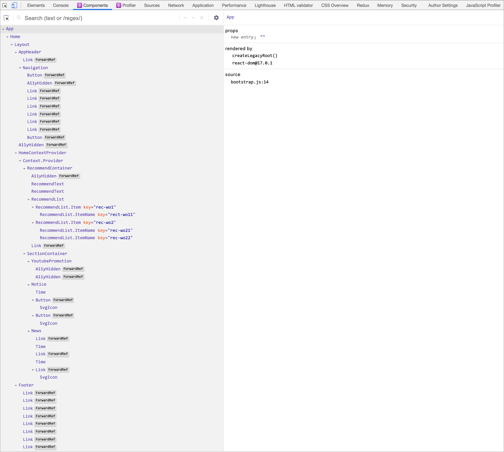

# 2주차 오프라인 학습 가이드

1주차 학습에 이어 이디야 커피(Ediya Coffee) 홈 페이지 제작 실습을 이어갑니다.

<br/>

## 영상 강의(3주차) 학습 내용 리마인드

- **미니 프로젝트** : React 프로그래밍 실습
- **고차 컴포넌트(HOC)** : 컴포넌트 → 컴포넌트를 반환하는 래퍼 함수
- **React 폼 컨트롤** : 컨트롤 컴포넌트 vs 컨트롤 되지 않는 컴포넌트 + `ref` 속성

<br/>

## 패키지 업데이트

[package.json](./ediya-ui-demo/package.json) 파일의 `dependencies`, `devDependencies` 항목을 복사, 붙여넣기 한 후 패키지를 최신 상태(2020.11)로 업데이트 합니다.

```json
{
  "dependencies": {
    "@testing-library/jest-dom": "^5.11.5",
    "@testing-library/react": "^11.1.1",
    "@testing-library/user-event": "^12.2.0",
    "classnames": "^2.2.6",
    "node-sass": "^5.0.0",
    "react": "^17.0.1",
    "react-dom": "^17.0.1",
    "react-helmet": "^6.1.0",
    "react-html-parser": "^2.0.2",
    "react-scripts": "^4.0.0",
    "serve": "^11.3.2"
  },
  "devDependencies": {
    "@axe-core/react": "^4.0.0"
  }
}
```

> NOTE. 🐧  
> [Version Lens](https://marketplace.visualstudio.com/items?itemName=pflannery.vscode-versionlens) VS Code 확장을 설치하면 손쉽게 버전 정보를 확인할 수 있습니다.

<br/>

## 실습 Overview

실습 진행에 앞서 진행할 내용을 정리합니다.

### 프로젝트 디렉토리 구조 재구성

프로젝트 소스([src](./ediya-ui-demo/src/))의 각 역할(목적)에 맞게 디렉토리를 재구성합니다.

```sh
src/
├── index.js      # 엔트리 파일
├── bootstrap.js  # 부트스트랩 파일 (React.StrictMode → On/OFF)
├── app/          # 앱 엔트리 (App.js)
├── pages/        # 페이지 컴포넌트 
├── components/   # 컴포넌트 (공통, 레이아웃 등)
├── constants/    # 상수 (프로젝트에서 사용될 상태, 변수 등, .env 사용도 가능)
├── context/      # 컨텍스트
└── utils/        # 유틸리티
```

### 앱 엔트리 컴포넌트

`index.js` ← `bootstrap.js` ← `app/App.js` 구조로 앱이 부트스트랩 되도록 구성합니다.

```sh
src/
├── index.js      # 엔트리 파일
├── bootstrap.js  # 부트스트랩 유틸리티 함수
└── app/
    └── App.js    # 앱 엔트리 파일
```

유형 | 파일 이름 | 설명
--- | --- | ---
엔트리 | `src/index.js` | ReactDOM을 통해 실제 DOM에 렌더링
부트스트랩 | `src/bootstrap.js` | React.StrictMode 활성/비활성 모드 처리
앱 엔트리 | `src/app/App.js` | React 가상 DOM Tree의 루트

### 유틸리티

[src/utils/](./ediya-ui-demo/src/utils/) 디렉토리에는 엔트리, 컴포넌트 등 프로젝트 전반에 사용될 유틸리티를 구성합니다.

```sh
src/utils/
├── axeAutoTest.js           # 접근성 자동 검사
├── delay.js                 # 코드 실행 지연 처리
├── detectMobileOrDesktop.js # 모바일/데스크톱 감지
├── devProd.js               # 개발/배포 모드 별 처리
├── dom/                     # DOM 접근/조작 헬퍼 (jQuery 라이브러리와 유사하게 구성)
│   ├── getNode.js
│   ├── getNodeList.js
│   └── index.js
├── ellipseText.js           # 텍스트 줄임(...) 처리
├── fetchData.js             # 비동기 데이터 패치
├── logError.js              # 오류 기록
└── index.js                 # 유틸리티 엔트리
```

유틸리티 엔트리 파일(`src/utils/index.js`)에 사용된 코드는 [모듈 내보내기](http://jamesknelson.com/re-exporting-es6-modules/) 문서를 참고하세요.

- [다시 내보내기(re-exporing)](https://bit.ly/ES6-re-exporting)
- [기본(defualt) 내보내기(고급)](https://exploringjs.com/impatient-js/ch_modules.html#the-default-export-as-a-named-export-advanced)

```js
/* -------------------------------------------------------------------------- */
// 기본 내보내기가 없는 경우

export * from './dom'
export * from './detectMobileOrDesktop'

/* -------------------------------------------------------------------------- */
// 기본 내보내기로 내보낸 경우

export { default as ellipseText } from './ellipseText'
export { default as delay } from './delay'
export { default as logError } from './logError'
export { default as fetchData } from './fetchData'
export { default as axeAutoTest } from './axeAutoTest'
export { default as devProd } from './devProd'
```

### 공통 / 레이아웃 컴포넌트

프로젝트에서 공통으로 사용 될 [`<Button/>`](./ediya-ui-demo/src/components/common/Button.js), [`<Link/>`](./ediya-ui-demo/src/components/common/Link.js), [`<A11yHidden/>`](./ediya-ui-demo/src/components/common/A11yHidden.js) 컴포넌트는 [common](./ediya-ui-demo/src/components/common/) 디렉토리에 구성하고,
프로젝트의 각 페이지 레이아웃으로 사용될 [`<Layout/>`](./ediya-ui-demo/src/components/layout/Layout.js), [`<Header/>`](./ediya-ui-demo/src/components/layout/Header.js), [`<Footer/>`](./ediya-ui-demo/src/components/layout/Footer.js), [`<Naivagation/>`](./ediya-ui-demo/src/components/layout/Naviagtion.js) 컴포넌트는 [layout](](./ediya-ui-demo/src/components/layout/)) 디렉토리에 구성합니다.

```sh
src/components/
│ # 공통 컴포넌트
├── common/ 
│   ├── A11yHidden.js
│   ├── Button.js
│   └── Link.js
│ # 레이아웃 컴포넌트
└── layout/ 
    ├── Footer.js
    ├── Header.js
    ├── Layout.js
    └── Navigation.js
```

유형 | 디렉토리 이름 | 설명
--- | --- | ---
공통 컴포넌트 | `src/components/common/` | 앱 어디서나 사용되는 공통 컴포넌트 디렉토리
레이아웃 컴포넌트 | `src/components/layout/` | 앱 레이아웃을 구성하는 컴포넌트 디렉토리

### 페이지 컴포넌트

각 페이지를 구성할 컴포넌트는 [pages](./ediya-ui-demo/src/pages) 디렉토리에 구성합니다. 

```sh
src/pages/
├── Home.js # 홈 페이지 컴포너트 엔트리 파일
└── Home/   # 홈 페이지를 구성하는 컴포넌트
    ├── News.js
    ├── Notice.js
    ├── RecommendContainer.js
    ├── RecommendList.js
    ├── RecommendText.js
    ├── SectionContainer.js
    ├── SvgIcon.js
    ├── Time.js
    └── YoutubePromotion.js
```

유형 | 디렉토리 이름 | 설명
--- | --- | ---
페이지 컴포넌트 | `src/pages/` 또는 `src/components/pages/` | 앱의 개별 페이지를 구성하는 컴포넌트 디렉토리

### 앱 구성 상수

[src/constants/index.js](./ediya-ui-demo/src/constants/index.js) 파일에 앱을 구성하는 상수(Configure Constants)를 설정하여 관리할 수 있습니다.

```js
// public 디렉토리 참조
const PUBLIC = process.env.PUBLIC_URL

// public/api 디렉토리 참조
const API_ADDRESS = `${PUBLIC}/api`

// API 참조 내보내기
export const API = {
  navigation: `${API_ADDRESS}/navigation.json`,
  footer: `${API_ADDRESS}/footer.json`,
  home: `${API_ADDRESS}/home.json`,
}

/* -------------------------------------------------------------------------- */

// 중단점 내보내기
// 반응형 웹(RWD) 구성에 사용 됨
export const BREAKPOINTS = 768

/* -------------------------------------------------------------------------- */

// 상태 클래스 이름 내보내기
export const CLASSES = {
  currentPage: 'is--selected',
  activeClass: 'is-active',
}
```

### Context 구성

[src/context/HomeContext.js](./ediya-ui-demo/src/context/HomeContext.js) 파일을 통해 
홈 페이지 컴포넌트를 구성하는 컴포넌트에 데이터를 일괄 공급(provide)할 수 있습니다.
Context 기본 값(default value)은 Context.Provider에 `value`를 설정 하지 않아도 기본 제공될 콘텐츠를 추가할 수 있습니다.

```js
import React, { createContext } from 'react'

// 초기 데이터
const homeContextDefaults = {
  author: 'yamoo9',
  description: 'Context 기본 값',
}

// AppContext
const HomeContext = createContext(homeContextDefaults)

// HomeContext.Provider 래퍼 컴포넌트
export const HomeContextProvider = ({ children, value = {} }) => (
  <HomeContext.Provider value={{ ...homeContextDefaults, ...value }}>
    {children}
  </HomeContext.Provider>
)

export default HomeContext
```

### 컴포넌트 트리

완성된 홈 페이지의 컴포넌트 트리는 다음과 같이 구성됩니다. 자주 재사용 되는 공통 컴포넌트는 모두 [forwardRef](https://ko.reactjs.org/docs/forwarding-refs.html) 처리되어 있습니다.

