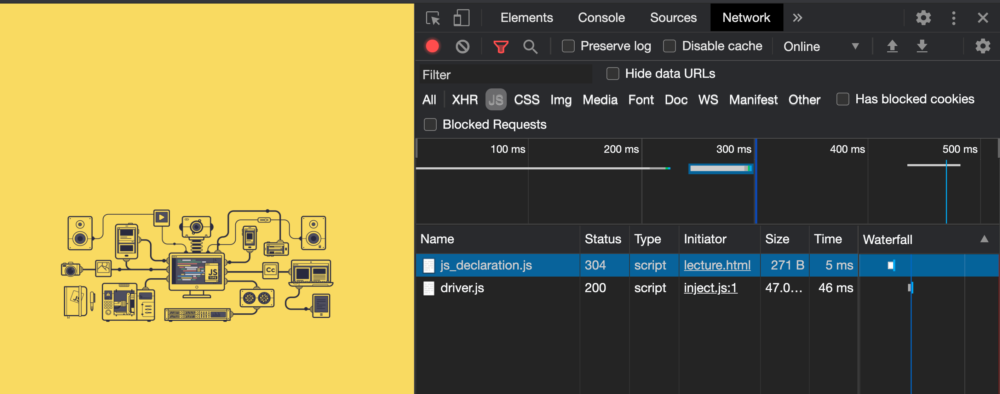

[← BACK](../README.md)

# UI Interaction Junior, QnA

질문을 남겨주시면, 최선을 다해 답변하겠습니다. 🐧

## 목차

1. [JIT 컴파일러는 정확히 무엇이고, 인터프리터와 정확한 차이는 무엇일까요?](#q1-질문)
1. [함수형 프로그래밍은 객체지향 보다 어떤 장점이 있을까요?](#q2-질문)
1. [ES6가 가장 안정된 버전이라 현재 사용되고 있는건가요?](#q3-질문)
1. [304 오류가 나는 이유는 무엇일까요?](#q4-질문)
1. [래퍼객체 목적이 상속이라는 깊은 의견이 있어서 궁금합니다.](#q5-질문)
1. [함수의 `get`, `set`이 정확히 이해가 안되는데 구체적인 사용 예시를 알려주세요.](#q6-질문)


<br />

---

<br />

## Q6. 질문

함수의 `get`, `set`이 정확히 이해가 안되는데 구체적인 사용 예시를 알려주세요.

<details open>
  <summary>A6. 답변</summary>
  <br/>

  간단한 DOM 스크립트 속성 가져오기(GET), 설정하기(SET) 예시를 살펴보면서
  함수의 GET, SET 사용 예를 알아보죠. 🐧

  *HTML*

  ```html
  
  ```
  
  *JavaScript*
  
  ```js
  var testerNode = document.querySelector('.tester');

  // [GET], 속성 값 가져오기
  var altValue = testerNode.getAttribute('alt');
  console.log(altValue); // '테스터'

  // [SET], 속성 값 설정하기
  testerNode.setAttribute('alt', '테스터(Tester)');

  // [SET → GET], 속성 값 설정 후 설정된 값 가져오기
  altValue = testerNode.getAttribute('alt');
  console.log(altValue); // '테스터(Tester)'
  ```

  살펴봤듯이 HTML 요소 노드의 속성을 통해 값을 가져올 때는 `get` 값을, 
  설정할 때는 `set` 접두사가 함수(또는 메서드) 이름에 사용됩니다.

  직접 함수를 작성할 경우에도 이러한 이름 작성 패턴이 반영됩니다.

  ```js
  // CSS 속성 값을 반환하는(가져오는) 함수
  function getCSS(domNode, property) {
    return window.getComputedStyle(domNode).getPropertyValue(property);
  }

  // CSS 속성 값을 설정하는 함수
  function setCSS(domNode, property, value) {
    domNode.style[property] = value;
  }
  ```

  작성된 함수를 사용하는 코드를 살펴보죠. 속성 값을 반환하는(가져오는) 함수는 결과 값을 기억할 변수에 담을 수 있고,
  속성 값을 설정하는 함수를 사용하는 경우는 별도로 반환되는 값이 없으므로 변수에 담을 필요가 없습니다.

  ```js
  var testerNode = document.querySelector('.tester');

  // DOM 요소 노드의 CSS 속성 값 가져오기
  var widthValue = getCSS(testerNode, 'width');
  var heightValue = getCSS(testerNode, 'height');
  console.log(widthValue); // '260px'
  console.log(heightValue); // '140px'

  // DOM 요소 노드의 CSS 속성 값 설정오기
  setCSS(testerNode, 'width', '520px');
  setCSS(testerNode, 'height', '280px');
  ```
</details>

<br/>

## Q5. 질문

래퍼객체의 목적은 원래 코딩에서는 문자열로는 메서드를 상속할 수 없지만, 자바스크립트에서는 원시데이터로도 상속할 수 있는게 목적인가요?

<details>
  <summary>A5. 답변</summary>
  <br/>

  ### 질문 리마인드

  래퍼객체 목적이 상속이라는 깊은 의견이 있어서 궁금합니다.
  래퍼객체의 목적은 원래 코딩에서는 문자열로는 메서드를 상속할 수 없지만, 자바스크립트에서는 원시데이터로도 상속할 수 있는게 목적인가요?

  ### 질문 해석 후 답변

  질문이 "래퍼 객체의 사용 목적이 상속인가?"라고 이해하고 답변드립니다.

  결론부터 이야기 하면 "상속"이 목적이 아닙니다. 굳이 비유하자면 "사용자 편의를 위해 눈에 보이지 않게 작동되는 수단"일 것입니다.

  말보다는 예시가 이해하는데 도움이 되겠죠. JavaScript에서 래퍼(Wrapper) 객체를 제공하지 않을 경우, 두 수의 소수점을 제거하고 
  합을 구하는 프로그램을 작성하려면 다음과 같이 작성해야 합니다.

  ```js 
  // Number 객체 생성
  var number1Object = new Number(9.12);
  // 생성된 Number 객체의 원시 값 추출
  var primitiveValueOfNumber1Object = number1Object.valueOf();
  // 원시 값 출력
  console.log(primitiveValueOfNumber1Object); // 9.12 출력
  // 값에서 소수점 제거 (숫자 → 문자로 형 변환 됨)
  console.log(primitiveValueOfNumber1Object.toFixed(0)); // "9" 출력
  // 문자 → 숫자로 형 변경 (사칙 연산을 수행하기 위한 목적)
  number1Object = Number(primitiveValueOfNumber1Object.toFixed(0)); // 9 출력

  // Number 객체 생성
  var number2Object = new Number(10.45);
  // 생성된 Number 객체의 원시 값 추출
  var primitiveValueOfNumber2Object = number2Object.valueOf();
  // 원시 값 출력
  console.log(primitiveValueOfNumber2Object); // 10.45 출력
  // 값에서 소수점 제거 (숫자 → 문자로 형 변환 됨)
  console.log(primitiveValueOfNumber2Object.toFixed(0)); // "10" 출력
  // 문자 → 숫자로 형 변경 (사칙 연산을 수행하기 위한 목적)
  number2Object = Number(primitiveValueOfNumber2Object.toFixed(0)); // 10 출력

  // -------------------------------------------------------------------------

  // 숫자 원시 값 합산
  var resultSumNumbers = number1Object + number2Object;
  // 두 수의 합으로 연산된 결과 값 출력
  console.log(resultSumNumbers); // 19 출력
  ```

  보다시피 단지 두 수의 소수점을 절삭하고 합을 구하고 싶을 뿐인데... 코드가 매우 복잡합니다.
  그럼 이어서 래퍼 객체가 제공될 경우 위의 프로그램 작성 코드가 어떻게 바뀌는지 비교해봅시다. 어떤가요? 비교적 코드가 상당히 간결해졌죠.

  ```js
  var resultSumNumbers = Number(9.12.toFixed(0)) + Number(10.45.toFixed(0))
  // 두 수의 합으로 연산된 결과 값 출력
  console.log(resultSumNumbers); // 19 출력
  ```

  코드를 자세히 뜯어볼까요? 먼저 아래 코드를 살펴봅시다.

  ```js
  9.12.toFixed(0)
  ```

  `9.12`는 숫자 값입니다. 객체가 아니죠. 그러므로 `.toFixed()` 메서드를 소유할 수 없습니다.
  왜냐고요? **객체가 아니니까요.** <u>멤버(members)인 속성 또는 메서드를 소유하려면 객체여야 합니다.</u>
  하지만 숫자 값은 원시 값일 뿐, 객체가 아니기에 `.toFixed()`를 가질 수도 사용할 수도 없습니다.
  그러므로 메서드를 사용하려면 숫자 값이 아닌, Number 객체가 필요합니다.

  ```js
  var number1Object = new Number(9.12); // Number 객체 생성
  number1Object = number1Object.valueOf().toFixed(0); // Number 객체의 메서드 활용
  ```

  앞서 작성된 코드의 결과 값 유형은 문자(String) 입니다. 문자인 경우 사칙연산이 안되므로
  문자 유형을 숫자 유형으로 변경해야 합니다. 래퍼 객체가 제공될 경우, 아래와 같이 코드 구문이 간결하게 작성됩니다.

  ```js
  Number(9.12.toFixed(0))
  ``` 

  반면, 래퍼 객체가 제공되지 않을 경우는 아래와 같이 코드가 장황하고 복잡해집니다.

  ```js
  var number1Object = new Number(9.12); // Number 객체 생성
  number1Object = Number(number1Object.valueOf().toFixed(0)); // Number 객체의 메서드 활용
  ```

  ### 정리

  답변 글에서 "사용자 편의를 위해 눈에 보이지 않게 작동되는 수단"으로 래퍼 객체가 활용된다고 짚어드렸습니다.
  예제로 다룬 코드를 비교해서 체험했듯이 JavaScript에서 Number, String, Boolean 래퍼 객체를 제공하기에
  값임에도 객체인 것처럼 메서드를 사용할 수 있어 코드를 손쉽게 작성이 가능한 것입니다.

  **원시 값은 값일 뿐이고 객체가 아니므로 객체가 가지는 메서드를 사용할 수 없지만, 래퍼 객체를 제공함으로 메서드를 사용할 수 있게 한다.**

  ```js
  var numWrapper = 9;      // new Number(9)를 통해 생성된 객체인 것처럼 래핑
  var strWrapper = "9px";  // new String('9px')을 통해 생성된 객체인 것처럼 래핑
  var booWrapper = false; // new Boolean(false)를 통해 생성된 객체인 것처럼 래핑

  // 마치 객체인 것처럼 메서드를 사용할 수 있음
  numWrapper.toPrecision(2); // "9.0"
  strWrapper.indexOf('p');   // 1
  booWrapper.toString();     // 'false'
  ```
  
</details>

<br />

---

<br />

## Q4. 질문


`304`로 출력되는 이유는 무엇이고, 304의 정확한 서버측 정의는 무엇인지 궁금합니다.

<details>
  <summary>A4. 답변</summary>
  <br/>

  
  <br/>
  <br/>

  HTTP 상태 코드 `304`는 "리소스가 수정되지 않았음(Not Modified)". 즉, **서버에 다시 리소스를 요청할 필요가 없는 상태**임을 나타냅니다.

  이 말이 가지는 의미는 사용자가 처음 사이트에 방문했을 때는 HTML, CSS, JavaScript 파일과 이미지 파일 등을 서버에 요청해 모두 다운로드 받아야 하지만,
  다시 사용자가 사이트에 방문할 때는 자동 캐시(브라우저에서 다운로드 받은 리소스를 기억하는 것을 말함)된 리소스를 서버에 다시 요청하지 않습니다.
  이미 받은 리소스를 다시 요청하는 것은 낭비이고 불필요한 일이기 때문입니다.

  하지만, 서버의 파일이 업데이트(수정)되면 변경된 파일을 다시 다운로드 받아 사용자가 이용하는 사이트에 반영해야 합니다. 즉, **사용자 브라우저에
  캐시된 리소스와 서버의 리소스가 동일한 경우 Not Modified 상태인 것이고 불필요하게 리소스를 서버에 다시 요청하지 않는 것**이라고 이해하시면
  좋을 것 같습니다.
  
  > 참고: [304 Not Modified, [MDN]](https://developer.mozilla.org/ko/docs/Web/HTTP/Status/304)

  *답변 끝*

  ---

  *질문 내용 이동 됨*

  구글링 해보면 `modified`라고 나오는데 직관적으로 안와닿습니다 :)

  ### [304 Not Modified] - 구글링 검색결과 

  #### 2.1 Conditional GET Request

  HTTP Get 의 특별한 타입으로 요청 메시지에 다음 필드가 있다면 HTTP Conditional Get 으로 변경한다.

  ```
  If-Modified-Since
  If-Unmodified-Since
  If-Match
  If-None-Match
  If-Range header fields
  ```

  > ※ 대부분의 브라우저는 HTTP conditional request를 사용하여 자동 캐시 기능을 지원한다.

  #### 2.2 304 응답

  클라이언트가 조건부 GET 요청을 실행하고 접근이 허용되었지만 문서가 수정되지 않았다면, 서버는 304 상태코드로 응답한다. 304 응답은 메시지-바디 를 절대 포함하면 안된다. 그래서 이것은 항상 헤더 필드후에 처음 공백라인으로 종료된다.

  > If the client has performed a conditional GET request and access is allowed, but the document has not been modified, the server SHOULD respond with this status code. The 304 response MUST NOT contain a message-body, and thus is always terminated by the first empty line after the header fields.

  만약 304 응답이 현재 캐시되지 않은 엔티티를 지시하면, 캐쉬는 반드시 이 응답을 무시하고 조건없는 요청을 반복해야 한다.

  > If a 304 response indicates an entity not currently cached, then the cache MUST disregard the response and repeat the request without the conditional.
</details>

<br/>

---

<br/>

## Q3. 질문

ECMA는 2017년도 2018년도 버전이 계속 나왔는데 ES6가 가장 안정된 버전이라 지금 사용되고 있는걸까요? 왜 2020년 버전은 안쓰는것인지 궁금합니다.

<details>
  <summary>A3. 답변</summary>
  <br/>

  JavaScript 즉,  [ECMAScript](https://www.ecma-international.org/publications/standards/Ecma-262.htm)는 웹 표준 스크립트 명칭입니다. 
  1997년 초판 발행 이후, 2015년에 6판이 발행되면서 클래스, 모듈과 같은 새로운 문법이 추가되었습니다. 그 후 매년 새로운 문법이 조금씩 추가되어 발행되고 있습니다.

  - 1997.06 초판
  - 1998.06 2판
  - 1999.06 3판
  - 1999.06 중단
  - 2009.06 5판
  - 2011.06 5.1판
  - 2015.06 6판 (클래스, 모듈 문법 추가)
  - 2016.06 7판
  - 2017.06 8판 (`async`/`await` 추가)
  - 2018.06 9판 
  - 2019.06 10판 
  - 2020.06 11판 

  질문은 "왜 2020년 버전은 안쓰는가?" 인데, 웹 환경의 특성상 새로 등장한 기술을 바로 사용할 수 없습니다.
  다양한 플랫폼, 브라우저 환경에서 새로운 기술을 지원해야만 쓸 수 있기 때문입니다. 그러니 2020년에 등장한 새 기술을 바로 사용하지 못하는 거죠. 안 하는게 아니라.

  그리고 2015년에 등장한 ES6가 안정적이라서 사용되는 것이 아니고, 새 기술을 구형 브라우저에서 해석되도록 구 기술로 변환(컴파일)해주는 도구가 있기 때문에 사용하는 겁니다.
  예를 들어 Babel 또는 TypeScript 를 사용할 경우 ES6-9 기술을 사용해 (ES5) 코드로 변환해 오래된 브라우저에서도 호환될 수 있도록 만들어 주기 때문입니다.
  이런 도구를 사용할 수 없는 환경에서는 ES6를 사용할 수 없습니다.

  ES6, ES7, ES8 등의 새로운 기술이 사용되는 Front-End 개발 환경은 React나 Vue 같은 프레임워크를 사용할 경우입니다. 일반적인 jQuery를 사용하는 개발 환경에서는
  ES6가 사용되지 않습니다. 프레임워크와 달리 직접 모듈 번들러와 컴파일러 개발 환경을 구축해야 하기 때문입니다. 결론은 개발 환경에 따라 새로운 ECMAScript를 사용할 수도 있고
  아닐 수도 있습니다.  
</details>

<br />

---

<br />

## Q2. 질문

함수형 프로그래밍은 객체지향 보다 어떤 장점이 있을까요? (함수형 프로그래밍이 정확히 뭔지 안와닿네요.)

<details>
  <summary>A2. 답변</summary>
  <br/>
  
  해당 질문은 주니어 레벨의 질문은 아니네요. ^^; 그래도 답변 드립니다.

  함수형 프로그래밍과 객체 지향 프로그래밍 모두 프로그래밍 방식을 말합니다. 
  어떤 방식이 낫다, 아니다의 관점으로 접근하기 보다는 상황에 따라 방식을 선택해 사용할 수 있다고 생각해보세요.
  예를 들어 목적지에 가기 위해 이용 가능한 교통 수단이 어떤 상황에서는 버스일 것이고, 다른 상황에서는 지하철일 수 있으니까요.
  간단하게 동일한 처리를 하는 각 프로그래밍 방식을 비교해보도록 하죠.

  ### 함수형 프로그래밍

  재사용 할 함수를 선언합니다.

  ```js
  // 함수 

  function getNode(selector, context = document) {
    return context.querySelector(selector);
  }

  function css(domNode, prop, value) {
    if (!value) {
      return window.getComputedStyle(domNode).getPropertyValue(prop);
    } else {
      domNode.style[prop] = value;
    }
    return domNode;
  }
  ```

  선언된 함수를 실행해 처리합니다.

  ```js
  const appNode = getNode('.app');
  const appHeaderNode = getNode('.appHeader', appNode);
  css(appHeaderNode, 'margin', '10vw 0');
  css(appHeaderNode, 'padding', '20px');
  ```

  또는 변수 참조 없이 아래와 같이 인라인으로 작성할 수도 있습니다.

  ```js
  css(css(getNode('.appHeader', getNode('.app')), 'margin', '10vw 0'), 'padding', '20px');
  ```

  ### 객체 지향 프로그래밍

  재사용 할 클래스를 선언합니다.

  ```js
  // 클래스

  class DomUtils {
    
    constructor(selector, context) {
      this.domNode = DomUtils.getNode(selector, context);
    }
    
    static getNode(selector, context = document) {
      if (typeof context === 'string') {
        context = DomUtils.getNode(context);
      }
      return context.querySelector(selector);
    }

    css(prop, value) {
      const {domNode} = this;

      if (!value) {
        return window.getComputedStyle(domNode).getPropertyValue(prop);
      } else {
        domNode.style[prop] = value;
      }
      return this;
    }

  }
  ```

  클래스를 사용해 새로운 객체를 생성한 다음 객체의 메서드를 활용해 처리합니다.

  ```js
  var appHeader = new DomUtils('.appHeader', '.app');

  appHeader
    .css('margin', '10vw 0')
    .css('padding', '20px');
  ```
</details>

<br />

---

<br />

## Q1. 질문

JIT 컴파일러는 정확히 무엇을 말하는건가요? 인터프리터와 정확한 차이는 무엇일까요?

<details>
  <summary>A1. 답변</summary>
  <br/>
  컴퓨터 프로그램을 만드는 전통적인 2가지 방법은 인터프리트 방식과 컴파일(정적) 방식이 있습니다.
  이 중 인터프리트 방식은 JavaScript가 동작하는 것처럼 프로그래밍 언어를 브라우저의 JavaScript 엔진이 실시간으로 해석하여
  기계어 코드를 실행합니다. 반면 컴파일(정적) 방식은 JAVA가 동작하는 것처럼 애플리케이션 실행 전에 코드를 기계어로 번역해둔 상태입니다.
  <br/>
  <br/>

  컴퓨터 프로그램 방식 | 설명
  --- | ---
  인터프리트(like 통역) | JavaScript가 작동하는 방식 (실시간 해석이 필요해 상대적으로 느림)
  컴파일(like 번역) | JAVA가 작동하는 방식 (이미 해석된 코드를 실행하므로 인터프리트에 비해 빠름)

  반면 JIT(just-in-time) 컴파일은 **프로그램을 실제 실행하는 시점에 기계어로 번역하는 컴파일 기법** 입니다.
  JIT 컴파일러는 앞서 다룬 인터프리트, 컴파일(정적) 2가지 방식을 혼합한 방식으로 생각할 수 있는데, 실행 시점에서 
  인터프리트 방식으로 기계어 코드를 생성한 후 그 코드를 캐싱합니다. 캐싱하는 이유는 동일한 함수가 여러 번 호출 때 
  매번 기계어 코드를 생성하는 것을 방지하기 위함입니다.

  컴퓨터 프로그램 방식 | 설명
  --- | ---
  JIT 컴파일 | 인터프리트 방식 + 컴파일(정적) 방식 혼합
</details>