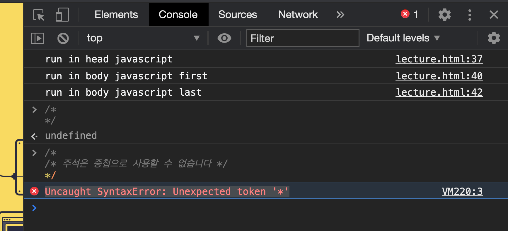
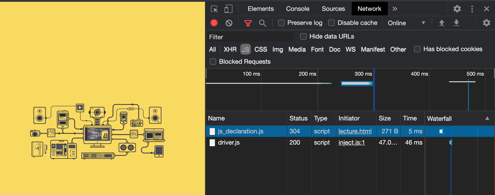

[← BACK](../README.md)

# 1일차 학습

## 자바스크립트란 ? 
-사용자가 요구하는 행동을 조작하는것
(집을 지을때 현관문을 자동으로 처리한다든지) 

-개인적인 생각 :  
자바스크립트는 데이터를 제어하여 이를 자동화하여 성과를 낼 수 있는 새로운 그로스해킹 영역으로도 활용할 수 있다. 
즉 단지 집 지을때만 사용한는 것이 아닌 외부 데이터를 자동화하여 성과를 낼 수 있는 포인트를 만들어갈 수 있다.  
하지만 근원적으로 
데이터의 액션(행동)을 제어하기 때문에 
액션을 제어하는 근원은 본질적으로 같다.

(비브라우저의 환경에서의 제어가 유의미할 수도 있다) -> 프로토타입의 패러다임 객체지향 언어
 

## 인터프리터형 vs JIT-컴파일의 차이 
인터프리터형은 쉽게 말해 통역
즉 해석을 해주는 역할이라고 본다.

<구글링 찾아본 결과> 

V8엔진(구글, c++): 인터프리터 없이 두개의 컴파일러로 구성되어 있습니다. 크롬이나 노드가 사용합니다.

Rhino엔진(모질라,java): 이 엔진은 기본적으로 인터프리터, 부분적으로 자바 바이트코드로 컴파일 합니다.

Monkey 엔진: 최초의 자바스크립트 엔진. 파이어폭스에서 사용되고 있습니다. 이건 컴파일러(JIT(Just in Time) )를 사용하고 있습니다.

## 객체지향형 VS 함수형 프로그래밍 

공부를하다보니 
객체지향형은 약간 수직적으로 구조화된 설계와 비슷하고, 함수형은 뭔지 잘모르겠지만... 
GTM에서 함수들은 언제든 콜백 시켜서 재사용성을 극대화 시키는게 아닐까?

## ECMA에 대하여 
자바스크립트의 유럽 표준 

## 주석,선언,

// 한줄주석 
/* */ 여러줄 주석 

/*
/* 주석은 중첩으로 사용할 수 없습니다 */
*/

중첩을 사용하면 아래와 같은 오류가 나옴.
Uncaught SyntaxError: Unexpected token '*'
VM220:3 

# 2일차 학습 

## Declaration, Assignment (선언과 할당)

Q1. 304 오류가 나는 이유는 무엇일까?

 

 
변수의 세가지 선언 방법

<ul>
    <li>var</li>
    <li>let</li>
    <li>const</li>

</ul>

 
변수를 사용할 때 주의해야할점

<ul>
    <li>var current yaer 처럼 
띄어쓰기 사용하면 안됨.<</li>
    <li>var current-yaer 처럼 
대시도 사용하면 안됨.</li>
    <li>cameCase 방식 혹은 snake_Case 방식 사용 </li>

</ul>

 
undefined와 null의 차이 

<ul>
    <li>undefined는 데이터타입이자 값(리터럴)을 나타냄</li>
    <li>null은 참조되어 있지 않아 값이 빈 상태</li>
 
  null은 객체데이터값을 초기화 하는 경우가 많은데, 둘다 조건문의 조건처리를 역이용할 때 많이 사용하는것을 보았다.

</ul>

 

 
연산시 주의해야할점 

<ul>
    <li>문자와 숫자를 연산하면 문자로 출력 </li>

</ul>

 

