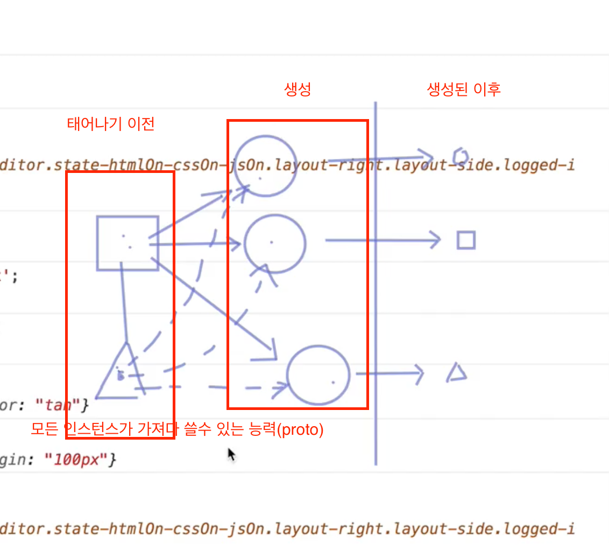

# 22일차 학습

#### 객체 / 상속

- mixin()로 두개의 객체를 합친다.
- Object.create()사용하면 타 객체의 능력을 상속받을 수 있다.
- Object.isFrozen()을 설정하면 새로운 객체를 추가도 설정도 할 수 없다.
- hasOwnProperty()는 인스턴스 메서드로 자신의 속성인지를 파악할 때 사용한다.

### 생성자 / 프로토타입

- 생성자함수를 사용해야 사용자 정의객체 (instance)를 만들수 있다.
- 자바스크립트는 클래스가 없기 때문에 첫글자를 대문자로 구문해 일반함수와 차이를 둔다.
- 생성자함수로 정의한 객체는 프로토타입 객체에 접근 가능하면 이는 constructor로 구성되어 있다.
- Array.prototype.constructor === Array // true
  (결국 Array함수는 constructor 객체 즉 프로토타입객체와 같다)
- 결국 서로가 서로를 참조하고 있는 형태 구조를 가지고 있다.
- ES6부터는 Class를 사용할 수 있다.
- 생성자 함수 내부에 생성된 this는 생성된 객체를 가리킨다.
  생성자 함수를 사용하지 않은 일반함수는 this가 window를 가리킨다.

```js
function Tab(selector) {
  this.el = document.querySelector(selector);
  return this; // 기본적으로 this를 참조함 this는 생성된 객체를 참조
}
var tab1 = new Tab();
var tab2 = new Tab();
var tab3 = new Tab("body");

// 검증방법
// tab1.constructor === Tab
// tab1 instanceOf Tab
```

- 상위 3가지 생성자 함수는 모두 proto에 연결되어 있다.
- proto 안에는 constructor가 있는데 결국 이는 생성자함수를 가리킨다.
- Object.getPrototypeOf(tab1) 처럼 constructor에 접근할 수 있다.



- 생성자함수를 통해 모체가 태어나기이전,태어남,태어난이후로 정리된다
- proto의 constructor는 각 인스턴스가 공통으로 능력을 빌려쓴다.
- 태어난 이후 각 인스턴스에 생성된 속성들은 각 인스턴스의 능력을 상속받는다.
- 'use strict' 사용해서 자바스크립트의 고질적인 문제를 알려주게 만든다.
- 생성자 함수 new를 사용하지 않아도 오류를 내뿜지 않기 때문입니다.
- IIFE를 사용할 경우 엄격한 모드로 관리해야 좋은습관이다.

  ```js
  function phone(numbers) {
    console.log(this);
    numbers = numbers.replace(/-/g, "");
    return numbers;
  }

  function Phone(numbers) {
    "use strict"; // this를 undefined로 출력
    console.log(this);
    this.ns = numbers;
  }

  new phone();
  phone(); // 전역을 오염시키버리는 문제
  ```

질문 : 생성자 함수로 만들때 인자값을 부여하면 객체(인스터스)를 개별로 만드는게 맞는건가?
따라서 인자로 모든 함수 및 원시데이터들을 객체지향적으로 프로그래밍할 수 있는게 맞는건가?
